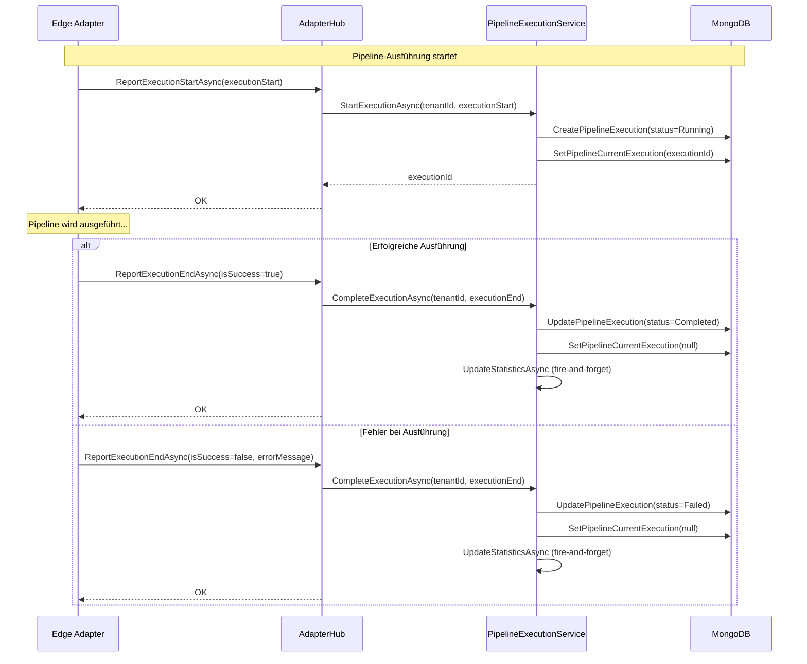
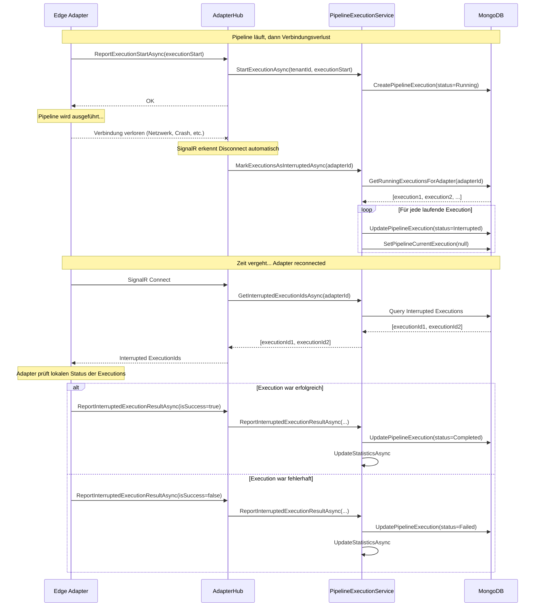
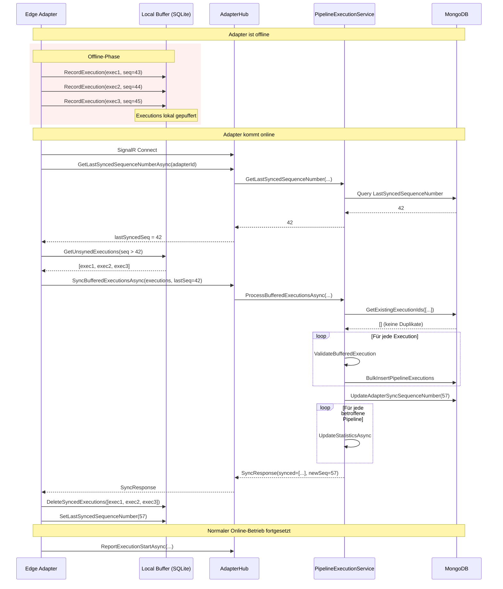
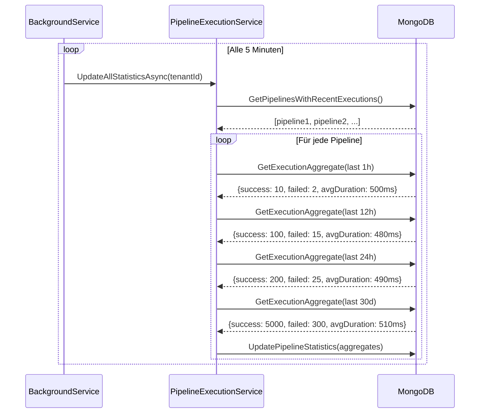
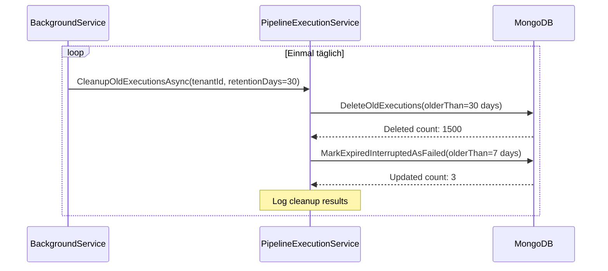
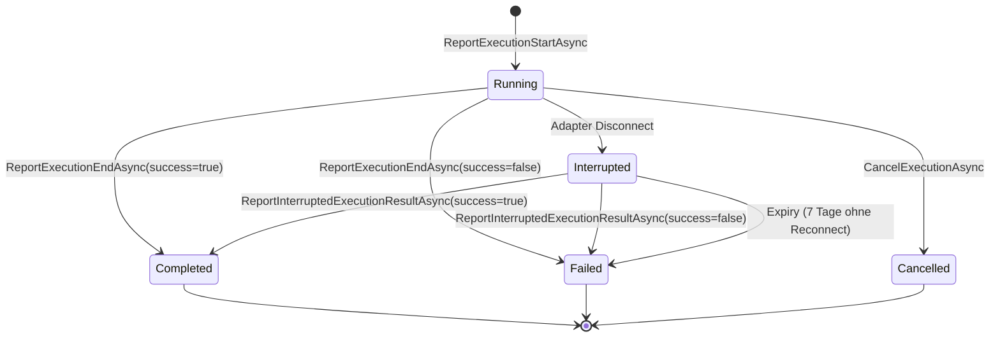
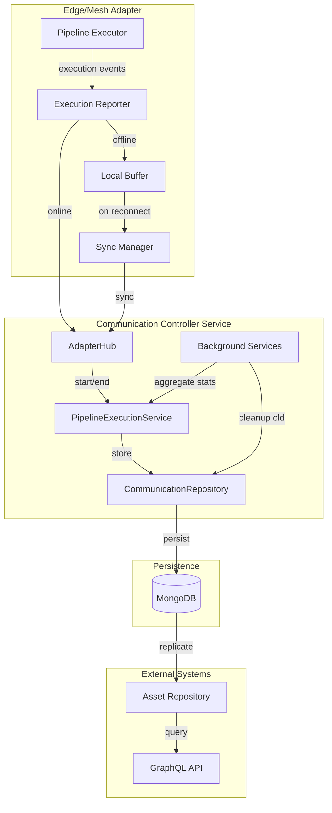
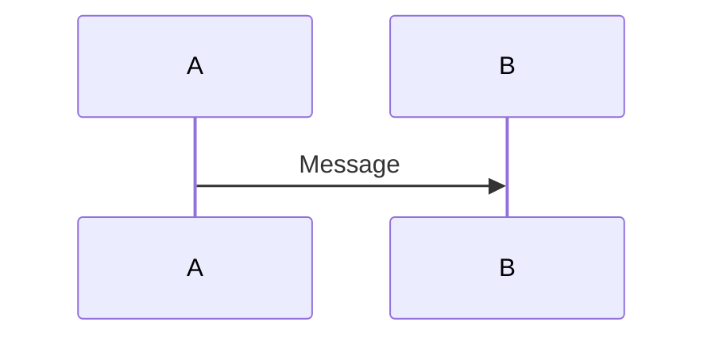

# Pipeline Execution Metrics - Sequenzdiagramme

Diese Datei enthält Mermaid-Sequenzdiagramme für die verschiedenen Abläufe des Pipeline Execution Tracking Features.

## 1. Normaler Ablauf (Online)



---

## 2. Disconnect während Execution



---

## 3. Offline-Betrieb mit Buffering



---

## 4. Statistik-Aggregation (Background Service)



---

## 5. Cleanup (Background Service)



---

## 6. Zustandsdiagramm: Execution Status



---

## 7. Komponenten-Interaktion



---

## Hinweise zur Verwendung

Diese Diagramme können in folgenden Tools gerendert werden:
- **GitHub/GitLab**: Unterstützt Mermaid nativ in Markdown
- **VS Code**: Mit der "Markdown Preview Mermaid Support" Extension
- **Mermaid Live Editor**: https://mermaid.live/
- **Confluence**: Mit dem Mermaid Plugin

### Beispiel: GitHub Rendering

GitHub rendert Mermaid-Diagramme automatisch, wenn sie in einem `mermaid` Code-Block stehen:

````markdown

````
