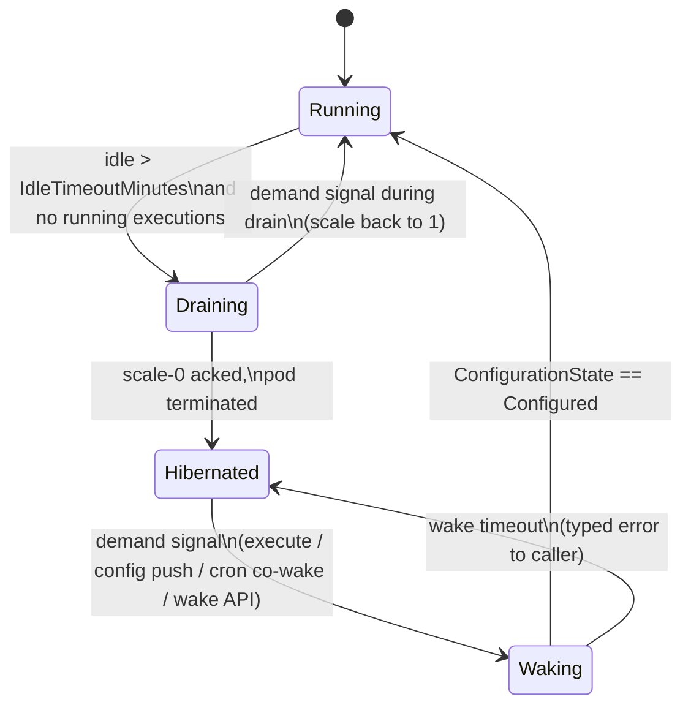
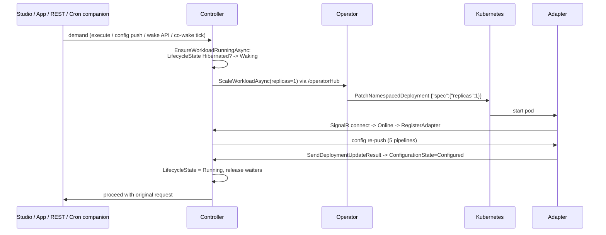

# On-Demand Adapter Lifecycle (Scale-to-Zero)

**Epic:** AB#4914 · **Status:** Design draft 1.0 (2026-08-27) · **Issues:** AB#4915–AB#4924

Rarely used adapter workloads scale to 0 replicas when idle and are woken automatically on demand. Live-data adapters keep running permanently. Motivation, prod-1 analysis, and alternatives considered are documented in the epic; this document is the implementation design.

## 1. State machine

A new runtime attribute `LifecycleState` on `DeployableWorkload` carries the lifecycle. The existing state fields are deliberately untouched: `CommunicationState=Offline` remains factually correct while hibernated (the SignalR connection *is* gone), `DeploymentState=Deployed` remains correct (the helm release still exists). All consumers interpret them *through* `LifecycleState`.

- `LifecycleMode` (`AlwaysOn` default | `OnDemand`) and `IdleTimeoutMinutes` (default 30) are **author configuration** (no `isRuntimeState`).
- `LifecycleState` and `LastActivityAt` are **runtime state** (`isRuntimeState: true` — blueprint re-apply must not reset them).
- CK model changes: `System.Communication` 3.28.0 → 3.29.0, additive, template = AB#4706 commit `7568df7`. Mind the System.Ai minor-floor cascade (AB#4554/AB#4729).

## 2. Readiness definition

**A workload is "ready" iff `ConfigurationState == Configured`.**

`CommunicationState=Online` is *not* sufficient — Online means "SignalR connected", set in `AdapterHub.OnConnectedAsync`, before any pipeline is registered (this is exactly the AB#4594 recurrence-#2 failure mode: Online with zero routes). `Configured` is written by `AdapterService.UpdateConfigurationStateAsync` after the adapter acks the register-path config re-push, and is reset to `Unconfigured` on every disconnect — so waiting for `Configured` is race-free on every wake.

Measured on staging-1 (2026-08-27, meshtest, 5 pipelines, warm image): scale 0→1 to `Configured` = **~16 s** (pod scheduled +1 s, first app log +13 s, Online +13.5 s, RegisterAdapter +15 s, Configured +15.9 s). Kubernetes `Ready` lags at +32 s purely because of readiness `initialDelaySeconds: 15` — this gates only the HTTP/ingress path and is addressed by probe tuning (AB#4920). First-execution CK-model lazy-load cost is *not* included in the 16 s and must be measured against a large tenant model with/without the eager-load flag (AB#4920).

## 3. Components

### 3.1 Operator scale verb (AB#4917)

- Wire: `ScaleWorkloadDto` + `IOperatorHubCallbacks.ScaleWorkloadAsync` + `IOperatorHub.ReportWorkloadScaleStatusAsync` in octo-sdk (`Meshmakers.Octo.Communication.Contracts`); routing mirrors `NotifyWorkloadDeployedAsync` incl. the AB#4371 pending queue (extend the two-type switch in `FlushPendingWorkloadNotificationsAsync`).
- K8s: find Deployments via label `app.kubernetes.io/instance={releaseName}` (never derive the resource name — Application charts may render `{release}-{chart}`), then `PatchNamespacedDeploymentAsync` with merge patch `{"spec":{"replicas":N}}`. Works under the operator's existing RBAC (`apps/deployments: ['*']`); no scale-subresource grant needed.
- Redeploy must not resurrect: `WorkloadReconciler.DeployAsync` sets `setValues["replicaCount"] = "0"` for hibernated workloads (`--set` beats every values layer; the `ValueOverride` path is unusable — its emitter force-quotes scalars).
- Chart fix (both adapter charts): values-driven `terminationGracePeriodSeconds` (default 180) — the SDK shutdown budget (up to 240 s worst case) exceeds the k8s default 30 s.
- Skew: controller + octo-sdk + operator ship together; both directions use the once-only `HubException` degrade pattern.

### 3.2 Wake gates (AB#4918)

`EnsureWorkloadRunningAsync(tenantId, adapterRtEntityId, budget)` — own wait registry keyed by adapter (do **not** reuse `_pendingDeployments`, a single-TCS-per-adapter slot). Insertion points:

| Path | Location | Note |
|---|---|---|
| Execute pipeline | `TriggerManagementService.StartExecutePipelineAsync`, before the queue send | `ExecutePipelineCommand` queue is non-durable/auto-delete → publish to an absent queue is silently dropped; the gate must complete *before* the send. Pass an explicit `RequestTimeout` (default is 30 s); SDK caller cap is 100 s. |
| Config/deploy pushes | `DeployAdapterConfigurationAsync`, `DeployPipelineAsync`, `Deploy/UndeployDataFlowAsync` | today throw `AdapterNotLoaded`; wake-first after the tenant `IsEnabled` checks |
| Manual/API wake | new `POST {tenant}/v1/adapter/{id}/wake` | used by Studio "wake now", the app wake interceptor (AB#4922), the activator (AB#4923) |
| Cron co-wake | companion schedule (below) | |

**Cron co-wake:** the controller only *registers* recurring sends; the Hangfire scheduler runs in **octo-bot-services**. For pipelines on `OnDemand` workloads, `UpdateScheduleAsync` registers a second recurring send (same cron) to a durable controller-owned queue `octo::com-controller::lifecycle-wake-{tenantId}`, consumed by the controller → `EnsureWorkloadRunningAsync`. The adapter's own trigger message meanwhile buffers durably (verified: per-pipeline trigger queues are Durable=true/AutoDelete=false, no TTL, survive the pod) and is consumed on wake. Companion schedules are added/removed together with the trigger schedule (same scheduleGroup).

### 3.3 Idle watchdog (AB#4918)

`IdleWatchdogBackgroundService`, cloned from `AdapterOfflineReconciliationBackgroundService` (5-min loop, per-tenant try/catch). Idle metric: `max(LastExecutionAt)` over the adapter's pipelines' `RtPipelineStatistics` — raw executions are folded after `PipelineExecutionRetentionHours` (default 1 h), so `CompletedAt` is unusable. Busy guards: `GetRunningExecutionsForAdapterAsync`, in-flight config deployments, `LifecycleState=Waking`. Transition: idle > `IdleTimeoutMinutes` → `Draining` → scale 0 → on ack `Hibernated`.

**Known limitation:** workloads hosting in-process `FromPolling`/`FromMicrosoftGraphEmail` triggers never idle; those pipelines must be migrated to cron `PipelineTrigger`s first (AB#4922 precondition — also functionally required, since hibernation would otherwise silently stop their background work).

### 3.4 State semantics & observability (AB#4919)

When `LifecycleState ∈ {Draining, Hibernated}`: offline writers still record `Offline` but suppress error-audit events; `MarkExecutionsAsInterruptedAsync` should find nothing (log a warning if it does); the execution reaper is unchanged. Studio renders Hibernated/Waking distinctly and offers "wake now". Metrics: wake count, wake duration (scale-request → Configured), hibernated gauge, replayed-trigger count. Dash0 alerts fire only on `Offline && LifecycleState=Running`.

## 4. Activation & rollout (per-tenant testing)

Activation is **runtime configuration, not a deployment switch** — no helm/env option, no controller redeploy to turn it on or off. Two levels must both be on before anything scales down:

1. **Per-tenant configuration record** via the existing tenant-configuration mechanism (`tenantContext.Get/SetConfigurationAsync`, the same key-value store the controller already uses for its service-enabled flag `CommunicationControllerServiceEnabledKey` in `DefaultConfigurationCreatorServiceStandardized.IsEnabledAsync`): new key e.g. `communicationLifecycle` with `{ ScaleToZeroEnabled: bool }`, **default false**. Settable at runtime via octo-cli / Studio settings; this is the per-tenant test gate ("enable it for meshtest only").
2. **Per-workload opt-in:** `LifecycleMode=OnDemand` on the individual workload, settable via Studio / octo-cli / GraphQL and seedable via blueprint. Default `AlwaysOn` — selects *which* adapters of an enabled tenant participate.

The idle watchdog and the wake gates read the tenant config through a short-TTL cache (the watchdog's 5-min loop may read directly; the per-request wake gates should not hit the tenant DB every call). An **emergency stop** is therefore an octo-cli one-liner per tenant (set `ScaleToZeroEnabled=false` → watchdog stops hibernating; already-hibernated workloads are woken on next demand as usual or explicitly via the wake API). Optionally a system-tenant-scoped record of the same key can act as a cluster-wide default/override — decide in AB#4916 whether that is needed for wave 1 or YAGNI.

Test rollout: set the config record on selected staging-1 tenants (e.g. meshtest), `OnDemand` on their adapters, observe; prod-1 wave 1 = finAPI adapters (AB#4921), wave 2 = accounting mesh adapters after the trigger migration (AB#4922). `energyiq` stays `AlwaysOn` (and its tenant simply never gets the config record).

## 5. On-demand eligibility (trigger classification)

Whether a workload *can* be OnDemand is not a free choice — it is derivable from the trigger nodes of its deployed pipelines. All triggers fall into two classes:

| Class | Triggers | Behavior at 0 replicas |
|---|---|---|
| **Wake-capable** | cron `FromPipelineTriggerEvent`, `FromExecutePipelineCommand`, `FromHttpRequest@1/2`, `FromPipelineDataEvent` (chaining, durable queue) | work buffers durably or arrives through a wake gate |
| **Process-bound** | `FromPolling`, `FromWatchRtEntity`, `FromMicrosoftGraphEmail`, MQTT/EDA/Loxone event consumers | state is in-memory only, no external wake signal — **silently stops** |

A workload is **`OnDemandCapable` iff none of its deployed pipelines uses a process-bound trigger.**

**Classification source — self-description over node descriptors:** adapters already register their node descriptors on startup (meshtest reports 111). The trigger-node descriptor contract (octo-sdk, `Meshmakers.Octo.Communication.Contracts`) gets a capability flag `RequiresRunningProcess` (default `false`), set by the SDK trigger-node implementations; the reflection-based descriptor scan picks it up automatically, so any adapter — including future third-party ones — self-describes. Fallback for adapters running older SDK versions: a controller-side known-name list.

**Derived state & validation (both directions):**

- The controller computes `OnDemandCapable` per workload, with blocking reasons ("pipeline X uses FromPolling"). Exposed via API and shown in Studio next to the LifecycleMode setting.
- Setting `LifecycleMode=OnDemand` on a non-capable workload is **rejected** (validation in `PoolService`, same pattern as `EnsureWorkloadIsHelmDeployableAsync`).
- The reverse direction is the sneaky one: deploying a pipeline with a process-bound trigger **to an already-OnDemand workload** is rejected by default (explicit beats silent). Auto-fallback to `AlwaysOn` + audit event was considered and rejected as too implicit; revisit if the rejection proves annoying in practice.

**Future extension:** `LifecycleMode = Auto` (controller decides from capability). The enum value (`2 Auto`) is reserved in the model now to avoid a later CK bump cascade, but validation rejects it until implemented (post wave 2).

**Worked example — Energy Community billing:** "generate billing documents" arrives as a web request, which is no reason to be always-on. The EC mesh adapter (billing pipelines: HTTP/execute-triggered) classifies as OnDemandCapable; the EC *EDA adapter* (live event consumers) classifies as process-bound and stays `AlwaysOn` — exactly the split the classification exists for. For the request itself there are three options, in ascending quality: activator holds the request through the wake (~20–40 s once, AB#4923); the app calls the wake API first and shows "adapter starting" (AB#4922 pattern); or — the right answer for billing runs, which are long anyway — the **202 pattern**: trigger the pipeline with `awaitResult: false`, poll `PipelineExecution` status, show progress. Then wake latency disappears entirely into the background job (reference implementation: `bulkUpdateTransactions` in the accounting app). Rule of thumb: **HTTP-triggered long-runners belong on the 202 pattern — then wake is free.**

## 6. Failure modes

| Failure | Handling |
|---|---|
| Wake timeout (pod pending, image pull, crash loop) | `EnsureWorkloadRunningAsync` budget (2× measured p95, initial 60 s) → revert `Waking`→`Hibernated`, typed error to caller, audit event. Deployment stays at 1 for diagnosis; watchdog re-hibernates after idle timeout. |
| Operator offline during wake | Scale notification lands in the pending queue (AB#4371) and replays on operator reconnect; the gate keeps waiting within its budget. |
| Demand during Draining | Gate observes `Draining`, requests scale 1; SIGTERM-to-restart is safe (durable trigger queues; execute path gated). |
| Helm deploy of a hibernated workload | `setValues["replicaCount"]=0` keeps it down; a deploy that *should* wake (pipeline deploy) goes through the wake gate first. |
| Controller restart mid-wake | Wait registry is in-memory; callers time out and retry. `LifecycleState=Waking` without a waiter is reconciled by the watchdog (Configured → Running; stale Waking > budget → Hibernated). |
| Trigger replay storm after long hibernation | Queues have no TTL; N buffered `PipelineTriggerSchedule` replay at once. Measure (AB#4915), then decide: consumer-side dedupe in `FromPipelineTriggerEventNode` or values-driven `x-message-ttl` (AB#4920). |

## 7. Baseline measurements (staging-1, 2026-08-27)

| Metric | Value | Notes |
|---|---|---|
| Scale 0→1 → `Configured` | **~16 s** | meshtest, 5 pipelines, warm image |
| … breakdown | +1 s scheduled, +13 s first log, +13.5 s Online, +15 s Register, +15.9 s Configured | .NET boot dominates |
| k8s `Ready` (HTTP/ingress path) | +32 s | +15 s is pure readiness `initialDelaySeconds` → AB#4920 |
| Scale 1→0 (idle adapter) | ~2 s | no in-flight work; drain under load untested |
| Trigger queue during hibernation | persists, 0 consumers | `default-octo::bot::pipeline-trigger-meshtest-…` durable |
| Execute-command queue during hibernation | absent | confirms silent-drop analysis |

Still to measure: first-execution latency on a large tenant CK model with/without eager load (AB#4920); replay behavior with a real backlog; finAPI adapter cold start.

## 8. Out of scope / follow-ups

HTTP activator (AB#4923, two-tier: app wake-interceptor first), shared multi-tenant runtime for platform-owned adapters (AB#4924 evaluation), KEDA integration (deliberately not in the core path — per-pipeline queue names churn, interactive path invisible to KEDA, edge clusters would need KEDA installs).

## 9. As built (addendum, 2026-08-29)

The design above was implemented essentially as written (AB#4916–AB#4920, AB#4923). Where reality
moved past the text:

- **Cold start (AB#4920):** eager CK-model warm-up landed (triggered from `StartupAsync`, after the
  configuration applied — a hosted service started too early to see the Mongo settings). Measured
  effect on test/0.2-dev: wake 19 s → **7.8 s**, adapter boot 13 s → **4.2 s**, warm-up itself
  ~1.5 s. The 60 s wake budget stands and is generous.
- **§2 readiness held a hidden defect (AB#4968):** the adapter raised `Configured` *before* its
  HTTP routes were registered — and a startup race could leave a pod permanently serving 404 while
  every state signal read healthy. Fixed in the SDK (configuration-update lock taken before the
  register invoke; registry lock and trigger stops bounded). With that fix, the §2 claim
  ("waiting for Configured is race-free on every wake") actually holds.
- **HTTP activator (AB#4923)** moved from follow-up into the shipped feature set: controller
  middleware behind the nginx `default-backend` annotation, request held through the wake,
  bodies ≤ 32 MB buffered and replayed across the forward retries. Off by default.
- **Dash0 alert (§3.4):** the designed `Offline && LifecycleState=Running` join was not buildable
  from existing series — the controller now publishes the answer itself as the
  `octo.workload.offline_unexpected` event; alerting keys on that.
- **Fleet stabilisation findings** are collected in AB#4967 (resolved) / AB#4982 (finAPI image is
  amd64-only and the repo has no 0.2 chart lane).

The authoritative behavioural spec remains the octo-communication-controller-services and
octo-communication-operator `CLAUDE.md` sections; this document is the design record.
