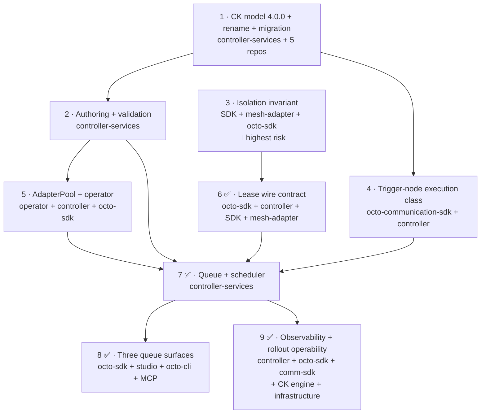

# Shared Adapter Leasing — Implementation Plan

**Epic:** AB#4914 · **Work item:** AB#4924 · **Design:** [`shared-adapter-leasing.md`](shared-adapter-leasing.md)
· **Status:** plan 2.0 (2026-09-14), increment 1 implemented against the reworked design

This breaks the leasing design into increments that each ship and are each verifiable on
their own. It is deliberately written against the **real code**: every file path below was
read, every count below was measured, and the places where the concept does not survive
contact with the code are called out in §13 rather than worked around silently.

Repositories involved, all on `test/0.2-dev`:

| Repo | Role |
|---|---|
| `octo-communication-controller-services` | CK model, lease scheduler, queue, validation, pool hub |
| `octo-sdk` | `Communication.Contracts` hub interfaces + DTOs, `Sdk.ServiceClient` SignalR client |
| `octo-communication-sdk` | adapter host: `AdapterOptions`, `AdapterExecutionService`, trigger-node descriptors |
| `octo-mesh-adapter` | the pool member process: tenant repository, identity, HTTP routes |
| `octo-communication-operator` | pool workload deployment into a platform namespace |
| `octo-sdk` (again, increment 5) | `WorkloadTypeDto.AdapterPool` — the operator cannot route a pool without it (§7.1b) |
| `octo-frontend-refinery-studio` | queue surface #1 |
| `octo-cli` | queue surface #2 |
| `octo-mcp-service` | queue surface #3 |
| `octo-ai-services`, `octo-adapter-loxone` | forced along by the major bump (§3) |
| `octo-construction-kit-engine` + `-mongodb` | the `RenameAssociationRole` migration transform the role rename needs (§3.10) — **must ship first** |
| `octo-construction-kit`, `meshmakers-app`, `demo-energy-iq` | seed/runtime data carrying the renamed `roleId` (§3.9) |
| `meshmakers-infrastructure` | the Dash0 check rules of increment 9 (§11.5) — alerting is Ansible-managed `PrometheusRule` CRDs, not application code |

### What changed between plan 1.0 and 2.0

Plan 1.0 was written while §8 of the concept still had eleven open questions. All of them are
now decided, and four decisions reshaped this plan rather than merely filling a blank:

| Decision | Effect here |
|---|---|
| Q16 + Q18 — rename `Pool` → `DeploymentSite`, shipping **with** leasing | Increment 1 becomes **4.0.0 with a migration**, not the additive 3.36.0 that was built. §3 is new and is the largest single piece of work in the plan. |
| §4a — adapter pools are first-class | New increment 5. Supersedes Q2 and, with it, the old "increment 6 is blocked" note. |
| Q1 — platform namespace, lender as owner reference | Unblocks the operator work and sets its scope: the one-workload-per-tenant-namespace assumption has to break. |
| Q3 + Q17 — two execution classes, declared by the trigger node | New increment 4, in `octo-communication-sdk`, on the critical path of the scheduler. |
| Q5, Q6, Q4 | Fold into increments 1, 6 and 7 as decided; no longer gates. |

Plan 1.0's increment 3 (the isolation invariant) is unchanged and is reproduced here as
increment 3 with its analysis intact — the concept now depends on it explicitly.

---

## 1. Increment overview



Increment 3 has **no dependency on 1, 2, 4 or 5** and should be started in parallel and
early: it is a behaviour-preserving refactor of the adapter fleet, it is the one that can
cause a cross-tenant data incident, and everything else waits on it before it can be enabled.

| # | Ships what | Independently testable? | Observable effect when shipped alone |
|---|---|---|---|
| 1 | CK engine transform, then CK model 4.0.0, `Pool` → `DeploymentSite` + `Manages` → `Hosts`, one migration | yes (CK compile + full suites + a migration run on a copy) | the estate takes one migration; no behaviour changes |
| 2 | `Leased` and `AdapterPool` authorable and validated | yes (unit) | a misconfigured `Leased` adapter is refused at deploy with a named reason |
| 3 | process retains nothing tenant-scoped between executions | partly — see §5.5: the 2-tenant integration form needs a lease | none — single-tenant behaviour identical |
| 4 | trigger nodes declare an execution class, resolved on save | yes (unit) | `ExecutionClass` visible on every pipeline; nothing reads it yet |
| 5 ✅ | pool workloads deploy into a platform namespace, scale within `MinReplicas..MaxReplicas`, and are invisible to the idle watchdog | yes (kind e2e) | a pool runs N members that no tenant can reach yet |
| 6 ✅ | management connection + `Lease`/`Release` verbs | yes (hub tests + a manual lease) | a pool member can be leased by hand |
| 6b ✅ | **the lease carries the borrower's DATABASE credential** — see §8a. Without it the operator's refusal of the cluster's shared data-store credentials to a pool left a member with no authorised way to reach any tenant's data, and the first end-to-end run only worked because the process had inherited a developer's Mongo credentials | yes (unit + a real MongoDB whose borrower password is rotated away from the installation's) | a pool member can execute a pipeline that touches RT entities **in a cluster**, and only for the tenant it was lent |
| 7 ✅ | queue, round-robin, priority, TTL, `Queued` executions; **the lease carries the work** and the member runs it (§9.9 / D4); **the per-tenant kill switch, pulled forward from 9** (§14 / D5) | yes (unit + integration) | the controller queues and schedules, a leased member executes the queued pipeline end to end, and `LeasingEnabled` (default off) stops it per tenant |
| 8 ✅ | queue visible and cancellable in all three surfaces, off one endpoint through one SDK client | yes (vitest + CLI + MCP tests) | the queue is operable |
| 9 ✅ | metrics (the amortisation triple, fairness, queue health, scale-up signals *and* decisions, named refusal reasons, member churn), alert rules in `meshmakers-infrastructure`, and the migration guards §14 wave 2 relies on. Per-tenant enablement already shipped with 7 (D5). **See §11** | yes (unit + mutation) | the rollout is operable: the queue, the rotation and the pool's own sizing are visible, and four of them are alertable |

---

## 2. Increment 1 — CK model 4.0.0 ✅ implemented

**Repo:** `octo-communication-controller-services` ·
**Version:** `System.Communication` 3.35.0 → **4.0.0** (major, with a migration script)

3.36.0 as built by plan 1.0 is **withdrawn**. Its contents were correct; only its version
label was, and the rename plus its migration now ship in the same bump (concept §8, Q18) so
the estate takes one migration instead of two. See §3.6 for why the withdrawn 3.36.0 still
needs a defensive migration entry of its own.

### 2.1 The rename

| File | Change |
|---|---|
| `types/pool.yaml` → `types/deploymentSite.yaml` | `typeId: Pool` → `DeploymentSite` (git mv, so history follows) |
| `types/deployableWorkload.yaml` | `Manages` association `targetCkTypeId` → `${this}/DeploymentSite` |
| `associations/manages.yaml` | **unchanged role id** — annotated, see below |
| `migrations/3.35.0-to-4.0.0.yaml` *(new)* | `ChangeCkType Pool → DeploymentSite`, `NoEntitiesOfType` post-validation at `severity: Error` |
| `migrations/migration-meta.yaml` | `ckModelId` 3.1.1 → 4.0.0; two entry points (§3.6) |

**The association role is renamed too: `Manages` / `ManagedBy` → `Hosts` / `HostedBy`**
(D1, decided 2026-09-14 — it moves with this bump, because deferring it guarantees the second
major migration Q18 set out to avoid).

`associations/manages.yaml` → `associations/hosts.yaml`; `types/deployableWorkload.yaml`
binds `${this}/Hosts`.

**Why `Hosts` / `HostedBy`.** A deployment location does not *manage* anything — the
Communication Operator does — so the old name described the relationship backwards, which is
the same defect as calling the type `Pool`. `Deploys` / `DeployedTo` was rejected for the same
reason on the site side: the site does not deploy either, it is deployed *to*. Hosting is the
relationship that persists once the deployment is over, which is exactly what this edge
records, and `DeploymentSite.Hosts → N workloads` / `Adapter.HostedBy → ZeroOrOne
DeploymentSite` both read correctly. It also keeps the model's dominant convention — active
verb inbound, passive inverse outbound (`Executes`/`ExecutedBy`, `MapsTo`/`MappedAsTarget`,
`SendsDataTo`/`ReceivesDataFrom`) — and stays a minimal cognitive delta from the old pair, so
review diffs remain legible.

🔴 **The rename moves three independent identifiers, with disjoint blast radii.** This is
the thing to understand before reading the numbers in §3.9:

| YAML field | What it generates | Blast radius |
|---|---|---|
| `id: Manages` | the persisted `roleId` in seed/runtime data **and** the generated C# constant `SystemCommunicationCkIds.RtCkManagesRoleId` → `RtCkHostsRoleId` | seed data + C# + **stored data** |
| `inboundName` | GraphQL field `manages`, union type `…_ManagesUnion*` | frontend only |
| `outboundName` | GraphQL field `managedBy`, union type `…_ManagedByUnion*` | frontend only |

Renaming *only* `inboundName`/`outboundName` would have bought most of the readability for a
third of the cost and **no migration at all** — the persisted `associationRoleId` derives from
`id`, not from the display names. That option was considered and rejected: it leaves seed data
saying `roleId: …/Manages` while the navigation says `hosts`, i.e. a hidden alias between the
data and the API, which is a worse comprehension trap than the one being fixed.

### 2.2 The additive elements

| Element | File | Meaning |
|---|---|---|
| `LifecycleMode` `3 Leased` | `enums/lifecycleMode.yaml` | the **borrower's** mode and only ever that. `2 Auto` stays reserved (AB#4984). |
| `PipelineExecutionStatus` `5 Queued` | `enums/pipelineExecutionStatus.yaml` | appended, never inserted — the keys are persisted on every entity. |
| `AdapterSharingMode` (`NotShared` / `Descendants` / `DescendantsAndSiblings`) | `enums/adapterSharingMode.yaml` | on `AdapterPool.SharingMode`. Q10 kept `DescendantsAndSiblings` a distinct mode. |
| `PoolScaleUpPolicy` (`QueueDepthOrWaitSeconds` / `QueueDepth` / `QueueWaitSeconds`) | `enums/poolScaleUpPolicy.yaml` *(new)* | Q14. Queue-driven, never CPU-driven. |
| `PipelineExecutionClass` (`Interactive` / `Batch`) | `enums/pipelineExecutionClass.yaml` *(new)* | Q3 + Q17. Keys ordered so ascending key order == scheduling order. |
| `AdapterPool` type | `types/adapterPool.yaml` *(new)* | §4a. Derives from `DeployableWorkload`; `MinReplicas` / `MaxReplicas` / per-member sizing / scale-up policy / lending scope. |
| `PoolServiceAccount` role | `associations/poolServiceAccount.yaml` *(new)* | the pool's **management** identity. A dedicated role, not a second origin on `PipelineServiceAccount` — see §2.4. |
| `Adapter.LentFromTenantId` + `LentFromPoolRtId` | `attributes/adapterLeasing.yaml`, `types/adapter.yaml` | borrower half. `LentFromAdapterRtId` from 3.36.0 was **renamed** to `LentFromPoolRtId`: it names the pool, not a member. |
| `PipelineExecution.QueuedAt` / `LeaseGrantedAt` / `LeaseReleasedAt` / `LeaseWaitMs` | `attributes/attributes.yaml`, `types/pipelineExecution.yaml` | Q5. Four timestamps, see §2.3. |
| `PipelineExecution.LeasedFromTenantId` / `LeasedFromPoolRtId` / `LeasedOnMemberId` | `attributes/adapterLeasing.yaml` | which pool and which member served it. Values, not an association — see §13.1. |
| `Pipeline.ExecutionClass` | `types/pipeline.yaml` | computed on save, persisted, `isRuntimeState: true`, default `Batch`. |
| `PipelineExecution` index on `QueuedAt` | `types/pipelineExecution.yaml` | the queue read is `(status = Queued) ordered by QueuedAt`; it cannot ride the `StartedAt` index because a queued execution has no `StartedAt`. |

**`StartedAt` relaxed to optional** (Q5), with `LeaseGrantedAt` and `LeaseReleasedAt` added
beside it. The alternatives were both worse: stamping `StartedAt` at enqueue makes it lie for
the whole queue wait and gets the entry reaped, because it is the **age key** of both the
AB#4280 stuck reaper and the AB#4280 orphan resolver; a separate queue entity contradicts
§5's "one execution is one entity". Relaxation is only a *minor* change on its own — it is
riding in 4.0.0 because the rename is what forces the major.

### 2.3 Why four timestamps and not two

`LeaseGrantedAt`..`LeaseReleasedAt` and `StartedAt`..`CompletedAt` are deliberately different
spans. The difference between them is exactly the per-lease warm-up — token, tenant
repository, pipeline definitions — that the pool exists to amortise. Concept §4's central
claim ("irrelevant at ~16 executions/h, prohibitive at energyiq's 4089/h") rests on that
overhead, and keeping both pairs is what makes the claim measurable instead of asserted.

`LeaseReleasedAt` is also a **billing input**, not only a diagnostic: §4b prices a borrower's
consumption as the sum of its lease spans times the pool's per-member sizing. It therefore
has to be stamped on the TTL-expiry and crash paths too, where `CompletedAt` never arrives.

### 2.4 Two modelling decisions worth defending

**The pool's service account is a dedicated role.** Adding `AdapterPool` as a second origin
type on the existing `PipelineServiceAccount` role changes the inverse union view on
`ServiceAccountConfiguration`, and the CK engine then drops `SystemConfigurationInterface`
from the generated GraphQL schema for **every** `Configuration` subtype. That failure is
already documented twice in this model (on the `HelmRepository` link and on
`PipelineServiceAccount` itself); a third instance was not worth the saved file.

**The lending scope moved from `Adapter` to `AdapterPool`.** 3.36.0 put `SharingMode`,
`LendingAllowedTenantIds` and `LendingMaxConcurrentLeasesPerTenant` on `Adapter`. Lending is a
property of the thing that owns processes, and after §4a that is the pool. On `Adapter` two
adapters in one tenant could declare different lending scopes over what is really one set of
processes.

### 2.5 Verification performed

All builds run `-c DebugL -p:BaseOutputPath=<temp>/`, and — per §3.7 — **after
`git clean -xfd` on the model's `bin` and `obj`**, so no stale `ck-system.communication-3.yaml`
could mask the rename. That matters: the same commands on an *incremental* tree reported 0
errors while `RtPool` still resolved.

- CK model, clean: **0 warnings, 0 errors**; the compiled artifact carries `AdapterPool`, `DeploymentSite`, the `Hosts` role and `modelId: System.Communication-4.0.0`.
- `Octo.CommunicationController.sln` (all projects incl. both test projects), clean: **0 warnings, 0 errors**.
- `CommunicationControllerService.Tests`: **917 / 917 passed**, 0 skipped.
- The AB#5187 ownership lint passes (it is a build warning source, and the build is warning-free).
- CK engine, the three changed projects built individually: **0 warnings, 0 errors**.

🔴 **One caveat, stated rather than smoothed over.** The model build above was run with the
`RenameAssociationRole` step temporarily removed, because the CK compiler validates migration
YAML against the schema in the *installed* engine package and that package predates the new
transform (§3.10). So what is proven is: the role rename itself — model, seed data, C# and all
917 tests — is clean, and the **only** thing blocking the full script is the engine release that
has to precede it anyway. The step is present in the committed script.

Two things remain unverifiable locally and must not be reported as done:

- `ckc ValidateVersion` against a real catalog, and an actual migration run against a tenant database (§14, wave 2).
- The `octo-construction-kit-engine-mongodb` override. It fails locally with `CS0115` purely because the restored `Meshmakers.Octo.Runtime.Engine` 999.0.0 package is the stale shared one — the restored assembly provably does not contain the new method, while the freshly packed one does. The base and override signatures are textually identical and `TenantRepository` derives directly from `RuntimeRepositoryBase`. Verifying it end-to-end requires republishing the three engine packages into the shared DebugL feed at `/Users/gerald/RiderProjects/meshmakers/main/nuget`, which would change what the `main` checkout builds against — deliberately not done.

Not yet verified, and it cannot be verified locally: `ckc ValidateVersion` against a real
catalog, and an actual migration run. Both are §3.7.

---

## 3. Increment 1, part two — the bump cascade 🔴

This is the part nobody should be surprised by, so it is measured rather than estimated.
Measurement date 2026-09-14, over the whole `~/RiderProjects/meshmakers/dev` checkout.

### 3.1 Correcting the numbers in the concept — and the scope they apply to

Three different counts of "how many pins are there" are in circulation, and they disagree
because they cover **different scopes**. Stating the scope is the whole point:

| Count | Scope | Status |
|---|---|---|
| 84 files / 82 blueprints (concept §2a) | `dev` checkout, counting *mentions* of `System.Communication` | ❌ wrong — mentions, not pins (85 files mention it, 51 under `Blueprints/`, but most are `ckTypeId:` type references) |
| **65 files / 46 source blueprints** (this plan, §3.2–3.3) | the **`dev` checkout only**, counting real version pins | ✅ what a PR on `test/0.2-dev` actually has to change |
| **203 blocking pins + 7 open-ended** | the **whole estate**, all checkouts | ✅ what the migration ultimately has to reach |

The gap between 65 and 203 is not a contradiction — it is everything outside this checkout:
the `main` checkout's copy of the same repos, repos not cloned into `dev` (`getting-started`
is one; it is absent here, which is why this plan's open-ended list has 5 entries and the
estate-wide one has 7), and the published catalog.

🔴 **The published catalog is immutable history and must not be edited.** The ~70 pins under
`meshmakers.github.io` (and the 10 local mirrors in `dev/.octo/local-catalog/ck-models/v2/s/System.Communication/3/`)
are *published versions*. They must keep saying `Pool` and `Manages` forever — that is what
makes an already-installed tenant reproducible. Only a new version carries the new names.
Anyone "fixing" the cascade by grepping and replacing across the estate will hit these; they
are the one bucket where a hit is correct as it stands.

With that scope fixed, the concept's figures for the `dev` checkout:

| What | Concept says | Actual | Note |
|---|---|---|---|
| Files carrying a `System.Communication` version **pin** | 84 | **65** (61 source + 4 generated) | |
| …of which blueprint files | 82 | **46 source** (10 `blueprint.yaml` + 36 seed-data) | 50 counting the 4 `.octo` artifacts |
| Dependent CK models with their own pin | 2 | **2** ✅ | `System.Ai-3.7.0`, `Loxone-4.3.1` |
| Loxone pinned exactly `[3.31,3.32)` | yes | **yes** ✅ | |

Where 84/82 came from: **85 source YAML files mention the string `System.Communication` at
all**, and 51 of those live under a `Blueprints/` directory. But most of those mentions are
`ckTypeId: System.Communication/Pipeline`-style *type references*, not version pins. Counting
mentions instead of pins overstates the blocking set by 30 %.

### 3.2 The pins, by range

| Range | Source files | Behaviour at 4.0.0 |
|---|---|---|
| `[3.0,4.0)` | 39 | 🔴 blocks |
| `[3.22.0,4.0)` | 14 | 🔴 blocks |
| `[3.18,4.0)` | 1 | 🔴 blocks |
| `[3.31,3.32)` | 1 | 🔴 blocks (Loxone — see §3.4) |
| `[1.0,2.0)` | 1 | already dead (`samples/Blueprints/HelloCommunication`) |
| `[3.6,)` / `[3.12,)` / `[3.13,)` | 5 | ⚠️ open-ended — **silently absorb 4.0.0** |
| **Total** | **61** | 56 block, 5 absorb silently |

The open-ended ranges are the more dangerous half. They will not fail; they will resolve to
4.0.0 and then import runtime data referencing a type called `Pool` and a role called `Manages`
that no longer exist. All five in this checkout are in `demo-energy-iq/data/` — which, note,
**is on branch `main`, not `test/0.2-dev`**, so it is outside the branch this work is being done
on and will not be seen by anyone reviewing the feature branch. Estate-wide there are **7**; the
two not visible here include `getting-started/scripts/simulation-adapter.yaml`, in a repo that
is not cloned into this checkout at all. That is precisely why they are dangerous: they are not
where anyone is looking.

(Three further open-ended ranges in `octo-adapter-loxone` — `DEVELOPMENT.md:357`,
`docs/concepts/ck-model.md:5`, `readme.md:141` — are **documentation prose quoting old ranges**,
not live pins. They go stale rather than break.)

### 3.3 By category, with owners

| # | Category | Source files | What has to happen |
|---|---|---|---|
| A | `blueprint.yaml` → `ckModelDependencies` | 10 | raise to `[4.0,5.0)` **and** bump the `blueprintId` |
| B | blueprint seed-data → runtime-model `dependencies` | 36 | raise to `[4.0,5.0)`; rewrite any `ckTypeId: …/Pool` |
| C | `ckModel.yaml` → `dependencies` | 2 | see §3.4 |
| D | standalone runtime-data YAML applied via octo-cli, **not** packaged | 12 | raise the range; these are easy to miss because no CI touches them |
| E | C# comment carrying a range | 1 | cosmetic (`DefaultConfigurationCreatorService.cs:84`) |

Category A, by repo: `octo-communication-controller-services` 3 (2 service-managed + 1 dead
sample), `octo-construction-kit` 4 (`Samples.Photovoltaics`, `Samples.PipelineBasics`,
`Samples.Simulator.Energy`, `Samples.Simulator.EnergyCommunity`), `octo-office-integration` 1
(`Office.ExcelImport`), `meshmakers-app` 2 (`MeshmakersAccounting`, `…​.Tesla`).

Category B is dominated by `meshmakers-app`: 28 files under `MeshmakersAccounting-1.0.0/seed-data/`
plus 2 under `…​.Tesla-1.0.0/`, then `octo-construction-kit` 5 and `octo-office-integration` 1.

🔴 **Plan 1.0 said "no blueprint bump — the floors are satisfiability floors only". That was
true for a minor bump and is flatly wrong for a major one.** `[3.22.0,4.0)` does not merely
go stale against 4.0.0, it **excludes** it: the blueprint becomes unsatisfiable and fails to
install. Both service-managed blueprints have accordingly been raised to `[4.0,5.0)` and
bumped `1.5.0` → `2.0.0` in this increment, and their seed data now creates a `DeploymentSite`.

### 3.4 The two dependent CK models

| Model | Path | Declares | Required action |
|---|---|---|---|
| `System.Ai-3.7.0` | `octo-ai-services/src/SystemAiCkModel/ConstructionKit/ckModel.yaml` | `System.Communication-[3.0,4.0)` | ✅ **done** — now `System.Ai-4.0.0` with `System.Communication-[4.0,5.0)`; blueprint `System.Ai.Default` 1.1.4 → 2.0.0 |
| `Loxone-4.3.1` | `octo-adapter-loxone/src/AdapterEdgeLoxone.CkModel/ConstructionKit/ckModel.yaml` | `System.Communication-[3.31,3.32)` | 🔴 **major bump to 5.0.0**, range widened to `[4.0,5.0)` |

✅ **`System.Ai` has been bumped to 4.0.0** (`System.Communication-[4.0,5.0)`) — done during §11a.2
part B, because it was the reason a 4.0.0 tenant had no AI types at all. What it looked like before:
the AI service retried and gave up with
*"Dependencies 'System.Communication-[3.36.0]' are unknown construction kit model libraries"* —
note it resolves to the **withdrawn** 3.36.0 of §3.6, so the compiled artifact points at a version
that does not exist either. Consequence beyond this repo: **any frontend schema introspected from a
4.0.0 tenant loses all `SystemAi*` types**, which is a silent, 419-line deletion in
`schema.graphql`. Verified while unblocking that: `System.Ai` has **zero** structural references
into `System.Communication` (its `Pool` strings are its own `SystemAiWorkspaceMode` /
`SystemAiCredentialKind` enum values), so the bump is purely version arithmetic — importing the
compiled `ck-system.ai-3.yaml` with the dependency rewritten to `System.Communication-4.0.0`
installs cleanly and produces a complete schema.

What the bump actually cost, for the next model that has to cross a major: the source generator
versions the generated **namespace** by the model's major, so `…Generated.System.Ai.v3` → `…v4`
touched **54 C# files** in `octo-ai-services` and renamed `AddCkModelSystemAiV3()` → `…V4()`. The
blueprint floor `System.Ai-[3.1.2,4.0)` **excluded** 4.0.0, so `System.Ai.Default` had to go
`1.1.4` → `2.0.0` (renaming `AddBlueprintSystemAiDefaultV1()` → `…V2()`), and its seed's exact
`dependencies:` pin moved too. **No migration file was needed** — nothing in the model changed, so
the engine's no-migrations bridge carried a tenant from 3.7.0 straight to 4.0.0, verified against a
tenant that held 3.7.0. Also measured: this repo's own integration suite had been **123 of 214 red**
on `test/0.2-dev` because `ServiceCollectionFixture` already called `AddCkModelSystemCommunicationV4()`
next to `AddCkModelSystemAiV3()`; it is 215/215 green after the bump. The cascade is mechanical and
the CI of the dependent repo tells you about it immediately — if you let it run.

**Both are major bumps, not minor ones.** `ck-semver-rules.md` classifies "dependency
switched to a new **major** version" as Major — so the cascade does not stop at
System.Communication, it propagates as a wave of majors. Plan 1.0 said `System.Ai` needed "a
minor bump"; that is wrong.

The consequences chain one level further: `System.Ai` going to 4.0.0 breaks
`octo-ai-services/src/SystemAiCkModel/Blueprints/System.Ai.Default/blueprint.yaml`, which
pins `System.Ai-[3.1.2,4.0)` — it too must be raised and bumped. Its
`Blueprints/System.Ai.Default/seed-data/entities.yaml` carries the dependency pin as well.
There is also a NuGet-level coupling that fails in the same breath:
`SystemAiCkModel.csproj:22` references `Meshmakers.Octo.ConstructionKit.Models.System.Communication`.

**Loxone is the frozen-pin trap and it must move with the bump, not after it.** The pin was
narrowed to exactly `[3.31,3.32)` by `499e55d "AB#5196 Fix: Pin Loxone-4.3.1 to
System.Communication 3.31.0 for prod-1"`, reverting an earlier widening. It resolves to
3.31.0 today and is therefore *unaffected* by a 3.x bump — which is precisely what makes it
dangerous here. `CkModelId` is name + version and `CkModelMigrationService` refuses to
migrate across model names, so **one tenant holds exactly one version of `System.Communication`**.
A prod-1 tenant running Loxone therefore cannot take 4.0.0 at all while the pin stands: the
install compares versions exactly and finds 3.31.0 against 4.0.0. That is the same failure as
AB#4696 / AB#4999 / AB#5196, for the third and fourth time.

Loxone's only structural coupling is one line —
`ConstructionKit/attributes/control.yaml`, `valueCkRecordId: ${System.Communication}/DataPoint`
— and `DataPoint` is **not** renamed. So the widening is safe in content; it is the version
arithmetic, not the model content, that blocks. `octo-adapter-loxone` contains no blueprints
at all, so there is no blueprint half to chase.

⚠️ Verify the "one version per model name per tenant" conclusion on a test tenant before the
train. It is read off `CkModelId` and `CkModelMigrationService.MigrateAsync`, not off a test.

### 3.5 The C# cascade — it is the namespace, not the type name

The interesting discovery of this increment. Renaming `Pool` breaks **26** C# files across
three repos (19 controller, 4 operator, 3 `octo-sdk`). Bumping the **major** breaks **123**,
because the source generator versions the generated namespace by major:

```
Meshmakers.Octo.ConstructionKit.Models.System.Communication.Generated.System.Communication.v3
                                                                                          ^^ → v4
```

| Surface | Files | Repos |
|---|---|---|
| `using …Generated.System.Communication.v3` | **123** | 122 controller-services, 1 `octo-ai-services` |
| `RtPool` → `RtDeploymentSite` | 26 | 19 controller-services, 4 operator, 3 `octo-sdk` |
| `SystemCommunicationCkIds.RtCkPoolTypeId` → `…RtCkDeploymentSiteTypeId` | 11 call sites | controller-services |
| `AddCkModelSystemCommunicationV3()` → `…V4()` | 3 | controller-services (`Program.cs` + 2 test fixtures) |
| `AddBlueprintSystemCommunication{Release,MainLatest}V1()` → `…V2()` | 1 | `Program.cs` — the blueprint DI extension is named by the blueprint's **major**, so the `1.5.0 → 2.0.0` bump renames it |
| `CommunicationCkTypeIds.Pool = "System.Communication/Pool"` | 1 | `octo-sdk` — a **string constant**, so it compiles fine and is simply wrong at runtime |

All of the above except the `octo-sdk` and operator halves has been applied in this pass and
the repo builds and tests green. The `octo-sdk` / operator halves are left for their own
increments because they need NuGet propagation and each repo's `CLAUDE.md` read first.

🔴 **`CommunicationCkTypeIds.Pool` is the one that will not announce itself.** Everything else
is a compile error; this is a `const string` whose *value* is stale. Grep for it explicitly.

**The nullable-`StartedAt` ripple is smaller than plan 1.0 claimed.** Plan 1.0 said "~16
sites"; the compiler says **11 errors in 5 files**, because most of the 16 reads are already
null-tolerant. The five, each fixed as a deliberate semantic decision rather than a cast:

| File | Decision |
|---|---|
| `Models/PipelineExecutionDto.cs` | property becomes `DateTime?` — the DTO must be able to say "not started" |
| `Services/PipelineStatisticsFolder.cs` | a `Queued` execution is **skipped**, not folded — otherwise it lands in a default-timestamp bucket and inflates that hour |
| `Repository/CommunicationRepository.cs` (stuck-execution failer) | no start time ⇒ `DurationMs = 0`, never a duration measured from a substituted timestamp |
| `TenantApi/v1/Controllers/PipelineDebugController.cs` (×2) | fall back to `QueuedAt` — the moment the entry became visible is what the history should order by |
| `tests/…/StatisticsTests.cs` | `Nullable.Compare` — ordering unchanged, just spelled explicitly |

### 3.6 🔴 The withdrawn 3.36.0 leaves a hole in the migration chain

`CkModelMigrationService.FindBridgedMigrationPathAsync` collects candidate entry points as
"every `fromVersion` **greater than** the installed version" and bridges the start gap with a
no-op. So a tenant on any 3.x below 3.35.0 bridges straight to the `3.35.0 → 4.0.0` entry and
runs the rename — good, and it is also why that entry hangs off 3.35.0 rather than extending
the 3.1.1 chain, which would drag every modern tenant back through four obsolete DataFlow
scripts.

But a tenant that installed the withdrawn **3.36.0** sits *above* every `fromVersion` in the
chain. For it the bridging finds no candidate at all, falls through to the final "post-chain
schema-only bridge", and **upgrades the schema while silently skipping the rename**. The
tenant is then left holding `Pool` entities of a type the model no longer defines, with no
error anywhere.

3.36.0 is on no cluster, but it **is** in `dev/.octo/local-catalog/ck-models/v2/s/System.Communication/3/`,
so any local dev tenant can be at it. `migration-meta.yaml` therefore carries a second entry
`3.36.0 → 4.0.0` pointing at the same (idempotent) script. It is documented in the file as
deletable once no environment can be at 3.36.0.

This is the same shape as the frozen-pin trap: a version that resolves correctly right up to
the moment it does not, and reports nothing when it does not.

### 3.7 🔴 A stale build artifact makes the rename look free

Found the hard way. The CK output directory holds **one compiled model file per major**:

```
bin/DebugL/net10.0/octo-ck-libraries/SystemCommunicationCkModel/out/
    ck-system.communication-3.yaml     ← left over from the 3.36.0 build
    ck-system.communication-4.yaml     ← the new one
```

The source generator emits `Rt*` classes for **every** file it finds there. With both present
it emits `RtPool` *and* `RtDeploymentSite`, the whole repo compiles clean, all 917 tests pass
— and `RtPool` now refers to a type that the installed model does not define. The failure
surfaces on a tenant at runtime instead of at build time.

Deleting `bin/DebugL` and `obj/DebugL` and rebuilding turned "0 errors" into **506 errors**,
which is the honest number.

**Consequences for the plan:** the CI step that publishes this model must build from a clean
output directory, and the increment-1 PR must be validated after `git clean -xfd` on the model
project, not incrementally. Nobody should trust a green local build of a major CK bump.

### 3.9 The role rename — measured blast radius

Measured 2026-09-14 across the whole checkout, the same way §3.1 was.

**20 source files, 38 occurrences.** Smaller than feared, and concentrated in three places:

| Repo | Category | Files | Occurrences |
|---|---|---|---|
| `octo-communication-controller-services` | CK model (`associations/hosts.yaml` + `types/deployableWorkload.yaml`) | 2 | 4 |
| `octo-communication-controller-services` | blueprint seed-data `roleId:` | 2 | 2 |
| `octo-communication-controller-services` | C# — **`CommunicationRepository.cs` only** | 1 | 4 |
| `octo-construction-kit` | blueprint seed-data (`Samples.Photovoltaics/seed-data/adapters/modbus-edge.yaml`) | 1 | 1 |
| `meshmakers-app` | blueprint seed-data (`MeshmakersAccounting-1.0.0/seed-data/configurations/adapter-and-app.yaml`) | 1 | 2 |
| `demo-energy-iq` | runtime-data YAML, octo-cli applied (`data/_general/rt-adapters-loxone.yaml`) | 1 | 1 |
| `octo-frontend-refinery-studio` | hand-written `.graphql` queries | 5 | 6 |
| `octo-frontend-refinery-studio` | hand-written TS components | 6 | 17 |
| `octo-frontend-refinery-studio` | TS spec | 1 | 1 |
| **Total source** | | **20** | **38** |

Plus **59 generated / published artifacts that must NOT be hand-edited** — 10 published CK
catalog JSONs, 1 published blueprint seed copy, 11 frontend codegen outputs across 5 repos, 6
generated CK doc pages, 30 Docusaurus build outputs, 1 ng-packagr cache.

Four results are worth stating explicitly because they contradict what the earlier plan
assumed:

- **The operator does not read this association at all.** It receives workloads *pushed* over `/operatorHub`; the controller resolves the edge server-side in `CommunicationRepository.GetWorkloadsForPoolAsync` and fans the results out. Its only `Manages` mentions are documentation prose. Plan 1.0 listed "the operator's association reads" as a reason not to rename — that reason does not exist.
- **`octo-cli` and the MCP server are zero.** Both handle associations generically, with the role id as a runtime parameter. Their exposure is in the *data* they apply, which is the `demo-energy-iq` row above.
- **C# is one file.** `SystemCommunicationCkIds` is source-generated, so the rename produces exactly 4 compile errors, all in `CommunicationRepository.cs` (lines 43, 72, 232, 1180). ~35 other files match `Manages` in doc-comment prose ("Manages the …") and must be left alone.
- **C# tests are zero.** No test references the role id; `RtEntityCreator` never wires the edge.

`meshmakers-app`, `octo-frontend-libraries` and `octo-office-integration` have **no hand-written
consumers** — their hits are 100 % codegen. Only the Studio actually queries the association.

⚠️ Two pre-existing defects surface on the exact lines this rename touches. All four Studio
`managedBy(…)` queries still filter `ckTypeIds: ["System.Communication/Pool"]`, and the
`octo-office-integration` / `octo-documentation` schema dumps are from an older model
generation entirely (they still contain `SystemCommunicationEdgeAdapter`). Both are stale
*before* this change and are not fixed by it.

### 3.10 ✅ The role rename needed a CK engine change that did not exist — added

**This is the finding that should have changed the D1 decision, and it was not knowable from
the design.** The transform has since been implemented and committed (`octo-construction-kit-engine`
`232220a`, `-mongodb` `cb37496`); it is **not released yet**, which is what the sequencing note at
the end of this section is about.

Renaming an association role is not migratable with the engine as it stands. The seven
transform types (`ChangeCkType`, `SetValue`, `RenameAttribute`, `CopyAttribute`,
`DeleteAttribute`, `MapValue`, `WrapScalarInRecord` — `ck-migration.schema.json`) all operate on
entities and their attributes. **None of them touches an association role id**, and
`RtAssociation.AssociationRoleId` is persisted on **every stored edge**.

Without a migration the rename orphans every deployment-site↔workload edge in every tenant —
and does so *silently*: the model no longer defines the role the data refers to, the navigation
returns nothing, and nothing raises an error anywhere. Every adapter in the estate would simply
stop resolving its deployment site.

What *is* already handled, verified in the code rather than assumed: `ChangeCkType` rewrites the
stored `originCkTypeId` / `targetCkTypeId` on edges via
`TenantRepository.UpdateAssociationCkTypeIdsForMigrationAsync`, so the **type** half of this
migration was already complete. There is no equivalent for the role id.

**A new transform was therefore added to the CK engine** — `RenameAssociationRole`, mirroring the
existing ckTypeId rewrite:

| Repo | File | Change |
|---|---|---|
| `octo-construction-kit-engine` | `ConstructionKit.Contracts/Serialization/Schema/ck-migration.schema.json` | enum value + `sourceAssociationRoleId` / `targetAssociationRoleId` |
| `octo-construction-kit-engine` | `…/DataTransferObjects/CkMigrationMetaDto.cs` | enum value + two DTO properties |
| `octo-construction-kit-engine` | `Runtime.Contracts/Repositories/IRuntimeRepository.cs` | `UpdateAssociationRoleIdsForMigrationAsync` |
| `octo-construction-kit-engine` | `Runtime.Engine/Repositories/RuntimeRepositoryBase.cs` | virtual `NotSupportedException` default |
| `octo-construction-kit-engine` | `Runtime.Engine/CkModelMigrations/CkModelMigrationService.cs` | dispatch + `ExecuteRenameAssociationRoleAsync` |
| `octo-construction-kit-engine` | `docs/ck-model-migrations.md` | the new transform documented |
| `octo-construction-kit-engine-mongodb` | `…/MongoDb/TenantRepository.cs` | the `UpdateMany` override |

Design notes that matter: the step takes **no `target`** (it rewrites the association
collection, not entities of one CK type), it runs **outside the step transaction** — the same
treatment the association half of `ChangeCkType` already gets, because wrapping a rewrite of
90K+ association documents in a transaction risks MongoDB's oplog entry size limit — and it is
**idempotent**, matching only rows that still carry the old role id.

Associations live in exactly **one** dedicated collection; the `_associations` / `$associations`
names in the query pipelines are `$lookup` aliases, not a second copy. A single `UpdateMany` is
therefore a complete rewrite, with no embedded duplicate to keep in sync. Verified before
writing the helper.

🔴 **Sequencing consequence for the plan.** Increment 1 now spans an extra repo and an extra
train, in a hard order:

```
octo-construction-kit-engine (+ -mongodb)  →  core-libs train  →  System.Communication 4.0.0
```

The CK compiler validates migration YAML against the schema embedded in the **installed**
`Meshmakers.Octo.ConstructionKit.Contracts` package. Until the engine change is published, the
model does not compile at all — the exact error is
`Schema validation failed at '/steps/1/transform/type' … Value: "RenameAssociationRole"`.
This is an ordering fact, not a defect, but it means the engine change cannot ride along in the
same PR as the model.

**If that prerequisite is unwelcome**, the fallback is the `inboundName`/`outboundName`-only
rename described in §2.1: it needs no engine change, no migration and no seed-data edit,
because nothing persisted derives from the display names. It buys the GraphQL and navigation
readability and leaves `roleId: …/Manages` in the data as a hidden alias.

### 3.8 Not in scope, and deliberately so

- **The `CommunicationPool` CRD is not renamed.** Its Kind is a hardcoded string literal in `V1CommunicationPoolEntity.cs` and its schema ships from `octo-helm-core/src/octo-mesh-crds`; the link to the CK entity is by **RtId**, not by name. Renaming it would require recreating every CR plus RBAC and webhook config, for no functional gain. Same for the Helm value names `operator.autoManagePools` / `poolNamespace` / `defaultPoolName`, which are a breaking chart change for every installation.
- **`rtWellKnownName: CommunicationPool` on the seeded entity stays.** It is identity, not display text: the service-managed blueprint re-applies against it, and renaming it would create a *second* deployment site on every provisioned tenant and orphan the adapters attached to the first.
- **Documentation follows separately.** 66 genuine markdown files in `octo-documentation` (45 EN + 28 DE, ~15 of them generated from the CK model or CLI metadata), including the doc folder `docs/technologyGuide/communication/pools/` whose URL would need a redirect.
- **The public REST route `{tenantId}/v1/pool`** comes from `[controller]` on `PoolController`. If the C# class is ever renamed, pin `[Route("pool")]` explicitly or accept a breaking API change. The same applies to the `octo-cli` commands `GetPools` / `DeployPool` / `UndeployPool` and the MCP tools `get_pools` / `undeploy_pool`, all user-facing.
- **The GraphQL type renames itself.** `SystemCommunicationPool` is derived from the CkTypeId, so publishing 4.0.0 breaks ~66 frontend files across `octo-frontend-refinery-studio` (59), `octo-frontend-libraries` (5) and `meshmakers-app` (2) **without anyone editing the frontend**. Codegen must be re-run in the same train. This is the largest downstream surface in the whole rename and it is invisible from this repo.
  🔴 **Correction after doing it (§11a.2a):** "codegen must be re-run" understates the coupling.
  `octo-frontend-libraries` is not a parallel item, it is a **prerequisite** — the Studio's codegen
  imports its base types from `@meshmakers/octo-services`, and the library's `dist/` (not its
  sources) is what the Studio compiles against, so the library must be refreshed *and rebuilt*
  before the Studio compiles at all. Both repos must also be introspected from the **same** tenant.
  `meshmakers-app` (2 files) is untouched so far and will break the same way.

---

## 4. Increment 2 — authoring and validation (no runtime yet) ✅ implemented

**Repo:** `octo-communication-controller-services`. Ships alone: `Leased` and `AdapterPool`
become *configurable and validated* states whose deploy is refused with an explicit "leasing
runtime not available" reason, so nothing can be half-enabled by accident.

### 4.1 Lending scope resolver

New `Services/TenantLendingScopeResolver.cs` + `ITenantLendingScopeResolver`, singleton.

```csharp
Task<bool> MayLendAsync(string lenderTenantId, string borrowerTenantId, RtAdapterPool pool);
Task<IReadOnlyCollection<string>> ResolveLendableTenantsAsync(string lenderTenantId, RtAdapterPool pool);
```

🔴 **It does not call `GET {tenantId}/v1/tenants/descendants`.** See §13.3 — the controller
has no `Sdk.ServiceClient` reference and a background scheduler has no caller token to
forward. It re-implements the same breadth-first walk in process over `ISystemContext` /
`ITenantContext.GetDirectChildTenantsAsync(session)` + `TryGetChildTenantContextAsync`,
copying the AB#5151 rules **verbatim**: a `visited` set seeded with the root (cycle guard),
and a child whose context cannot be resolved is listed but its subtree is not walked.
Reference implementation to mirror: `octo-asset-repo-services/src/AssetRepositoryServices/
TenantApi/v1/Controllers/TenantsController.cs`, `GetDescendants()`.

Sibling mode resolves the lender tenant's parent first, then that parent's direct children
minus the lender. Direction is fixed by the tree; `LendingAllowedTenantIds` intersects the
result and can never widen it.

Cache the resolved set behind a short TTL (the `ILifecycleConfigurationService` 30 s pattern);
the walk touches every descendant's admin session and must not run per work item.

Tests (`Services/TenantLendingScopeResolverTests`): parent→child, parent→grandchild,
sibling→sibling only in `DescendantsAndSiblings`, child→parent refused, `NotShared` refuses
everything, allow-list intersects and never widens, registry cycle terminates, unresolvable
child listed but not walked, TTL cache invalidation.

### 4.2 Deploy validation

`Services/PoolService.cs` → `EnsureWorkloadIsHelmDeployableAsync`, next to the AB#4984
`LifecycleMode` block at line ~535:

- `LifecycleMode == Leased` on a non-`RtAdapter` → reject (`WorkloadOnDemandNotSupportedForType` sibling).
- `LifecycleMode == Leased` and `!OnDemandCapable` → reject with the blocking reasons (concept §2).
- `LifecycleMode == Leased` with only one of `LentFromTenantId` / `LentFromPoolRtId` → reject; they are a pair.
- `LifecycleMode == Leased` whose pool does not lend to this tenant (resolver) → reject naming both tenants.
- `LifecycleMode != Leased` with `LentFrom*` set → reject (a value that does nothing is worse than an error).
- `LifecycleMode == Leased` on an `AdapterPool` → reject. A pool is not itself leased; see §13.2.
- `AdapterPool` with `MinReplicas > MaxReplicas`, or `MaxReplicas < 1` → reject.
- `AdapterPool` with `SharingMode != NotShared` and `!OnDemandCapable` → reject; a lease can only be handed to a wake-capable process.
- `LendingMaxConcurrentLeasesPerTenant <= 0` when present → reject.
- Resource strings that Kubernetes cannot parse → reject at authoring time, not at helm time.

New `PoolServiceException` factory methods, following the existing naming.

`Services/AdapterService.cs` → the reverse direction, next to the AB#4984 pipeline gate in
`DeployPipelineAsync` / `DeployDataFlowAsync`: deploying a **process-bound** trigger to a
`Leased` adapter is refused, exactly as it is for `OnDemand`
(`Services/OnDemandCapabilityService` already classifies this; reuse it, do not duplicate
the trigger list).

Until increment 7 lands, `DeployWorkloadAsync` on a `Leased` adapter or an `AdapterPool`
additionally refuses with "the leasing runtime is not available in this release" — explicit
beats a workload that deploys and then never executes.

### 4.3 Read surface

- `TenantApi/v1/Controllers/AdapterPoolController.cs` — CRUD over `AdapterPool`, mirroring `PoolController`'s shape.
- `AdapterController`: `GET {tenantId}/v1/adapter/{adapterRtId}/lending` → the resolved lendable tenant list + effective mode + cap, `TenantCommunicationApiReadOnlyPolicy`. Mirrors the `serviceAccount/health` shape (AB#5112) so the surfaces have one pattern.
- CLAUDE.md section.

**Tests:** `Services/PoolServiceTests/DeployWorkloadLeasingValidationTests`,
`Services/AdapterServiceTests/DeployPipelineLeasedGateTests`,
`Controllers/AdapterControllerLendingTests`, `Controllers/AdapterPoolControllerTests`.

### 4.4 What was built, and the one thing copying `GetDescendants` verbatim gets wrong

| Piece | Where |
|---|---|
| `ITenantLendingScopeResolver` + `LendingScope` | `Services/ITenantLendingScopeResolver.cs` |
| `TenantLendingScopeResolver` (in-process BFS, 30 s cache) | `Services/TenantLendingScopeResolver.cs` |
| 10 deploy guards + 9 exception factories | `Services/PoolService.cs`, `Services/PoolServiceException.cs` |
| Cross-tenant pool read | `CommunicationRepository.TryGetAdapterPoolLendingScopeAsync` |
| `GET {tenantId}/v1/adapter/lending` + `AdapterLendingScopeDto` | `TenantApi/v1/Controllers/AdapterController.cs`, `Models/` |

🔴 **`GetDescendants`'s cycle guard is not sufficient for an authorization decision.** The walk
is copied verbatim, as planned — but its `visited` set only stops the walk from *looping*. It does
**not** stop an ancestor from appearing in the result: in a registry where parent `P` lists child
`C` and a corrupted record also lists `P` as a child of `C`, the walk starting at `C` adds `P`,
because `P` was never visited. `GetDescendants` can tolerate that — it produces a listing. Here the
same set decides whether one tenant may execute work **inside** another, so a registry cycle would
become a privilege escalation upwards.

The resolver therefore subtracts the lender's own ancestor chain, computed by walking
`ParentTenantId` upwards — a path independent of the child records a cycle corrupts. That is what
turns "lending never flows upwards" from documentation into an enforced invariant, and
`ARegistryCycleCannotMakeAnAncestorBorrowable` is the test that holds it: deleting the subtraction
fails that test **and no other**.

Two smaller decisions worth recording: an unresolvable lender resolves to *nobody* rather than to a
wider scope (concept §6, "parent tenant deleted while lending"), and a tenant with no parent has **no
siblings** — treating "every other root" as a sibling set would make every unparented tenant lend to
every other one, erasing the boundary the tenant tree exists to draw.

---

---

## 5. Increment 3 — the isolation invariant 🔴 ✅ implemented

**Repos:** `octo-communication-sdk`, `octo-mesh-adapter`. **Not** `octo-sdk` — see §5.6.

> **This is the highest-risk increment in the whole feature. A defect here is not a bug, it
> is a cross-tenant data incident.** It is listed third but should be *started first*, and it
> must ship and bake as a behaviour-preserving refactor **before** any lease is ever granted.

Unchanged from plan 1.0. The concept now depends on it explicitly (§4, "The isolation
invariant"), and §4's three bullet points are answered here — one of them by correcting it.

### 5.1 What actually has to change

The concept is right that "the node layer is already prepared" — `MeshContextCreatorService`
resolves its repository from `pipelineRegistration.TenantId`, `PipelineRegistryService` is
already keyed by `(tenantId, rtEntityId)`, and every `CallerBinding` lookup takes a `tenantId`
parameter. The binding sits above them, and this is the **complete** inventory of
process-global tenant reads found in the dev checkout:

| # | File | Line | What it binds |
|---|---|---|---|
| 1 | `octo-communication-sdk/src/Sdk.Adapters/AdapterOptions.cs` | 15, 44 | the property itself, defaulted to `"meshTest"` |
| 2 | `octo-communication-sdk/src/Sdk.Adapters/AdapterBuilder.cs` | 158 | `AdapterHubClientOptions.TenantId` |
| 3 | `octo-communication-sdk/src/Sdk.Common.Web/Sockets/WebAdapterBuilder.cs` | 112 | same, web host |
| 4 | `octo-communication-sdk/src/Sdk.Adapters/ConfigureAdapterAuthenticatorOptions.cs` | 48 | `acr_values=tenant:{TenantId}` on the adapter's own token (AB#5072) |
| 5 | `octo-communication-sdk/src/Sdk.Adapters/AdapterExecutionService.cs` | 124, 343, 503, 598, 643 | foreign-tenant callback filter, register/unregister, shutdown |
| 6 | `octo-sdk/src/Sdk.ServiceClient/SignalRClient.cs` | 477–482 | **the hub URI itself**: `{endpoint}/{TenantId}/adapterHub`, and it throws when the tenant is blank |
| 7 | `octo-mesh-adapter/src/MeshAdapter.Sdk/Configuration/DependencyInjection/ServiceCollectionExtensions.cs` | 160 | `CommunicationServiceClientOptions.TenantId` (the `DeployPipeline@1` node's client) |
| 8 | `octo-mesh-adapter/src/MeshAdapter.Sdk/Services/HttpRequests/HttpRequestService.cs` | 321, 455 | route tenant check and the `/{tenant}` route prefix |
| 9 | `octo-mesh-adapter/src/MeshAdapter.Sdk/Services/ServiceAccountTokenService.cs` | 713 | own-tenant fallback; its token cache at line 151 is already keyed `(TenantId, ClientId)` |

Plus two singletons that hold tenant-derived *values* rather than the tenant id:

- `IServiceClientAccessToken` (registered in `AdapterBuilder`, written by `AdapterAccessTokenService`) — one token, one tenant, read by the SignalR client on **every reconnect**.
- `ICkCacheService` — the CK model cache; keyed by tenant, so it is isolation-safe, but it is loaded per tenant and grows with every leased tenant (see §13.4).

### 5.2 Shape of the change

1. **Delete `AdapterOptions.TenantId`.** Not deprecate, not ignore — delete, so every one of
   the nine sites above becomes a compile error and is dealt with deliberately. This is the
   concept's own requirement and it is the only mechanism that actually works: as long as the
   property exists, a future node can read it and get a plausible wrong answer.
2. Introduce **`IAdapterTenantScope`** in `Sdk.Adapters`: the tenant of the *current* lease,
   plus `IsPoolMember`. For a dedicated adapter it is set once at startup from a new
   `AdapterOptions.DedicatedTenantId` (name it differently on purpose — a property called
   `TenantId` invites the old assumption back); for a pool member it is set by the lease and
   cleared by the release.
3. 🔴 **Corrected during increment 6.** The method is `SignalRClient.BuildServiceUri()`, not
   `GetHubUri()`, and it is **already `protected virtual`** with a doc comment inviting exactly
   this override ("Override in subclasses to customize URL construction (e.g., for non-tenant-scoped
   hubs)") — `OperatorHubClient` has overridden it for the tenant-free `/operatorHub` since AB#5059.
   So `octo-sdk`'s core needed no tenant-free variant at all: `AdapterPoolHubClient` overrides
   `BuildServiceUri` and the dedicated path keeps today's URI unchanged.
4. **Per-lease scope**: a lease opens a DI scope; everything tenant-derived resolves from it.
   The token holder, the `HttpRequestService` route prefix and the communication service
   client all move from singleton to scoped.
5. On release: dispose the scope, clear the token holder, and unload the tenant's CK cache
   entry (`ICkCacheService.Unload(tenantId)` — `MeshAdapterService` already does exactly this
   on `CkModelChanged`, so the mechanism exists).

### 5.3 How it is verified — concretely

A defect here is silent by nature, so verification cannot rest on review.

1. **Compiler.** The property is gone. `grep -rn "AdapterOptions"` across all adapter repos
   must show no `TenantId` read. A source-level guard test pins this the way
   `OperatorHubAuthorizationWiringTests` pins the `Program.cs` filter registration: read the
   `AdapterOptions.cs` source at test time and assert no member named `TenantId`.
2. **DI sweep test.** Enumerate the built `IServiceCollection` of the mesh adapter host and
   assert that no `ServiceLifetime.Singleton` registration's implementation type appears on
   a maintained **allow-list** of types cleared as tenant-free. A new singleton therefore
   fails the build until somebody has looked at it. This is the test that catches the
   regression *nobody is thinking about* six months from now.
3. **Two-tenant interleave (the core test).** Integration test, real MongoDB via
   Testcontainers, two tenants A and B whose databases contain the *same* CK type with
   *different* marker values. Lease A → run a pipeline that reads the marker → release →
   lease B → run the same pipeline → assert B's marker, and then the reverse order. Repeat
   with A and B swapped and with A leased twice in a row. Assert on the **pipeline output**,
   not on internal state — a cache that leaks shows up exactly here.
4. **Poison canary.** One tenant's database holds an entity whose value must never appear in
   another tenant's execution output. Every interleave assertion also asserts the canary is
   absent. Cheap, and it fails loudly on a leak nobody predicted.
5. **Randomised interleavings.** N ≥ 200 random `(tenant, pipeline)` sequences over M ≥ 3
   tenants, each execution asserting it saw only its own tenant's data. Run repeatedly in CI;
   a race that shows up once in fifty leases is exactly the failure mode of a shared process.
6. **Post-release state assertion.** After `Release`: `ICkCacheService.IsTenantLoaded(prev)`
   is false, the `IServiceClientAccessToken` holder is empty, the per-lease DI scope is
   disposed, and `PipelineRegistryService` holds no registration for the released tenant.
7. **Log-target assertion**, using the existing pattern from
   `DeployWorkloadAsync_NeverWritesTheClientSecretToAnyLogTarget`: reconfigure NLog to a
   `MemoryTarget`, run an interleave, assert the **rendered** output of tenant B's execution
   contains no occurrence of tenant A's id.
8. **Identity assertion.** Assert the token presented during B's lease carries
   `tenant_id=B` — not merely that a token exists. The AB#5077 failure mode (a token without
   `acr_values` silently issued for the system tenant) is a 403 if you are lucky and a
   cross-tenant read if you are not.
9. **Staged rollout.** Ship this increment with `IsPoolMember` always false, i.e. the entire
   estate keeps running one tenant per process through the new abstraction. Bake one release.
   The refactor is then proven by the fleet before a single lease is granted.

### 5.4 What was actually built

| Change | Where |
|---|---|
| **`AdapterOptions.TenantId` deleted** | `octo-communication-sdk/src/Sdk.Adapters/AdapterOptions.cs` |
| `AdapterOptions.DedicatedTenantId` added in its place | same file |
| `IAdapterTenantScope` + `AdapterTenantScope` | `octo-communication-sdk/src/Sdk.Pipeline/Services/` |
| The tenant entered per execution | `EtlDataOrchestrator.ExecutePipelineAsync` |
| `ConfigureLegacyAdapterTenantId` (one-release deprecation of `OCTO_ADAPTER__TENANTID`) | `octo-communication-sdk/src/Sdk.Adapters/` |
| 6 call sites moved to `DedicatedTenantId` | `AdapterBuilder`, `WebAdapterBuilder`, `ConfigureAdapterAuthenticatorOptions`, `AdapterAccessTokenService`, `AdapterExecutionService` (×5 reads) |
| 4 call sites moved to `DedicatedTenantId` | `octo-mesh-adapter`: `ServiceAccountTokenService`, `HttpRequestService` (×2), `ServiceCollectionExtensions` |
| 17 test sites updated by the compiler | 9 in `octo-communication-sdk`, 8 in `octo-mesh-adapter` |

**The scope is entered at one chokepoint, not at every call site.** `EtlDataOrchestrator` already
created a DI scope per execution and already had `etlContext.TenantId` in hand; that is where the
tenant is entered and it is the only place. Every pipeline execution in the estate passes through
it, so the mechanism is **live from day one** rather than dormant until leasing arrives — which is
the entire point of baking increment 3 for a release. When leasing lands, only the *value* differs
between consecutive executions; this site does not change.

Two design decisions worth defending:

- **`AsyncLocal` on a singleton, not a scoped DI service.** Executions run concurrently in one
  process and a DI scope does not flow across an async call chain — the tenant of an execution must.
  An `AsyncLocal` flows into every continuation of the execution that set it and into nothing else,
  which is exactly the required shape. It is an **instance** field, not static: a static one would
  couple two adapter hosts sharing a process and would couple otherwise independent tests.
- **`IsPoolMember` is hard-coded `false` and is not bindable.** A flag that could flip it by
  environment variable would defeat the point of shipping a refactor for the fleet to bake.

⚠️ The orchestrator resolves the scope with `GetService`, not `GetRequiredService`, so adapter repos
that do not register it (the samples, and any adapter host not built on `AdapterBuilder`) keep
working unchanged. **That tolerance must be removed before the first lease**: on a pool member a
missing scope means every execution falls back to no tenant at all, and the failure would be a
confusing null rather than a loud one.

### 5.5 🔴 Which verification mechanisms exist — and which cannot exist yet

**§5.3's list is internally inconsistent, and that only became visible while building it.** Item 9
requires shipping with `IsPoolMember` always false so the fleet bakes the refactor before any lease
exists. Items 3–8 all require **one process to serve two tenants** — which is precisely what a lease
is. Both cannot be true in the same increment.

The resolution: increment 3's exit criterion is the fleet baking a behaviour-preserving refactor;
the full interleave suite is the exit criterion for **enabling leasing in increment 6**, and it is
listed there, not here. What was built now is everything that can be built now.

| # | Mechanism | Status |
|---|---|---|
| 1 | Compiler / source guard | ✅ `AdapterOptionsTenantIdRemovalTests` — reflection over all members incl. non-public, static and inherited, so a re-added `TenantId` fails by any route |
| 2 | DI sweep over singletons against a cleared allow-list | ✅ `SingletonTenantFreedomSweepTests` — **SDK singletons only**, see the caveat below |
| 3 | Two-tenant interleave asserting on **pipeline output**, real MongoDB | ✅ **delivered in increment 6** — `octo-mesh-adapter` `LeasedTenantIsolationTests.ConsecutiveLeasesEachSeeOnlyTheirOwnTenantsData`, over two real tenant databases. The increment-3 scope-level form stays as the concurrency probe |
| 4 | Poison canary | ✅ **delivered in increment 6** — `ThePoisonCanaryNeverCrossesATenantBoundary`, a value seeded only into tenant A's database |
| 5 | Randomised interleavings | ✅ at scope level. `RandomisedInterleavingsHoldOverManyRuns` — 200 executions over 4 tenants |
| 6 | Post-release state assertion (CK cache unloaded, token holder empty, scope disposed) | ✅ `AfterAReleaseTheProcessRetainsNothingOfTheReleasedTenant` — plus "no registration left behind", which needed the work item to actually register one first (see §8) |
| 7 | Log-target assertion (tenant B's rendered log contains no tenant A id) | ✅ `TenantBsRenderedExecutionLogNeverNamesTenantA` |
| 8 | Identity assertion (`tenant_id=B` on B's token) | ✅ `TheTokenPresentedDuringALeaseBelongsToTheLeasedTenant`, and — more usefully — the **production** guard in `BorrowerIdentityLeaseParticipant` that refuses the lease on a mismatch |
| 9 | Staged rollout with `IsPoolMember` false | ✅ that is what this increment ships; see §14 |

**What the scope-level tests are and are not.** They are not a proxy for the real thing and must not
be read as one. What they *do* cover is the mechanism this refactor introduces and the one place it
can fail on its own: whether the per-execution tenant follows an async call chain correctly under
concurrency. `AsyncLocal` flows into continuations but is copy-on-write across them, and getting
that wrong produces exactly the failure the increment exists to prevent — an execution observing
another tenant's value — while a single-tenant suite stays green.

**They were checked against a mutation, not just run.** Changing `Restore.Dispose` to clear the
tenant instead of restoring it makes
`ASubPipelineRestoresTheOuterTenantRatherThanClearingIt` fail. A test that cannot fail proves
nothing, and on this increment that distinction is the difference between verification and comfort.

⚠️ **The DI sweep sees only what the SDK registers.** Domain singletons registered by an adapter
repository are invisible from `octo-communication-sdk`, so the same sweep has to exist on the
`octo-mesh-adapter` side over its own registration extension **before** leasing is enabled. That is
an increment-6 entry criterion, not an optional follow-up: the mesh adapter is where the caches are.

✅ **Delivered in increment 6** as `MeshAdapterSingletonTenantFreedomSweepTests`, over
`AddOctoMeshAdapterPoolMember()` **and** `AddOctoMeshAdapter()`. It found eleven domain singletons
that mention a tenant and now carry a written reason; the one worth knowing about is
`CrateDbConnectionAccess`, which caches a CrateDB datasource **per tenant schema**. Keyed, so
isolation-safe by construction — but unbounded across leases, exactly the shape the CK model cache
had before this increment. Sockets and memory, not leakage; the next candidate for a lease
participant if a member ever leases stream-data tenants at scale.

### 5.6 `octo-sdk` is not touched by this increment

Plan 1.0 listed `SignalRClient.GetHubUri()` (site 6 of §5.1) among the nine. It belongs to
**increment 6**: the tenant-free hub URI exists for the *management* connection, which is the lease
protocol's, and the dedicated path keeps today's URI unchanged. Increment 3 therefore spans two
repos, not three, and `octo-sdk` needs no release for it.

Sites 1–5 and 7–9 are all resolved; site 6 is deferred with the increment that needs it.

### 5.4 Fleet compatibility

`AdapterOptions` is shared by every SDK-based adapter (Loxone, Modbus, Zenon, EDA, finAPI,
WeClapp, the simulation plug) and its env key `OCTO_ADAPTER__TENANTID` is set by eight Helm
charts. Renaming the property without renaming the key would be invisible; renaming the key
takes the fleet down on upgrade. Bind **both** keys for one release with the old one
logging a deprecation warning, then drop it. That deprecation window is part of this
increment, not a follow-up.

---

## 6. Increment 4 — trigger-node execution class ✅ implemented

**Repos:** `octo-communication-sdk` (descriptor contract first), then
`octo-communication-controller-services`.

Concept §5, Q17. Two classes, `Interactive` before `Batch`, **within a tenant's turn only**.

- **The descriptor contract gains a second capability.** `RequiresRunningProcess` (AB#4914 §5)
  is the precedent and the pattern: a property on the trigger-node descriptor, set by the SDK
  trigger-node implementations and picked up automatically by the reflection-based descriptor
  scan. No controller-side list of node names — future and third-party nodes self-describe.
- Initial classification, to be confirmed against the node inventory:
  `FromHttpRequest@*`, `FromExecutePipelineCommand` and manual/Studio execution →
  `Interactive`; `FromCron`/scheduled, `FromPipelineDataEvent`, `FromPipelineTriggerEvent`
  and every event-driven source → `Batch`. A node that declares nothing is `Batch`.
- **Resolved on save, persisted on the pipeline.** `Pipeline.ExecutionClass` is written where
  `OnDemandCapable` is computed today, on the same code path, so the two cannot drift.
  Deriving it at dequeue time would mean parsing the YAML per work item and would leave the
  class invisible until something ran.
- Same caveat as `OnDemandCapable`: a pipeline edited to a different trigger changes class on
  save, so §8's surfaces must show the current value rather than cache it.

Shipping alone this increment has no behavioural effect — nothing reads the class until
increment 7 — but it makes the classification of the whole estate visible and reviewable
*before* it starts ordering a queue, which is the point.

### 6.1 What was built

| Piece | Where |
|---|---|
| `PipelineExecutionClass` enum + `[NodeExecutionClass]` attribute | `octo-communication-sdk/src/Sdk.Pipeline/EtlDataPipeline/Configuration/` |
| `NodeDescriptor.ExecutionClass`, picked up by the reflection scan, `x-executionClass` schema extension | `NodeDescriptor.cs`, `NodeSchemaRegistry.cs` |
| `NodeDescriptorDto.ExecutionClass` (appended, defaulted — the wire-compat trick) | `octo-sdk/src/Communication.Contracts/` |
| `FromHttpRequest@1`, `@2`, `FromExecutePipelineCommand@1` → `Interactive` | SDK + `octo-mesh-adapter/src/MeshNodes.Sdk/Trigger/` |
| `IPipelineDefinitionService.TryGetTriggerNodes` (**new** — trigger-only) | controller |
| `IPipelineExecutionClassService` + implementation | controller |
| Persisted in the same update as the definition | `CommunicationRepository.SetPipelineDefinitionAsync` |
| Single-field writer for the redeploy path | `CommunicationRepository.SetPipelineExecutionClassAsync` |

### 6.2 🔴 Three corrections to what this plan assumed

**1. "Write `ExecutionClass` where `OnDemandCapable` is computed today, on the same code path"
cannot be taken literally.** `OnDemandCapable` is written **per workload, after deploy,
best-effort**, from a full re-scan of every pipeline — it is never written inside a pipeline-save
transaction. `ExecutionClass` belongs on the **pipeline**, so the precedent gives the *shape* (a
capability declared by the node, a descriptor scan, a fallback list) but not the *hook*. The actual
choke point is `SetPipelineDefinitionAsync`, the one repository method that writes
`RtPipeline.PipelineDefinition`, and the class is written in that same update so the two can never
disagree.

**2. `IPipelineDefinitionService` had no trigger-only API.** `GetAllNodes` / `TryGetAllNodes` flatten
`triggers:` and `transformations:` into one list — which is right for on-demand capability (a
process-bound node anywhere is disqualifying) and wrong here (the class describes how work
*arrived*). `TryGetTriggerNodes` was added. `AnInteractiveNodeInTheTransformationsSectionIsIgnored`
pins it: switching the service back to `TryGetAllNodes` fails that test and no other.

**3. The redeploy path needed its own writer, and a pre-existing test caught it.** The first cut
re-resolved on redeploy by calling `SetPipelineDefinitionAsync` with the *existing* definition.
`DeployPipelineAsync_NewPipelineWithoutCustomDefinition_AddsToConfiguration` asserts
"deploy must not persist a definition when none was provided" — a real invariant, and the
re-resolution broke it. `SetPipelineExecutionClassAsync` writes the single field instead.

### 6.3 The fallback list — a known wart, adopted deliberately

Node descriptors are **never persisted**: `Adapter.NodeDescriptors` is in-memory only and is null
whenever the adapter has not registered during this controller process's lifetime — offline,
hibernated, or simply after a controller restart. Without a fallback the class would depend on
whether the adapter happened to be connected when somebody saved, which is not an answer the queue
surfaces can explain.

So `PipelineExecutionClassService` carries `KnownInteractiveTriggerNames`, knowingly the same wart as
`KnownProcessBoundTriggerNames`. It is bounded: the list has two entries, a self-describing
descriptor always wins over it, and drift degrades to "classified Batch" — never to a wrong
`Interactive`.

⚠️ **The AB#4984 list it mirrors has a live gap.** `octo-adapter-loxone`'s `LoxonePollTrigger@1` is
process-bound, carries no `[NodeRequiresRunningProcess]` attribute, and is **absent from
`KnownProcessBoundTriggerNames`** — so a workload whose only trigger is that node is currently
classified on-demand capable and would be hibernated. `FromLoxoneStateChange` is in the list;
`LoxonePollTrigger` was missed. That is an existing AB#4984 defect, not one this increment
introduces, and it deserves its own work item.

### 6.4 Where the class is *not* resolved

Deliberately named rather than left silent: `RtPipeline` is a plain CK entity, so GraphQL writes and
blueprint seed data can set `PipelineDefinition` without going through `AdapterService` at all. Those
pipelines keep the CK default (`Batch`) until the next deploy. The CK default is the safety net and
the deploy is the enforcement point — exactly the arrangement `PoolService` already documents for
`LifecycleMode`.

**Tests:** `Services/PipelineExecutionClassServiceTests` (12) — descriptor self-description, the
fallback, trigger-only extraction, the `IsTrigger` filter, malformed YAML, multi-trigger precedence,
version-stripped matching, and both cache-hit and cache-miss paths of `ResolveForAdapter`.

---

## 7. Increment 5 — `AdapterPool` deployment and the platform namespace 🔴

**Repos:** `octo-communication-operator`, `octo-communication-controller-services`.

Plan 1.0 listed this as **blocked**. Q1 and Q2 unblocked it and, at the same time, set its
scope precisely.

### 7.1 What Q1 decided — and what this section wrongly derived from it

🔴 **Corrected 2026-09-14, after the fact.** This section opened by asserting that pool members must
run in a platform namespace because "a member sitting in the lender's namespace would charge every
borrower's load to the lender", and treated that as the deciding argument for the whole increment.

**Q1 was about billing, not about Kubernetes namespaces.** The decision was that consumption is
billed to the tenant whose work executed; that is an accounting rule to be implemented in OctoMesh,
computed from the lease spans the model already carries (concept §4b). The account follows the
lease, not the pod — so where a member runs says nothing about who is charged for it, and the
namespace argument in this section never followed from the decision it cited.

What survives: the implementation defaults `PlatformNamespace` to `PoolNamespace`, which is where
every other workload already runs. That was arrived at for the owner-reference reason in §7.1a and
it is also what the operational grounds point at on their own, so the built behaviour is unaffected
by withdrawing the argument. What does *not* survive is the framing that the operator cost below was
forced by an attribution requirement — it was not, and a future proposal to move pool members
elsewhere cannot be refused on billing grounds.

🔴 **Four things this section asserted about the code turned out to be wrong.** They were
corrected during implementation (2026-09-14) rather than worked around; the paragraph below is what
the estate actually looks like.

| Asserted | Actually |
|---|---|
| `WorkloadReconciler` and `WorkloadHostnameIndex` assume one workload per **tenant namespace** | There are no tenant namespaces. `WorkloadReconciler` deploys **every** workload of **every** tenant into the single `OperatorOptions.PoolNamespace` (default `octo`); tenants are separated by release name `{tenantId}-{workloadRtId}`, not by namespace. The string "tenant namespace" appears nowhere in the code. |
| `WorkloadHostnameIndex` is operator work | It lives in the **controller** (`src/CommunicationControllerServices/Services/WorkloadHostnameIndex.cs`). The operator has no such type. |
| New RBAC for the platform namespace, in the operator | The operator's Role/ClusterRole is a chart template in **`octo-helm-core`** (`src/octo-mesh-communication-operator/templates/operator-role.yaml`). With the default `rbac.scope: cluster` nothing changes at all; only a `rbac.scope: namespace` install with a *distinct* platform namespace needs a Role + RoleBinding there. |
| "A member in a platform namespace cannot pick up tenant-namespace secrets" | There are no tenant-namespace secrets to pick up. The real question is which of the operator's three injection tiers a member gets, and the answer is: the RabbitMQ command bus and the TLS trust anchor yes, the cluster's **shared** Mongo/CrateDB credentials never — see §7.4. |

So the operator cost is smaller than stated in one respect and sharper in another: the assumption
that breaks is "one namespace for everything the operator deploys", and the thing that has to not
weaken is that ordinary Adapter and Application workloads keep landing in `PoolNamespace`.

### 7.1a 🔴 Cross-namespace owner references are forbidden by Kubernetes

Q1 asks for two things at once — *a platform namespace* and *the lending tenant as owner
reference* — and they are only simultaneously satisfiable when the owner object lives in that same
namespace. Kubernetes disallows cross-namespace owner references: a namespaced dependent whose owner
is in another namespace is treated as having a **missing** owner and is *deleted* by the garbage
collector. Writing one would not merely fail to clean up after a deleted tenant; it would delete a
live tenant's pool seconds after the deploy.

The only object that represents a tenant in the cluster is its `CommunicationPool` CR, and that CR
lives in `PoolNamespace`. Implemented accordingly:

- `OperatorOptions.PlatformNamespace` is **empty by default and resolves to `PoolNamespace`** — which
  is already a platform namespace rather than a tenant namespace, so the default satisfies both
  halves of Q1.
- Setting a distinct platform namespace is supported and moves the release there, but the operator
  then **refuses** to write the owner reference and logs why, once per deploy. Garbage collection is
  a safety net behind the controller's undeploy cascade; a silently invalid reference would be worse
  than no reference.
- Restoring garbage collection in a distinct platform namespace needs an owner object *in* that
  namespace. That was not invented here — it is a design question for whoever wants that topology.

### 7.1b 🔴 The operator has to be told, and the discriminator lives in `octo-sdk`

§7.3 lists two repos. It needs three. The operator routes a pool to a different namespace, gives it
an owner reference and withholds cluster credentials — none of which it can do without knowing that
the workload *is* a pool, and `WorkloadTypeDto` (`octo-sdk/src/Communication.Contracts/
DataTransferObjects/WorkloadTypeDto.cs`) had exactly two values, `Adapter` and `Application`. An
`RtAdapterPool` reached the operator as an `Adapter`.

Implemented as one appended enum value, `AdapterPool = 2`. It is additive on the wire (the value
travels as an integer and an operator that pre-dates it only uses `WorkloadType` for log output),
but it is still a contract change and the usual rule applies: **`octo-sdk` publishes before its
consumers build in CI.** The alternative — resequencing increment 5 behind increment 6, which owns
the rest of the wire contract — was available and rejected as more disruptive than one enum member.

### 7.2 What the model makes easier than the concept suggests

Because an `AdapterPool` is **one workload with a replica range** (§13.2), the operator's
1:1 workload ↔ helm release ↔ `RtDeployableWorkload` model is *preserved*. `MinReplicas` /
`MaxReplicas` map to a replica count on one release, and the AB#4917 `ScaleWorkloadDto` verb
that already exists is the scaling mechanism — no new deployment concept, and KEDA stays
rejected for the same reasons as on the on-demand path (per-pipeline queue names churn, edge
clusters would need KEDA installs).

The per-member sizing (`PoolMemberCpuRequest` etc.) becomes chart values applied identically
to every replica, which is exactly Q15's "one sizing per pool".

### 7.3 Work ✅ implemented

**`octo-sdk`** (§7.1b): `WorkloadTypeDto.AdapterPool = 2`.

**Operator** (`octo-communication-operator`):

| Piece | Where |
|---|---|
| `PlatformNamespace` option + `ResolveNamespace`, applied to deploy / undeploy / scale / secret | `Options/OperatorOptions.cs`, `Reconcilers/WorkloadReconciler.cs` |
| Owner reference to the tenant's `CommunicationPool` CR, on the per-release Secret and — after the install — on the release's Deployments | `WorkloadReconciler.TryResolvePoolOwnerReferenceAsync` / `ApplyPoolOwnerReferenceAsync`, `Services/CommunicationPoolKubernetesGateway.cs` |
| Cross-namespace refusal (§7.1a) | `WorkloadReconciler.TryResolvePoolOwnerReferenceAsync` |
| Pool never receives the shared data-store credentials | `WorkloadReconciler.AppendClusterSecrets` |

**Controller** (`octo-communication-controller-services`):

| Piece | Where |
|---|---|
| `WorkloadTypeDto` mapping, one place for all four call sites | `Services/WorkloadWireMapping.cs` |
| `RtAdapterPool` arms for `DeploymentState` and the lifecycle writers | `PoolService.SetWorkloadDeploymentStateAsync`, `CommunicationRepository.SetAdapterPoolDeploymentStateAsync` / `UpdateWorkloadPolymorphicAsync` |
| `replicaCount` + per-member sizing as chart values (Q15) | `PoolService.AppendAdapterPoolMemberOverrides` |
| Scale verb + `MinReplicas` floor | `PoolService.ScaleAdapterPoolAsync`, `WorkloadLifecycleService.ClampToAdapterPoolRange`, `POST {tenantId}/v1/pool/workloads/adapter-pool/scale` |
| `ReceivesClusterSecrets` forced false for a pool | `PoolService.BuildWorkloadDeployedDtoAsync` |
| Idle-watchdog exclusion | `WorkloadLifecycleWatchdogBackgroundService.SweepTenantAsync` |
| Activator index scoping | `WorkloadHostnameIndex.RefreshAsync` |

🔴 **The AB#4918 idle watchdog must not see pool members.** It drains a workload from *its own*
pipelines' `LastExecutionAt`, and a pool has no pipelines of its own — every pipeline it runs
belongs to a borrower in a different tenant database. Left alone it would drain a healthy pool to
zero, and the failure would look like a correctly working idle timeout. `AdapterPool` is excluded
explicitly, before the `LifecycleMode` filter, at every mode; `MinReplicas` + `IdleTimeoutMinutes` +
queue pressure own the lifecycle instead (concept §4a). This closes plan 1.0's Q7. See §7.5 for the
`Waking` path, which that exclusion turned out to be the *only* thing guarding.

**Tests:** `PlatformNamespaceTests` (13, including 8 that pin the one-namespace assumption as
unchanged for Adapter and Application), `PoolOwnerReferenceTests` (10), `AdapterPoolKindE2ETests`
(5, against a live cluster — see §7.6), `WorkloadLifecycleWatchdogTests` pool cases (5),
`AdapterPoolDeploymentTests` (12), `RequestScaleAsyncTests` pool cases (5),
`WorkloadHostnameIndexTests` pool cases (2), `AppendClusterSecretsTests` pool cases (2).

### 7.4 What a pool member is allowed to pick up

Stated positively, because "cannot pick up tenant-namespace secrets" (§7.1) names something that
does not exist. The operator injects in three tiers; a pool gets the first two and never the third:

1. `secrets.rabbitmq` — yes. The controller↔adapter command bus; every workload needs it and it
   carries no tenant authority.
2. `secrets.rootCa` — yes. The TLS trust anchor for reaching the controller; same reasoning.
3. `secrets.databaseUser` / `databaseAdmin` / `streamDataPassword` — **never**. These are the
   cluster's *shared* Mongo and CrateDB credentials: one user, every tenant's data behind it. A pool
   member executes work for tenants other than the one that owns it, and the lease is the mechanism
   that grants it exactly one tenant at a time. A standing credential to all of them makes that
   mechanism decorative, and concept §4's isolation invariant ("between two leases the process must
   retain nothing tenant-scoped") meaningless.

Beyond those, a member gets its own per-release `{release}-octo-secrets` Secret in the platform
namespace. Tenant-scoped data access arrives with the lease and leaves with it (increment 6).

The refusal is implemented **twice**, once on each side of the wire — the controller never sets
`ReceivesClusterSecrets` on a pool, and the operator ignores it if set. Either gate alone is one edit
away from silence.

### 7.5 🔴 Two holes the pool type fell through before this increment

Both were reachable, neither had a symptom that pointed at its cause.

- **`DeployableWorkload` writers had no `RtAdapterPool` arm.** `PoolService.SetWorkloadDeploymentStateAsync` logged a warning and skipped, and `CommunicationRepository.UpdateWorkloadPolymorphicAsync` threw `WorkloadNotFound`. Net effect: a pool deployed, its `DeploymentState` never moved, Studio never showed it deployed, and Undeploy then refused it as "already not deployed" — a workload that could be deployed and not taken down again.
- **The watchdog's stale-wake reconcile runs before its `is not RtAdapter` guard.** `ReconcileWakingAsync` is reached from the `LifecycleState` switch at the top of `SweepWorkloadAsync`, i.e. *before* the type test that keeps Applications out of the idle judgement. A pool sitting in `Waking` was therefore written to: `LifecycleState → Hibernated` plus an error event about a wake that never existed. For a **Running** pool the new exclusion is currently redundant with that same type test; for a `Waking` one it is the only guard, and it is the one thing that removing the exclusion alone makes a test fail on.

### 7.6 The kind end-to-end suite

`tests/CommunicationOperator.Tests/E2E/AdapterPoolKindE2ETests` runs against a real apiserver:

```bash
OCTO_OPERATOR_E2E_KUBECONTEXT=kind-kind \
  dotnet test --project tests/CommunicationOperator.Tests/CommunicationOperator.Tests.csproj \
  -c DebugL --treenode-filter "/*/*/AdapterPoolKindE2ETests/*"
```

🔴 `--treenode-filter`, **not** `--filter`. Under the Microsoft.Testing.Platform runner the
operator repo opts into, `--filter` is accepted, matches nothing and exits **5** with "no tests were
run". This section said `--filter` until the suite was next picked up, and the wrong flag reads like
a broken cluster rather than a typo.

Five tests. **Scale** — a pool scaled **1 → 3 → 1** through
`WorkloadReconciler.ScaleAsync`, asserting both `spec.replicas` and the ReplicaSet controller's
`status.replicas`, so the cluster agrees rather than the spec merely having been accepted — and
**garbage collection** when its tenant's `CommunicationPool` CR is deleted.

Then the pair that closes §7.1a, added after the first two:

- **`CrossNamespaceOwner_DestroysThePoolWhileItsOwnerIsStillAlive`** — the fact the refusal exists
  for. A Deployment in the platform namespace, owned by a CR in the pool namespace, is destroyed by
  the garbage collector **while that CR is still alive**. Until this existed, "Kubernetes deletes a
  dependent whose owner lives elsewhere" was an unverified claim in a comment, and
  `PoolOwnerReferenceTests` — which substitutes the gateway, and therefore has no garbage collector
  — could never verify it. The test asserts the GC's own `OwnerRefInvalidNamespace` event rather
  than merely that the object vanished, and Arrange deletes stale events first, since events outlive
  their objects by an hour and would otherwise let the test assert evidence it did not produce.
- **`DeployingAPoolIntoAPlatformNamespace_WritesNoOwnerAndThePoolSurvives`** — the operator
  declining to do that, against the same live apiserver.

And the dependent the first four left out:

- **`DeletingTheLendingTenantsCommunicationPool_AlsoCollectsTheReleaseSecret`** — §7.3 writes the
  owner reference to *two* kinds of object, and the Secret is reached by a different path than the
  Deployments: its reference is set when the Secret is created, not patched on after the install, so
  covering only Deployments left that path unverified against a real garbage collector. It is also
  the dependent that matters most if the net fails — the Secret holds the release's secret-flagged
  values, and one that outlives its tenant is credential material in a namespace with nothing left
  to own it, where a surviving Deployment merely keeps running.

🔴 **A correction to what this section implied, found by mutating the code.** Deleting the
namespace guard in `TryResolvePoolOwnerReferenceAsync` does **not** on its own produce a
cross-namespace owner reference, and no test fails. The CR lookup and the owner-reference write both
take the same `ns`, so with the guard gone the lookup simply moves to the platform namespace and
finds no CR. The guard is defence in depth; the load-bearing protection is that the lookup namespace
and the write namespace are **one variable**. The reachable regression is repointing the lookup at
`_options.PoolNamespace` — which the guard's own warning text invites, since it says that is where
the CR lives — while the write stays on `ns`. That is the mutation the new test fails on.

Without the environment variable all five report as *skipped*, never as passed. Requirements: the
`communicationpools.octo-mesh.meshmakers.io` CRD and permission to create the `octo-pool-e2e` and
`octo-pool-e2e-platform` namespaces.

🔴 A deployed operator registers a finalizer on `CommunicationPool`, so a deleted CR lingers in
`Terminating` until that operator clears it. Arrange waits for the object to actually be gone rather
than for the delete to be accepted — without that, the second test to create the CR fails with
`409 AlreadyExists: object is being deleted`, in whichever test happens to run next. Helm is deliberately not in the loop — this increment changed
nothing in the helm layer, and a directly created Deployment carrying the release's
`app.kubernetes.io/instance` label is exactly the shape the scale path selects on.

---

## 8. Increment 6 — lease wire contract ✅ implemented

**Repos:** `octo-sdk` (contracts first — publish before consumers), then
`octo-communication-controller-services`, `octo-communication-sdk` and — 🔴 **a fourth repo this
section did not list** — `octo-mesh-adapter`, which the entry criteria below require by name (the
DI sweep) and which is where every piece of tenant-scoped state a release has to drop actually
lives.

- `octo-sdk/src/Communication.Contracts/Hubs/` — new `IAdapterPoolHub` (adapter → controller:
  `RegisterPoolMemberAsync`, `ReleaseLeaseAsync(result)`, heartbeat) and
  `IAdapterPoolHubCallbacks` (controller → adapter: `LeaseAsync(LeaseDto)`, `DrainAsync`).
  New DTOs under `DataTransferObjects/`.
- 🔴 **A new hub, not `AdapterHub`.** `/{tenantId:tenantId}/adapterHub` (`Program.cs:371`) is
  tenant-addressed, and `AdapterHubAuthorizationFilter` (AB#5063) exists precisely to bind a
  connection to its route tenant. A tenant-free adapter connection cannot use that route and
  must not weaken that filter. Mount `/adapterPoolHub` next to `/operatorHub`
  (`Program.cs:372`) with its own `AdapterPoolHubAuthorizationFilter`, staged
  `LogOnly` | `Enforce` exactly like the other two.
- **Hub authorization — Q4 decided (a):** the **lending tenant's** read-write policy plus a
  filter binding the connection to that tenant. Authorization for a *borrower* comes from the
  lease, never from the connection. `SystemCommunicationApiPolicy` was rejected as too much
  authority for the job.
- **Borrower identity — Q6 decided (b):** the lease carries the **borrower's own
  `PipelineServiceAccount` credential** (AB#5027), scoped to the lease TTL and never persisted
  by the member. The member logs in and acts exactly as the borrower's own adapter would.
  RFC 8693 token exchange does **not** cover this case — see §13.5, which is unchanged and is
  what drove the decision.

  Concretely this means: the controller already holds these secrets (it provisions the account
  in `DeployWorkloadAsync`), so no new secret store is needed; the `LeaseDto` carries
  `clientId` + `clientSecret`; and the AB#5027
  `DeployWorkloadAsync_NeverWritesTheClientSecretToAnyLogTarget` pattern must be extended to
  the lease path, because a secret now travels over the hub as well as over the deploy path.
- Controller: `Hubs/AdapterPoolHub.cs`, `Services/LeaseService` with a manual
  `POST {tenantId}/v1/adapterPool/{id}/lease` for testing. No scheduler yet.
- SDK: `AdapterPoolClient` driving `IAdapterTenantScope` from increment 3.

🔴 **Entry criteria, inherited from increment 3 (§5.5).** Leasing must not be enabled until all
of these exist, because each of them can only be written once a lease can be granted:

- the two-tenant interleave asserting on **pipeline output** over real MongoDB, plus the poison canary in that form;
- the post-release state assertion (CK cache unloaded for the released tenant, token holder empty, scope disposed, no registration left behind);
- the log-target assertion that tenant B's **rendered** execution log contains no occurrence of tenant A's id;
- the identity assertion that the token presented during B's lease carries `tenant_id=B`;
- a DI sweep on the **`octo-mesh-adapter`** side — the SDK-side sweep cannot see the adapter repo's own singletons, and that is where the caches are;
- `EtlDataOrchestrator`'s `GetService` tolerance for a missing `IAdapterTenantScope` replaced by `GetRequiredService`.

Skew rule, as for AB#4917: controller + `octo-sdk` + adapter SDK ship together, and both
directions use the once-only `HubException` degrade pattern.

**Tests:** `Hubs/AdapterPoolHubTests` (register, lease routed to the right connection, release,
disconnect mid-lease, `IShutdownState` guard), `Hubs/AdapterPoolHubAuthorizationFilterTests`
(the AB#5063 matrix), SDK-side lease/release scope tests, and a log-target test that the
borrower credential never reaches a log.

### 8.1 What was actually built

| Where | What |
|---|---|
| `octo-sdk/src/Communication.Contracts/Hubs/` | `IAdapterPoolHub` (`RegisterPoolMemberAsync`, `ReleaseLeaseAsync`, `HeartbeatAsync`) + `IAdapterPoolHubCallbacks` (`LeaseAsync`, `DrainAsync`) |
| `octo-sdk/…/DataTransferObjects/` | `LeaseDto`, `LeaseResultDto`, `LeaseReleaseReasonDto`, `PoolMemberRegistrationDto`, `PoolMemberRegistrationResultDto`, `PoolMemberHeartbeatDto` |
| `octo-sdk/src/Sdk.ServiceClient/CommunicationControllerServices/` | `AdapterPoolHubClient` + options + interface — a tenant-free `BuildServiceUri` override, mirroring `OperatorHubClient` |
| `octo-communication-controller-services` | `Hubs/AdapterPoolHub`, `Hubs/AdapterPoolHubAuthorizationFilter` + `Options/AdapterPoolHubAuthorizationOptions` (staged `LogOnly`\|`Enforce`), `Hubs/AdapterPoolConnectionManager`, `Services/LeaseService`, `TenantApi/v1/Controllers/AdapterPoolController` (`POST {tenantId}/v1/adapterPool/{id}/lease` + `GET …/members`), `Program.cs` wiring |
| `octo-communication-sdk` | `AdapterPoolTenantScope` + `IAdapterLeaseScope`, `AdapterPoolClient`, `IAdapterLeaseParticipant`, `IAdapterLeaseWorkItem` + `NoAdapterLeaseWorkItem`, `AdapterPoolMemberOptions`, `AddAdapterPoolMember()` |
| `octo-mesh-adapter` | `Leasing/BorrowerIdentityLeaseParticipant`, `Leasing/CkModelCacheLeaseParticipant`, `Leasing/PipelineRegistryLeaseParticipant`, `AddOctoMeshAdapterPoolMember()`, `tenant_id` added to `JwtPayloadReader` |

**Two nested notions of "the current tenant", and keeping them apart is the design of
`AdapterPoolTenantScope`.** A *lease* binds the whole process to one borrowing tenant; an
*execution* is one pipeline run inside it. The lease tenant has to be a **process-wide field** and
not an `AsyncLocal` — the lease arrives on a hub callback and the executions it serves run on
entirely different async call chains, so an `AsyncLocal` set by the callback would never reach them.
That is precisely the process-wide tenant value concept §4 warns about, and it is safe here for one
reason only: **it is null between leases**. "Isolation is a property of time" stops being a slogan
at that line. Two further guards make it enforced rather than documented: a second `BeginLease`
while one is held **throws**, and an execution for a tenant other than the leased one **throws**.

**The ordering inside `AdapterPoolClient` is the invariant.** Participants are entered in
registration order, the work item runs, participants are left in **reverse** order, the lease scope
is left — and only then is the release reported. Reporting first would open exactly the window the
design exists to close, because the controller's next act is to hand the member another tenant. A
participant whose *leave* throws puts the member into **draining**: concept §6 says a member whose
post-lease cleanliness is unproven is drained rather than re-used, and that is a state change, not a
logged shrug.

**`IAdapterLeaseParticipant` is the isolation invariant made composable.** The SDK cannot see the
caches an adapter repository owns, so each of them registers a participant instead of the SDK
carrying a hard-coded list it would have to keep in step. "Did this member really drop everything"
becomes a question a test can answer by enumerating participants.

### 8.2 🔴 Four corrections to what this section assumed

1. **`SignalRClient.GetHubUri()` does not exist.** The method is `BuildServiceUri()`, it is already
   `protected virtual`, and its own doc comment invites this exact override — `OperatorHubClient`
   has used it for the tenant-free `/operatorHub` since AB#5059. `octo-sdk`'s core therefore needed
   no change at all for the tenant-free URI. §5.2 item 3 and §13.6 are corrected.
2. **The section lists three repos; the entry criteria require four.** The DI sweep is named for
   `octo-mesh-adapter`, and so are the CK-cache unload, the token holder and the pipeline registry —
   none of which the SDK can reach.
3. **A pool member is a composition in its own right.** `AddAdapterPoolMember()` has to register
   `IPipelineRegistryService` itself: it used to come from `AdapterBuilder`, which a pool member does
   not run. Found by the integration test, not by review — the DI sweep enumerates *descriptors* and
   never builds the provider, so it cannot see a missing registration.
4. **"No registration left behind" was vacuous until the work item registered one.** An empty
   registry stays empty whether or not anything drops it. The integration work item now registers a
   real pipeline (behind a no-op probe trigger, because a registration requires a trigger) so the
   assertion has something to be about.

### 8.3 The entry criteria, and the mutations that prove them

Every test below was checked against a deliberate mutation, not merely run. The decisive one is the
last: it produces a genuine cross-tenant **read**, and the interleave suite fails on the *pipeline
output*.

| Mutation | Turns red |
|---|---|
| `AdapterPoolTenantScope` never clears the lease on dispose | 8 SDK tests **and all 7** integration tests |
| `BeginExecution` drops the cross-tenant guard | 2 SDK scope tests |
| `AdapterPoolClient` reports the release before unwinding | 4 SDK client tests |
| `AddDataPipeline` stops registering `IAdapterTenantScope` | 12 SDK tests, incl. the orchestrator's own |
| `CkModelCacheLeaseParticipant` does not unload | the post-release assertion |
| `PipelineRegistryLeaseParticipant` does not unregister | the post-release assertion |
| `BorrowerIdentityLeaseParticipant` does not clear the token holder | the post-release assertion + 1 unit test |
| `BorrowerIdentityLeaseParticipant` drops `acr_values` | 1 unit test + **all 7** integration tests (the production guard refuses the lease) |
| `LeaseDto` loses its `ToString` override | the secret-rendering test |
| `AdapterPoolConnectionManager` drops the stale-release check | exactly the 2 stale-release tests |
| `LeaseService` skips the borrower declaration check | exactly the 5 consent tests |
| The gate stops recording the connection tenant | 3 filter tests |
| The hub trusts the declared pool tenant | 2 registration tests |
| 🔴 **The process keeps the first tenant it ever served** | `ConsecutiveLeasesEachSeeOnlyTheirOwnTenantsData`, `ThePoisonCanaryNeverCrossesATenantBoundary`, `RandomisedInterleavingsHold`, `TenantBsRenderedExecutionLogNeverNamesTenantA` — on the pipeline output |

### 8.4 What the `GetService` tolerance turned out to protect

Increment 3 (§5.4) left `EtlDataOrchestrator` resolving `IAdapterTenantScope` with `GetService`
"so adapter repos that do not register it keep working". Replacing it with `GetRequiredService`
outright would have broken **every host that composes the pipeline without an adapter builder** —
`IAdapterTenantScope` was registered only in `AdapterBuilder` and `WebAdapterBuilder`, while
`AddDataPipeline()` (which registers the orchestrator) did not register it at all. That set is:
`octo-adapter-sap`'s `Program.cs`, `octo-plug-zenon`'s `AdapterInstanceEntryPoint`, both SDK samples
(`Sdk.Plugs.Sample`, `Sdk.Socket.WebSample`), and roughly a dozen test fixtures across
`octo-communication-sdk`, `octo-mesh-adapter` and `octo-adapter-weclapp`.

The fix was to move the registration to where the requirement is: `AddDataPipeline()` now
`TryAddSingleton`s the dedicated scope next to the orchestrator, so anything that can resolve an
`IEtlDataOrchestrator` can resolve what it requires. `TryAdd` rather than `Add`, so a pool member
that registered the lease-aware scope first is not silently overwritten by the dedicated one — which
would fail nowhere and enforce no lease at all.

---

## 8a. Increment 6b — the lease carries the borrower's DATABASE credential ✅ implemented

**AB#4924.** Increment 6 gave the member the borrower's *identity*. It did not give it the
borrower's *data*, and the gap was invisible because of how it was first exercised.

**The evidence.** A mesh adapter opens MongoDB directly — `AddMongoDbRuntimeRepository()` in
`MeshAdapter.Sdk`'s DI — and the first end-to-end lease run measured **128 MongoDB commands against
`$db:"salzburgdev"`** during one lease. Meanwhile
`WorkloadReconciler.AppendClusterSecrets` refuses a pool the cluster's shared data-store
credentials outright (`if (workloadType == WorkloadTypeDto.AdapterPool) receivesClusterSecrets =
false;`), with the reasoning *"tenant-scoped data access arrives with the lease and leaves with
it"*. **That sentence was false.** The lease carried `ClientId`/`ClientSecret` and nothing else, so
in a real cluster a mesh-adapter pool member could execute no pipeline touching an RT entity; the
local run only worked because the process was started by hand and inherited a developer's Mongo
credentials from its environment — the same shared-credential situation the operator's refusal
exists to prevent, arriving by a different door.

### 8a.1 What the decision was, and what it deliberately is not

Build the mechanism **as if user and password were both per-database**, even though the password is
installation-wide today. The *authorisation* already is per tenant: `TenantContext` calls
`CreateUser(admin, {database}, "octo-system-ds-user-{database}", DatabaseUserPassword)` and grants
`readWrite` on that one database. What is shared is the **secret**.

- `LeaseDto` gains **two independent credential fields** — `DatabaseUser` and `DatabasePassword` —
  both filled by the controller. Not one derived value, and explicitly **not** "the member formats
  the name itself": a second copy of the naming rule inside a process that must not be able to name
  any database but the one it was lent is one edit away from constructing a neighbour's user and
  finding the shared password still fits.
- It gains a third, **non-credential** field: `DatabaseName`. That is the scope key, and it has to
  come from the controller because the member cannot resolve `tenantId → database` without already
  holding the credential it is trying to install (see §8a.5). Carrying it is what lets the
  credential be installed for **one** database rather than for the process.
- **AB#5255** is the follow-up that gives each database its own password. It changes only *where the
  password comes from* — one line in `TenantDatabaseCredentialResolver` — never the wire and never
  the member. Nothing on either side derives one value from the other, and
  `TenantDatabaseCredentialResolverTests` is what says so.

### 8a.2 What was built

| Where | What |
|---|---|
| `octo-sdk/…/DataTransferObjects/LeaseDto.cs` | `DatabaseName`, `DatabaseUser`, `DatabasePassword`. `ToString` prints the two identities and **neither secret** — the `ClientSecret` precedent, extended rather than assumed to cover the new field. |
| `octo-construction-kit-engine-mongodb/…/Configuration/ITenantDatabaseCredentialSource.cs` | The seam: *"the credential for **this** database, if you have one"*. Optional — `UserMongoRepositoryClient` resolves it with `GetService`, so every host that registers none is byte-for-byte unchanged. |
| `…/Repositories/MongoDb/Generic/UserMongoRepositoryClient.cs` | Consults the source before falling back to `DatabaseUser`/`DatabaseUserPassword`. |
| `octo-communication-controller-services/…/Services/TenantDatabaseCredentialResolver.cs` | Tenant record → database name; installation configuration → user format + password. The one line AB#5255 changes, and it says so at the assignment. |
| `…/Services/LeaseService.cs` | Resolves the borrower's credential **after** the two consent checks (order of least trust) and fills the three fields. |
| `…/Services/AdapterLeasingMetrics.cs` | `LeaseRefusalReason.BorrowerDatabaseCredentialUnresolvable` + its metric label. Distinct from `BorrowerCredentialMissing`: one is identity, the other is data access, and a dashboard that conflated them would send an operator to the wrong half of the system. |
| `octo-mesh-adapter/…/Leasing/LeasedDatabaseCredentialSource.cs` | Holds one lease's credential, answers **only** for the database the lease named. |
| `octo-mesh-adapter/…/Leasing/BorrowerDatabaseLeaseParticipant.cs` | Installs it on enter, drops it on leave, and evicts the engine's cached repository clients on **both** edges. |
| `octo-communication-operator/…/WorkloadReconciler.cs` | The claim in the refusal comment now names the mechanism it depends on, Mongo and CrateDB separately. |

### 8a.3 🔴 Where the participant sits in the order, and why it is forced from both sides

Registration order is entry order and its reverse is leave order:
**identity → database → CK cache → pipeline registry.**

- **After identity**, because identity is the gate. A member that cannot become the borrower must
  not touch its data at all, and installing a live credential to a tenant's database *before*
  knowing whether the token exchange succeeds would put that credential into the process for a lease
  that is about to fail.
- **Before the CK cache**, because `CkModelCacheLeaseParticipant`'s warm-up calls
  `FindTenantRepositoryAsync` — the first thing that opens the borrower's database. This is not a
  preference: **M-M5 below moves the participant one position later and the lease fails**, which is
  the mutation that proves the order is load-bearing rather than documented.
- **And therefore third of four on the way out**: after the registrations and the model are gone,
  before the token is cleared — the last moment anything could legitimately still need the
  borrower's database.

### 8a.4 🔴 Per database, not per process — and why a process-wide swap is not an option

The obvious implementation is to swap `OctoSystemConfiguration.DatabaseUser`/`DatabaseUserPassword`
for the duration of the lease. **It cannot work.** A pool member opens more than the borrower's
database: `SystemContext.IsSystemTenantExistingAsync` reads the *system* database through the same
user repository client. Under a process-wide swap that read is attempted as
`octo-system-ds-user-{borrower}` against `OctoSystem`, which that user is not authorised on, and
every lease fails at tenant resolution. Mutation **M-M3** demonstrates exactly this: making the
source answer unconditionally turns the entire pre-existing isolation suite red.

Two further consequences of the engine's caching, both of which the participant handles and a test
pins:

- The engine caches **one repository client per database for the life of the process**, and builds
  its connection — credential included — exactly once. A client left over from an earlier lease of
  the same tenant would keep authenticating with *that* lease's credential. Hence the eviction on
  **enter**.
- A cached client holds a live, authenticated connection pool. Leaving one behind after a release is
  a live connection to the released tenant's data inside a process that serves another tenant a
  moment later. Hence the eviction on **leave** — and it is deliberately not swallowed: a member
  that cannot prove it dropped them drains instead of taking another lease (concept §6).

### 8a.5 What this does NOT solve, stated rather than left to be rediscovered

**A pool member still needs an installation-scoped credential for the tenant registry.** Resolving
`tenantId → database` is a read of the system database (`SystemContext.TryFindTenantContextAsync` →
admin session + a CK-model read), and the per-tenant credential the lease carries is by construction
not authorised there. So a cluster pool member needs a credential for `OctoSystem` alone — which
today is the same shared secret, because there is only one. The residue is real and is named here
rather than papered over:

- it is why the lease carries the database **name** (the member cannot look it up without already
  holding the credential it is installing);
- it is the second thing **AB#5255** makes separable — once each database has its own password, a
  member can hold the *system* database's password without thereby holding every tenant's;
- until then the honest statement is: **the lease now supplies all tenant *data* access; registry
  access is still installation-scoped.**

### 8a.6 CrateDB — deferred, with the reason

**There is nothing per-tenant to carry.** `StreamDataConfiguration` holds one `ConnectionString` for
the whole installation and `CrateDbConnectionAccess` builds one datasource per tenant from that
single string; tenants are separated by **schema**, not by credential, and no CrateDB user is ever
created per tenant. A lease-carried stream-data credential would therefore be time-scoped but not
tenant-scoped — the shape of the Mongo mechanism without its substance — and would make the
operator's refusal of `secrets.streamDataPassword` decorative in exactly the way this increment
removed for Mongo.

Consequence, accepted deliberately: **a leased pipeline that writes an archive fails to connect
rather than reaching another tenant's schema.** That is the correct direction for the failure.
Archive-writing pipelines stay on dedicated adapters until a per-tenant CrateDB user exists — the
stream-data sibling of AB#5255. The seam is shaped so that adding it later touches
`TenantDatabaseCredentialResolver`, two more lease fields and one more member-side participant, and
nothing else. Recorded in three places so it cannot be rediscovered by accident: here, in the
resolver's remarks, and in the `CrateDbConnectionAccess` entry of the mesh adapter's singleton
sweep.

### 8a.7 The mutations that prove the new tests

| # | Mutation | Turns red |
|---|---|---|
| **M-S1** | `LeaseDto.ToString` appends `DatabasePassword` | `ToString_NeverRendersTheDatabasePassword` |
| **M-S2** | `ToString` drops the database name and user | `ToString_NamesTheDatabaseAndItsUser` |
| **M-S3** | `DatabasePassword` marked `[JsonIgnore]` | `RoundTripsThroughJson_DatabaseCredentialIncluded` |
| **M-S4** | `DatabasePassword => DatabaseUser` (one derived value) | `TheDatabaseUserAndPasswordAreIndependentFields`, `RoundTripsThroughJson_DatabaseCredentialIncluded` |
| **M-R1** | Resolver formats the user from the tenant id instead of the database name | `TheUserIsTheTenantsOwnDatasourceUser`, `TwoTenantsResolveToTwoDifferentUsers` |
| **M-R2** | A missing datasource password yields a blank credential instead of nothing | `AControllerWithoutADatasourcePasswordResolvesToNothing` |
| **M-R3** | `TenantDatabaseCredential.ToString` renders the password | `TheCredentialNeverRendersItsPassword` |
| **M-R4** | An unknown tenant falls back to the tenant id as the database name | `AnUnknownTenantResolvesToNothing`, `ATenantRecordWithoutADatabaseNameResolvesToNothing` |
| **M-C1** | `LeaseService` resolves the credential for the **lender** | `TheLeaseCarriesTheBorrowersDatabaseCredential`, `TheCredentialIsResolvedForTheBorrowerAndNeverForTheLender` (+3 more) |
| **M-C2** | The refusal is removed; a blank credential is granted | all three `AnUnresolvableDatabaseCredential_*` |
| **M-C3** | The grant log line names `DatabasePassword` | `GrantLeaseAsync_NeverWritesTheDatabasePasswordToAnyLogTarget` |
| **M-M1** | The credential source never answers (the engine seam is dead) | `TheDatabaseCredentialOnTheLeaseIsWhatOpensTheBorrowersDatabase` (integration), `DuringALeaseTheCredentialIsHeldForTheBorrowersDatabaseOnly`, 2 unit |
| **M-M2** | The credential is not dropped on release | `AfterTheRelease_TheMemberHoldsNoDatabaseCredential`, `AfterAReleaseTheProcessRetainsNothingOfTheReleasedTenant` |
| **M-M3** | The source answers for **every** database | 3 unit + **9** of the pre-existing isolation tests — the process-wide-swap argument of §8a.4, demonstrated |
| **M-M4** | A lease with no database credential is accepted | `ALeaseWithoutACompleteDatabaseCredential_IsRefused` (×3), `ALeaseWithNoDatabaseCredentialIsRefusedByTheMember` |
| **M-M5** | The database participant moved **after** the CK cache | `TheParticipantsAreEnteredInTheDocumentedOrder`, `TheDatabaseCredentialOnTheLeaseIsWhatOpensTheBorrowersDatabase` |

🔴 **The integration substrate is what makes the positive test mean anything.**
`TwoTenantLeaseFixture` now creates a fourth tenant, `leasetenantrot`, and then **rotates its
datasource user's password** to a value the member is not configured with. The member still holds
the installation-wide password — it needs it for the registry — so the *only* way its execution can
read that tenant's marker is the credential the lease carried. Without the rotation the positive
test would pass on a member that ignored the lease entirely, on every installation where the two
values coincide, which is every installation today. It is also a live preview of AB#5255.

---

## 9. Increment 7 — queue and scheduler ✅ implemented

**Repo:** `octo-communication-controller-services`.

### 9.1 The queue belongs to the pool

- `Services/LeaseSchedulerService` — **one queue per pool**, round-robin across borrowing
  tenants, honouring `LendingMaxConcurrentLeasesPerTenant`. The per-adapter view is a
  projection of the pool queue (`LeasedOnMemberId` carries the member), never a collection of
  its own: pool membership is elastic and a queue held by a member would strand its work the
  moment that member is drained.
- **Manual adapters have no queue.** They execute immediately, as today. `Queued` is a
  pool-only state, and the asymmetry in the surfaces is intended.
- `Services/TriggerManagementService.StartExecutePipelineAsync` — for a `Leased` adapter the
  execution entity is created **`Queued`** with `QueuedAt` instead of being sent to the
  execute queue. This is where the `Queued` status is written.
- On lease grant: `Queued → Running`, `LeaseGrantedAt` stamped, `LeaseWaitMs = LeaseGrantedAt - QueuedAt`,
  `LeasedFromTenantId` / `LeasedFromPoolRtId` / `LeasedOnMemberId` recorded.
- On release: `LeaseReleasedAt` stamped — **including** on the TTL-expiry and crash paths,
  because it is a billing input (§2.3).

### 9.2 Fairness and priority

Round-robin per tenant, never global FIFO: global FIFO would let one tenant with 200 queued
jobs starve every other, which is the displacement problem this design exists to remove.

**Within one tenant's turn**, order by `Pipeline.ExecutionClass` (increment 4): `Interactive`
before `Batch`. It never reorders tenants against each other, so it cannot reintroduce the
starvation round-robin exists to prevent.

The cost of round-robin is intuitiveness, so §10's surfaces must show **position within the
tenant plus the number of tenants ahead in the rotation**, never a single global rank. The
second number is the scheduler's rotation cursor and exists only server-side — see §10.

### 9.3 Reliability

- Lease TTL + re-queue; on TTL expiry the previous attempt becomes `Interrupted` (existing status) and the member is **drained and restarted, not re-used**, because its post-lease cleanliness is unproven (concept §6).
- `Repository/CommunicationRepository.cs` — `EnqueueExecutionAsync`, queue reads by `(tenant, status = Queued)` ordered by `QueuedAt` (the new index), and a per-tenant position query.
- `BackgroundServices/` — a lease reaper on the `ExecutionCleanupBackgroundService` cadence.
- 🔴 A `Queued` execution must be invisible to the AB#4280 stuck reaper (which fails stale non-`Online` work) and must not fold into `RtPipelineStatistics` before it runs. Both filters are `ExecutionStatus`-based and both need `Queued` named **explicitly**. The statistics half is already done (§3.5); the reaper half is this increment's. — 🔴 **Both halves of that sentence turned out to be wrong about the code; see §9.8.**

### 9.4 Scale-up

`PoolScaleUpPolicy` + `ScaleUpQueueDepthThreshold` + `ScaleUpQueueWaitSeconds` drive
`ScaleWorkloadDto` against the pool, bounded by `MaxReplicas`. Q14 deliberately leaves the
**averaging window** to be measured here rather than guessed — instrument it (increment 9)
before fixing a default, and keep it configurable.

### 9.5 Cancellation

A `Queued` entry can be cancelled from any of the three surfaces; it becomes `Cancelled` (key
4, which already exists) and is never leased. Cancelling an execution that already **holds** a
lease is a different operation — it has to interrupt a running pipeline — and follows the
existing cancellation path, not the queue path. Both must be reachable from all three
surfaces, and the surfaces must make the difference visible.

**Tests:** round-robin fairness with one tenant holding 200 items, `Interactive` ahead of
`Batch` within a turn and *not* across turns, per-tenant cap, TTL re-queue, crash mid-lease,
pool exhaustion grows the queue rather than dropping work, `LeaseWaitMs` arithmetic,
`LeaseReleasedAt` stamped on the TTL path, integration coverage in
`FailStuckAndOrphanedExecutionsTests` that a `Queued` execution is never reaped.

### 9.6 What was actually built

| Where | What |
|---|---|
| `Services/LeaseSchedulerService` + `ILeaseSchedulerService` | one queue per pool, round-robin rotation with a per-pool cursor, `Interactive`-before-`Batch` inside a turn, `LendingMaxConcurrentLeasesPerTenant`, TTL reaper, queue-driven scale-up, the queue projection and the cancel verb |
| `BackgroundServices/LeaseSchedulerBackgroundService` | the scheduling round, on `LeaseSchedulerIntervalSeconds` (default **5 s**) |
| `BackgroundServices/ExecutionCleanupBackgroundService` | the **lease reaper**, on that service's existing cadence, next to the AB#4280 stuck reaper |
| `Services/TriggerManagementService.StartExecutePipelineAsync` | a `Leased` adapter's work is created `Queued` with `QueuedAt` instead of being sent to the execute queue |
| `Services/LeaseService` | `ApplyLeaseOutcomeAsync` (stamps `LeaseReleasedAt`, completes a still-`Running` execution), `InterruptAndRequeueAsync`, `DrainMemberAsync`, and the **admission gate** parameter on `GrantLeaseAsync` |
| `Repository/CommunicationRepository` | `EnqueueExecutionAsync`, `GetQueuedExecutionsForAdapterAsync`, `GetQueuedExecutionPositionAsync`, `TryClaimQueuedExecutionAsync`, `TryCancelQueuedExecutionAsync`, `StampLeaseReleasedAsync`, `TryInterruptLeasedExecutionAsync`, `GetExecutionQueueEntryAsync` |
| `TenantApi/v1/Controllers/AdapterPoolController` | `GET {tenantId}/v1/adapterPool/{id}/queue` and `DELETE …/queue/{executionId}` — the shared contract §10 asks for, built here |
| `Options/CommunicationControllerOptions` | `LeaseSchedulerIntervalSeconds`, `LeaseTopologyRefreshSeconds`, `LeaseTtlMinutes`, `LeaseQueueReadLimitPerAdapter`, `LeaseScaleUpAveragingWindowSeconds` |

**The admission gate is the shape of the increment.** `GrantLeaseAsync` gained an optional
callback that runs **after** an idle member is reserved and **before** the lease is pushed to it.
That position is forced by two requirements at once: the claim writes `LeasedOnMemberId`, which
does not exist until a member is reserved; and a second controller pod that claimed the same work
item first has to be able to stop this one from dispatching it. A gate that declines — or throws —
puts the member back, because otherwise every lost race costs the pool a member.

**The claim is latched, not merely checked.** `TryClaimQueuedExecutionAsync` writes the
`Queued → Running` transition through `CreateConditionalUpdate` with an
`AttributeNewerThanGuard("attributes.leaseGrantedAt", DateTime.MinValue)` — "apply only while
unclaimed", since any real grant time is greater. The pre-read alone is not enough: two pods can
both read `Queued` before either writes. A conditional update reports nothing about whether it
applied, so the claim re-reads and confirms it owns the row.

### 9.7 🔴 A re-queue is a NEW execution entity

Concept §6 asks for two things in one sentence — *"the controller re-queues the execution"* and
*"marks the previous attempt `Interrupted`"* — and one entity cannot hold both states at once.

Resolved by keeping each **attempt** as one entity: the interrupted attempt keeps its own
`LeaseGrantedAt`/`LeaseReleasedAt` span, which is what makes the §4b billing input honest about
time a member really was held, and the retry is enqueued as a fresh execution with its own
`QueuedAt` and therefore its own honest `LeaseWaitMs`. Reusing the entity would erase both and
would also erase the `Interrupted` record §6 explicitly asks for. The surfaces show attempt 1
`Interrupted` and attempt 2 `Queued → Running`, which is a continuous history rather than a
rewritten one.

### 9.8 🔴 Three corrections to what §9.3 assumed about the reapers

1. **The stuck reaper never needed a `Queued` clause.** `FailStuckExecutionsAsync` reads
   `Status == Interrupted` and `Status == Running` as **exact** filters, so `Queued` is excluded by
   construction — as are `TimeoutStaleExecutionsAsync` (`Status == Running`) and
   `FailOrphanedExecutionsForAdapterAsync`. §9.3's "the reaper half is this increment's" describes
   work that did not exist.
2. **The statistics half was not done either — and did not need to be.** `§3.5` records that
   `PipelineStatisticsFolder` skips an execution without a `StartedAt`, which is true, but
   `FoldAndPrunePipelineAsync` then **erases every row of the batch it drained**, and
   `GetTerminalExecutionsOlderThanAsync` selects on `Status != Running` — which does not exclude
   `Queued`. `DeleteOldExecutionsAsync` is worse: it filters on **no status at all**. On paper both
   therefore matched a queued execution and deleted it.
3. **They do not, and the reason is not in this repository.** Null sorts below every date in BSON
   *ordering*, but MongoDB's range **operators are type-bracketed**: `StartedAt < cutoff` never
   matches a null or missing value. Measured, not reasoned about — removing the explicit `Queued`
   exclusion from either query leaves
   `FailStuckAndOrphanedExecutionsTests.AQueuedExecutionIsInvisibleToEveryReaperAndSweep` green.
   The exclusions are kept as defence in depth so that a queued work item's survival is a property
   of the query rather than of the storage engine's comparison semantics, and both comments now say
   so instead of claiming a bug that is not there.

### 9.9 ✅ Resolved: the lease now carries the work

**Decided 2026-09-14 (D4, option one).** `LeaseDto` gains the pipeline rtId, the input, and the
pipeline configuration the member needs in order to run it; `octo-mesh-adapter` implements
`IAdapterLeaseWorkItem` as `LeasedPipelineWorkItem`. The second candidate — sending an
`ExecutePipelineRequest` to the per-pipeline queue after the grant — was rejected, and the reason is
the one that mattered most:

🔴 **Exactly one execution entity.** The queued `PipelineExecution` already exists and the claim has
already moved it `Queued → Running` with `LeaseGrantedAt` stamped. The other option would have had
the member's trigger context report an execution *start*, and
`PipelineExecutionService.StartExecutionAsync` **inserts** a new entity with a new RtId — it never
looks an existing one up by `ExecutionId`. Two entities for one piece of work means a reconciliation
step, two billing spans (concept §4b) and a queue history that no longer joins up.

| Where | What |
|---|---|
| `octo-sdk` `LeaseDto` | `PipelineRtId`, `PipelineInput`, `Pipeline` (a `PipelineConfigurationDto`). `ToString` names identifiers only — it renders neither the input nor the configuration, for the same reason it never rendered `ClientSecret` |
| `octo-sdk` `LeaseResultDto` | `OutputData` — the only route a leased execution's `SetPipelineExecutionResult@1` output has home |
| controller `QueuedExecution` | `InputData`, read off the entity by `ProjectQueuedExecutionsAsync` |
| controller `IAdapterService` | `GetLeasedPipelineConfigurationAsync(tenant, adapter, pipeline)` — one pipeline, projected exactly as a dedicated adapter's registration is |
| controller `LeaseService` | fills the three new fields, and **refuses the lease** when the pipeline cannot be projected — before a member is reserved |
| controller `LeaseSchedulerService` | passes the queued item's pipeline and input into the `LeaseRequest` |
| `octo-communication-sdk` | `LeaseWorkOutcome.OutputData`, carried onto the release by `AdapterPoolClient` |
| `octo-mesh-adapter` | `Leasing/LeasedPipelineWorkItem` |

**Why the configuration travels on the lease and is not pulled.** The projection
(`AdapterService.CreatePipelineConfigurationAsync`) injects the adapter's default pipeline service
account (AB#5027), projects the tenant's Signal channel (AB#5145) and resolves the deploy-time
`{{service.authority}}` token (AB#5111). A member rebuilding that from the borrower's entities would
be a second implementation of a projection that already exists, free to drift from it silently.

**What the work item does, and what it deliberately does not.** It resolves the tenant from
`IAdapterTenantScope` (never from the lease — it checks the lease *against* the scope and fails on a
disagreement), registers the borrower's pipeline, builds the ETL context through
`IContextCreatorService` with **the execution id off the lease**, and runs
`IEtlDataOrchestrator.ExecutePipelineAsync`. Those are the same three steps
`MeshAdapterTriggerContext.StartExecutePipelineAsync` takes, minus the execution-report bookkeeping —
so the increment 3 and 6 isolation work stays on the execution path. It reports **no** execution
start and **no** execution end: the controller owns that entity's whole lifecycle for a leased
execution (created `Queued` at enqueue, `Running` at claim, terminal at release), and the member
could not report one anyway — both report verbs take their tenant and adapter from the *adapter hub
connection*, and a pool member holds a tenant-free management channel instead.

It also **awaits** the run rather than detaching it. A dedicated adapter detaches so the RabbitMQ ack
is not held for the pipeline's duration (AB#4279); a lease is the opposite contract — the member holds
the tenant until the work is done, and releasing while the pipeline still ran would hand the process
to another tenant mid-execution.

### 9.9a Size limits, measured rather than assumed

The question the enlarged DTO raises is what happens to a large input. Nothing new was invented; this
is what is actually configured:

| Hop | Limit | Where |
|---|---|---|
| controller → member (`LeaseAsync`) | **none applies** | `HubOptions.MaximumReceiveMessageSize` governs what the *server receives*; a lease push is server-to-client |
| member → controller (`ReleaseLeaseAsync`, incl. `OutputData`) | **100 MiB**, explicit | `Program.cs`: `o.MaximumReceiveMessageSize = 1024 * 1024 * 100` — the ASP.NET Core default would be 32 KiB |
| adapter SDK hub client | none configured | `SignalRClient.CreateHubConnection()` sets no `MaximumReceiveMessageSize` |
| the input on its way in (`POST …/pipeline/execute`) | nginx `proxy-body-size: 100m`, then Kestrel's default ~28.6 MB | `octo-helm-core` values, and no `MaxRequestBodySize` override anywhere |
| `ExecutePipelineRequest` over RabbitMQ | none configured; broker default 128 MiB | no `max_message_size`/`frame_max` in any chart or config |

The empirical argument is stronger than the arithmetic one: **the identical shape already ships.**
`IAdapterHubCallbacks.AdapterConfigurationUpdatedAsync` pushes a whole `AdapterConfigurationDto` —
*every* deployed pipeline of an adapter, definitions included — down the same kind of channel to
every dedicated adapter in the estate. One pipeline on a lease is strictly less than that. No new
limit was introduced, because there is no measurement yet that would justify picking a number.

### 9.9b 🔴 Two DI-ordering traps the work item walked into

1. **`TryAddSingleton` after `AddAdapterPoolMember()` is a silent no-op.** That call TryAdds the SDK's
   `NoAdapterLeaseWorkItem`, so registering the mesh work item afterwards changes nothing: every lease
   reports "nothing to run" and looks perfectly healthy. The registration had to move **before** it —
   the same trap, in the same file, as the `IAdapterTenantScope` ordering increment 6 documented.
   Caught by the integration suite, and it is mutation M-M5 below.
2. **`IContextCreatorService` must be the mesh one, and the pool-member extension cannot guarantee
   it.** `AddDataPipeline()` registers `DefaultContextCreatorService` with a plain `AddSingleton`, so
   the last registration wins — and the pool-member extension has to run *before* it for reason 1.
   `AddOctoMeshAdapter()` registers `MeshContextCreatorService` after `AddDataPipeline()` and settles
   it for every real host; a composition that skips it fails every lease with *"Etl context type
   mismatch. Expected IMeshEtlContext"*. Documented on `AddOctoMeshAdapterPoolMember()` rather than
   papered over.

### 9.9c The mutations that prove the new tests

| Mutation | Turns red |
|---|---|
| `LeaseDto.ToString` appends the input and the configuration | the contract's `ToString_RendersNeitherTheInputNorThePipelineConfiguration` |
| `ToString` drops the pipeline and execution | `ToString_NamesThePipelineAndTheExecution` + `ToString_SaysSoWhenTheLeaseCarriesNoWork` |
| `Pipeline` marked `[JsonIgnore]` | both JSON round-trip tests |
| `LeaseResultDto.OutputData` swallowed | `LeaseResult_CarriesTheOutputButStillNoCredential` |
| **M-C1** `LeaseService` stops filling the three work fields | 3 tests: `LeaseCarriesTheWorkTests` + the enlarged secret probe |
| **M-C3** the release drops `outputData` | `TheReleaseCarriesThePipelineOutputOntoTheExistingExecution` |
| **M-C6** the scheduler stops naming the pipeline and input | all 3 `QueuedWorkReachesTheLeaseTests` |
| **M-C7** the queue projection drops `InputData` | `GetQueuedExecutionsForAdapterAsync_CarriesTheInputTheItemWasQueuedWith` |
| 🔴 **M-C8** the claim INSERTS a new entity instead of moving the queued one | `OneWorkItemIsOneExecutionEntityFromEnqueueThroughClaimToRelease` (and 5 other queue tests) |
| **M-M1** the work item invents its own execution id | `AnExecutionIdThatIsNotAGuidFailsTheLeaseInsteadOfInventingOne` |
| **M-M2** the work item ignores `PipelineInput` | `TheMemberRunsThePipelineTheLeaseNamesWithTheInputTheLeaseCarries` |
| **M-M3** a lease naming a pipeline it does not carry succeeds quietly | `ALeaseNamingAPipelineItDoesNotCarryFailsRatherThanDoingNothing` |
| **M-M4** the work item does not read the pipeline output | 2 work-item tests |
| **M-M5** the work item is registered AFTER `AddAdapterPoolMember()` | 4 of the 5 work-item tests |
| adding `LeasedPipelineWorkItem` without clearing it | both mesh-adapter DI sweeps — the AB#4924 sweep did its job unprompted |

---

## 10. Increment 8 — the queue in all three surfaces ✅ implemented

Concept §5 is explicit that the queue is operable from **Refinery Studio, `octo-cli` and the
MCP server** — "the same surface in all three, not a Studio-only view". Plan 1.0 had only the
Studio; this is a three-repo increment.

**Shared server contract, ✅ built in increment 7:**
`GET {tenantId}/v1/adapterPool/{id}/queue` returning, per entry: execution id, pipeline,
borrowing tenant, `ExecutionClass`, `QueuedAt`, position within the tenant, tenants ahead in
the rotation, and the assigned member when leased. Plus
`DELETE …/queue/{executionId}` for cancellation. All three surfaces consume this one endpoint
— a GraphQL query cannot serve it, because the rotation cursor is scheduler state, not entity
state, **and** because the entries span tenant databases: the pool belongs to the lender and
every execution to a borrower.

Three things the surfaces have to honour, decided by what the endpoint returns:

- The response carries **no global rank**, deliberately. `PositionInTenant` plus
  `TenantsAheadInRotation` is the only truthful pair under round-robin; a single number would
  contradict the order work actually runs in.
- The list also contains the entries the pool currently has **leased** (`LeasedOnMemberId` set,
  `PositionInTenant = 0`). That is what the waiting entries are waiting behind, and it is the only
  place a member id ever appears.
- `DELETE` answers **409 Conflict** for an execution that already holds a lease, rather than
  silently doing the other thing. Interrupting a running pipeline is a different operation and the
  difference has to stay visible (concept §5, "Cancellation").

| Surface | Repo | Work |
|---|---|---|
| Refinery Studio | `octo-frontend-refinery-studio` | Queue panel (`tenants/communication/adapter-pool-queue/`) + `QUEUED` in the `pipeline-execution-history-dialog.component.ts` `status` filter items (~line 420) and status-badge colour switch (~line 527). Cancel action. `ng lint` + `npm test` after every change. |

✅ **The codegen re-run this section deferred has since happened** — see §11a.2 part B below. The
Studio's `schema.graphql` now carries `SystemCommunicationDeploymentSite` and
`SystemCommunicationAdapterPool`, so the sentence "running it early … breaks the Studio in between"
is history: the window is closed. `AdapterPool` is a GraphQL type there now; what is still missing
is a screen that uses it.
| `octo-cli` | `octo-cli` | `GetAdapterPoolQueue` / `CancelQueuedExecution` in the `CommunicationServices` group, alongside the existing `GetPools` family. |
| MCP | `octo-mcp-service` | `get_adapter_pool_queue` / `cancel_queued_execution` tools with the right `McpRisk` classification (the cancel is destructive). |
| *(contract)* | `octo-sdk` | 🔴 **A fourth repo, unavoidably.** Both the CLI and the MCP server reach the controller through `ICommunicationServicesClient`, so `GetAdapterPoolQueueAsync` / `CancelQueuedExecutionAsync` and the DTOs live here. |

### 10.1 What was actually built

| Where | What |
|---|---|
| `octo-sdk` `Communication.Contracts` | `AdapterPoolQueueEntryDto` (mirror of the controller's `Models/AdapterPoolQueueEntryDto`), `AdapterPoolQueueCancellationOutcome` + `…ResultDto` |
| `octo-sdk` `Sdk.ServiceClient` | `GetAdapterPoolQueueAsync`, `CancelQueuedExecutionAsync` — **409 and 404 are outcomes, not exceptions** |
| `octo-cli` | `GetAdapterPoolQueueCommand` (human rendering + `-j`), `CancelQueuedExecutionCommand` (confirmation gate + `-y`) |
| `octo-mcp-service` | `get_adapter_pool_queue` (Low) and `cancel_queued_execution` (**High**, `confirm=true`) in `DataFlowTriggerPoolTools` |
| `octo-frontend-refinery-studio` | `AdapterPoolQueueService` (interim `HttpClient` client), `AdapterPoolQueuePanelComponent`, its route under `communication/adapter-pool-queue/:adapterPoolRtId`, and `QUEUED` in the execution-history dialog |

**The 409 travels as a value, in all three surfaces.** The client maps it to
`AdapterPoolQueueCancellationOutcome.AlreadyLeased` instead of throwing, because every surface has to
be able to say *nothing was cancelled, and interrupting it is the other operation*. An exception
collapses that into "the call failed" and invites a retry, which is precisely the wrong next move.
`404` gets the same treatment; anything else still throws.

### 10.2 🔴 Three corrections to what this section assumed

1. **It is a four-repo increment, not three.** See the table above: the shared contract has to exist
   in `octo-sdk` before two of the three surfaces can call it. Nothing in the concept is wrong about
   this — the plan simply listed the surfaces and not the client they share.
2. **The Studio cannot surface `QueuedAt`, `LeaseWaitMs` and `ExecutionClass` in this increment.**
   They are CK 4.0.0 *entity* attributes and therefore GraphQL fields, and this section's own warning
   defers the codegen re-run to the model train. The checked-in `schema.graphql` is pre-4.0.0: it has
   no `queuedAt`/`leaseWaitMs`/`executionClass`, and `SystemCommunicationPipelineExecutionStatus` has
   no `QUEUED` member. What *is* codegen-free — and was done — is the `QUEUED` filter item and the
   badge colour, both plain strings that never touch a generated type. The three attributes land with
   the same pass that renames `SystemCommunicationPool`. `LeaseWaitMs` is additionally not on the
   queue endpoint at all: it is stamped on the execution at lease grant, so it belongs to the history
   view, not to the queue view.
3. **"Queue panel on the pool view" has no pool view to sit on yet.** `AdapterPool` becomes a GraphQL
   type only with 4.0.0, so there is no adapter-pool list or detail page in the Studio to host the
   panel. It ships as a self-contained component addressed by the pool's rtId
   (`communication/adapter-pool-queue/:adapterPoolRtId`), taking that id as a component input so the
   detail view can host `<app-adapter-pool-queue-panel>` unchanged once it exists. No part of it
   depends on the generated schema.

### 10.3 The mutations that prove the tests

Every new test was verified to fail against a deliberate mutation, per surface:

| Mutation | Test it turned red |
|---|---|
| Add a `Rank` property to `AdapterPoolQueueEntryDto` | `AdapterPoolQueueEntryDtoTests.CarriesNoGlobalRankShapedMember` |
| `TenantsAheadInRotation => 0` | `AdapterPoolQueueClientTests.GetQueue_ReportsPositionInTenantAndTenantsAhead_NotAGlobalRank` |
| Drop the `Conflict` case from `CancelQueuedExecutionAsync` | `…CancelQueuedExecution_AlreadyLeased_IsItsOwnOutcomeAndNotAnException` |
| CLI prints `rank=tenantsAhead*100+position` | `AdapterPoolQueueCommandTests.Queue_PrintsPositionInTenantAndTenantsAhead_NotAGlobalRank` |
| CLI logs an error on an empty queue | `…Queue_Empty_ReadsAsAnIdlePoolRatherThanAnError` |
| CLI drops `member=` from the leased row | `…Queue_LeasedEntry_ShowsItsMemberAndSaysItCannotBeCancelledHere` |
| CLI folds `AlreadyLeased` into the success branch | `…Cancel_AlreadyLeased_SaysInterruptingIsADifferentOperation` |
| MCP reports `AlreadyLeased` as `IsSuccess = false` | `AdapterPoolQueueToolsTests.Cancel_AlreadyLeased_…` (+ the `NotFound` twin) |
| MCP answers an empty queue with `IsSuccess = false` | `…GetQueue_EmptyPool_IsSuccessAndSaysSo` |
| `cancel_queued_execution` downgraded to `Medium` | `…QueueRead_IsLow_AndCancel_IsHigh` |
| Add `HighestRank` to `GetAdapterPoolQueueResponse` | `…GetQueue_HappyPath_ReportsPositionInTenantAndTenantsAhead` |
| Studio renders `#tenantsAhead*100+position` | `AdapterPoolQueuePanelComponent … renders position within the tenant plus tenants ahead` |
| Studio shows the 409 via `showError` | `… reports a 409 as "already leased, interrupting is a different operation"` |
| Studio gives leased rows a Cancel button | `… shows the member of a leased entry and offers no cancel button for it` |
| Studio turns an empty queue into a load error | `… renders an empty queue as an idle pool, not as an error` |
| Studio service drops the 409 mapping | `AdapterPoolQueueService … maps 409 to AlreadyLeased …` |
| Remove the `QUEUED` filter item / badge colour | `PipelineExecutionHistoryDialogComponent` (both tests) |

### 10.4 🔴 A Vitest spec leak the new spec files exposed

Adding three spec files to the Studio turned four tests red in
`tenants/ai/new-session-dialog.component.spec.ts`, a file this increment does not touch. The cause
was not the new specs: the unit-test builder runs with `isolate: false`, and
`node-field.component.spec.ts` stubbed the clipboard with
`vi.stubGlobal('navigator', {...navigator, clipboard: …})`. The spread copies only *own* enumerable
properties, so the replacement carries no `userAgent`, and the stub is not undone between files — a
later file in the same worker then dies inside Angular's `DefaultValueAccessor`, whose `_isAndroid`
reads `navigator.userAgent.toLowerCase()`. New files merely changed which worker runs what.

Fixed at the source by defining the one property on the real `navigator`
(`Object.defineProperty(navigator, 'clipboard', …)`, as `signal-channel.component.spec.ts` already
did) rather than replacing the global. Suite back to green: 116 files, 1863 tests.

⚠️ The rename in increment 1 also forces a **separate, unavoidable** frontend pass: the
GraphQL type `SystemCommunicationPool` renames itself when 4.0.0 publishes (§3.8). Sequence
the codegen re-run with the model train, not with this increment, or the Studio will be broken
in between.

---

## 11. Increment 9 — observability and rollout operability

**Repos:** `octo-communication-controller-services` (the instruments and every call site) ·
`octo-sdk` (`LeaseResultDto.WorkDurationMs`) · `octo-communication-sdk` (the member measures it) ·
`octo-construction-kit-engine` (the migration guards §14 wave 2 relies on) ·
`meshmakers-infrastructure` (the alert rules).

Unlike increments 1–8 this one had no detailed section — only the one-line row in §1 and §14. This
section is that specification, written before the code and corrected by it.

### 11.1 What has to be answerable, and why that is the starting point

The temptation with an observability increment is to pick instruments off a catalogue. That produces
dashboards nobody reads, because nothing on them was chosen to settle an argument. Every instrument
below exists because the design makes a claim that cannot otherwise be checked:

| The design says | So this has to be answerable | Where the design says it |
|---|---|---|
| The lease-held span and the pipeline-run span are deliberately different, and the difference is the warm-up a pool exists to amortise | **Is the pool amortising anything, and how much?** | concept §5 · plan §2.3 |
| Round-robin was chosen over global FIFO so one tenant cannot starve another | **Is the rotation actually fair — served counts *and* wait distribution, per borrowing tenant?** | concept §5, §9.2 |
| Work is never dropped; a full pool simply grows its queue | **Is the queue healthy — how deep, per whom, how old, and growing or draining?** | concept §6 |
| The scale-up averaging window is left to be measured rather than guessed | **Which signals fired, under which window, and what decision did they produce?** | concept §8 Q14, D3 |
| A lease can be refused for a dozen different reasons, one of which is an operator's own kill switch | **What is failing, by named reason — and is it a fault or a decision?** | §14, concept §6 |
| A member whose lease expired is drained and replaced rather than re-used | **Is a pool churning members?** | concept §6 |

Two consequences follow immediately and shape everything else.

**The controller cannot measure the run span on its own.** For a leased execution the controller is
what stamps `StartedAt` — at claim time, in `TryClaimQueuedExecutionAsync` — so `StartedAt..CompletedAt`
and `LeaseGrantedAt..LeaseReleasedAt` are *the same span by construction*, and their difference would
read as zero forever. §2.3's whole argument rests on that difference being visible. The member is the
only party that knows when the work really began, so `LeaseResultDto` gains **`WorkDurationMs`**,
measured by `AdapterPoolClient` around the work item alone and carried back on the release. The
controller derives the overhead by subtraction. Without this field the increment would have shipped a
dashboard that confirms the design by tautology.

**A refusal message is not a metric label.** `LeaseGrantResult.StatusMessage` names the tenant, the
adapter and the pool, which is what makes it useful to a human and useless as a label — it would
produce one series per name that ever appeared in a message. `LeaseGrantResult` therefore gains a
**`LeaseRefusalReason`** enum alongside the message, and every refusal path goes through one
`Refuse(...)` helper so that a reason added later cannot be forgotten on the metric.

### 11.2 The instruments

One static class, `Services/AdapterLeasingMetrics`, mirroring `WorkloadLifecycleMetrics` and
`MongoCommandObservability`: process-wide instruments, no DI, because threading a metrics dependency
through the scheduler, the lease service, the trigger service and the reaper would add wiring without
adding a seam worth having.

**Meter: `Meshmakers.Octo.Communication`** — the same meter AB#4919 uses, and therefore *already*
registered in octo-common-services' `ObservabilityBuilder`. Nothing had to be wired up for these to
reach Prometheus, which is the whole reason for reusing it rather than opening a second meter.

| Instrument | Kind | Answers |
|---|---|---|
| `octo.lease.held.duration` | histogram, s | `LeaseGrantedAt` → release. The span that prices the borrower (§4b) |
| `octo.lease.work.duration` | histogram, s | What the member reported it actually spent running the pipeline |
| `octo.lease.overhead.duration` | histogram, s | held − work. **The amortisation number** concept §4's "irrelevant at 16/h, prohibitive at 4089/h" rests on |
| `octo.lease.granted.count` | counter | Served count per borrowing tenant — the fairness numerator |
| `octo.lease.queue.wait` | histogram, s | `QueuedAt` → `LeaseGrantedAt` per borrowing tenant — the fairness denominator |
| `octo.lease.enqueued.count` | counter | The queue's in-rate |
| `octo.lease.queue.depth` | gauge | Items waiting, **per pool and per borrowing tenant** |
| `octo.lease.queue.oldest_wait` | gauge, s | Age of the oldest waiting item — the exact quantity the wait signal thresholds |
| `octo.lease.pool.members` | gauge | Members on *this controller instance*, by state (`available` / `leased` / `draining`) |
| `octo.lease.scaleup.signal` | gauge | 1 while a signal fires, by kind (`depth` / `wait`) |
| `octo.lease.scaleup.window` | gauge, s | The averaging window actually in force for this pool |
| `octo.lease.scaleup.count` | counter | The decision, by outcome (`scaled` / `at_ceiling` / `failed`) |
| `octo.lease.pool.undersized` | gauge | 1 while the pool should grow and is at `MaxReplicas` — **the alertable condition** |
| `octo.lease.refused.count` | counter | By `octo.lease.stage` (`enqueue` / `schedule` / `grant`) and `octo.lease.refusal_reason` |
| `octo.lease.released.count` | counter | By release reason and work outcome |
| `octo.lease.interrupted.count` | counter | Leases that ended without a release, by `ttl_expiry` / `member_lost` |
| `octo.lease.requeued.count` | counter | Interrupted attempts that were successfully enqueued again |
| `octo.lease.member_drained.count` | counter | Members drained and replaced |

Three of these deserve their reasoning written down.

**`octo.lease.queue.depth` is per borrowing tenant, not per pool.** Round-robin makes "the queue" a
collection of per-tenant queues; one aggregate number shows the tenant with 200 items and the tenant
with 1 as a single "201", which is precisely the displacement the design exists to remove.

**`octo.lease.pool.undersized` publishes the answer, not the inputs.** "Work has waited longer than
this pool's own `ScaleUpQueueWaitSeconds`" and "the pool is already at `MaxReplicas`" live in two
different places, and an alert rule joining them would be a second implementation of a judgement
`EvaluateScaleUpAsync` already makes every round. Same shape, and the same reason, as
`octo.workload.offline_unexpected` in AB#4919.

**In-rate and out-rate, not just depth.** A depth gauge shows the level but not which way it is
moving. `octo.lease.enqueued.count` against `octo.lease.granted.count` is the honest answer to "is
the queue growing or draining"; re-queues are counted separately, so the full in-rate is the sum of
the two.

#### Cardinality — what is a label and what is not

Every series carries `octo.tenant.id` (the **borrowing** tenant, i.e. whose work it is),
`octo.pool.tenant_id`, `octo.pool.rt_id` and `octo.pool.name`. Tenants are dozens per cluster and
pools are a handful per lender, so the product is small and bounded. The borrower keeps the
`octo.tenant.id` name the AB#4919 instruments already use, so a dashboard can put leasing and
lifecycle side by side without a relabel.

Deliberately **not** labels:

- **Execution id and lease id** — one series per work item. Unbounded, and useless: nobody asks "how
  long did lease `a3f9…` take" of a time series.
- **Pipeline rtId** — bounded per tenant, but it multiplies the product by the pipeline count, and
  per-pipeline timing already lives on `RtPipelineStatistics` and on the execution entity.
- 🔴 **Member id** — the subtle one. It is bounded *at any instant* by `MaxReplicas`, which is what
  makes it look safe, and unbounded *over time*, because it changes on every pod restart. Draining is
  precisely the path that restarts members, so a drain counter tagged by member would grow its label
  set fastest exactly while it is firing — and a drain-loop alert keyed on it would reset its own
  window on every iteration and never fire. Drains and expiries are counted **per pool**; the member
  id goes in the log line, which is an exceptional event rather than a per-lease one.

`octo.lease.pool.members` is per controller instance by construction — a SignalR connection lives on
one pod — so any cluster-wide count is `sum by (pool)` across the controller pods. That is stated on
the instrument and in the alert template, because summing it is not optional.

### 11.3 Traces — a lease cannot be traced end to end, and saying so is the deliverable

A lease spans controller → member → back, and it would be genuinely useful to see that as one trace.
It is not possible today, and the gap is not in this increment:

- `ObservabilityBuilder` registers `AddAspNetCoreInstrumentation()` and `AddHttpClientInstrumentation()`
  and **no `AddSource(...)` at all**. The estate's two existing `ActivitySource`s
  (`Meshmakers.Octo.StreamData`, `…StreamData.Crate`) create spans that are never exported. Adding a
  controller-side source would produce the same thing: spans recorded and dropped.
- Nothing anywhere propagates trace context. There is no `traceparent`, no `ActivityContext`, no
  `Propagators` usage in any repo; SignalR hub invocations and MassTransit messages carry none.

So: **no.** What exists instead is correlation by identifier — the lease id and the execution id
appear in the controller's grant/release logs and in the member's own, and the execution entity
carries `LeasedFromTenantId` / `LeasedFromPoolRtId` / `LeasedOnMemberId`. That is a log join, not a
trace, and it is worth being plain about the difference rather than shipping a half-trace that looks
like one.

Making it a real trace is a separate, estate-wide piece of work with three parts, none of which
belongs in an increment about leasing metrics: the first `AddSource` registration in
octo-common-services (which affects every service), a `traceparent` field on `LeaseDto` and
`LeaseResultDto`, and a propagation convention for SignalR that MassTransit would want to share.

### 11.4 Log volume on the per-lease paths

⚠️ This estate has a recorded incident of an adapter log-level change flooding the backend, and a
lease is a frequent thing. The rule applied here is **metrics for the continuous, logs for the
exceptional**:

- Everything a scheduling round observes — depth per tenant, oldest wait, member states, both
  scale-up signals, the window — is published as a gauge and logged **not at all**. A round runs
  every 5 s per pool.
- `ScheduleForPoolAsync`'s "pool has N queued and no idle member" used to be a `Debug` line **per
  round**: twelve lines a minute per pool for as long as the condition lasted, which is exactly when
  nobody can read the log. It now fires once on the **transition into** exhaustion, at `Info`,
  latched per pool. The continuous signal is `octo.lease.pool.members` and `octo.lease.queue.depth`.
- The per-lease `Info` lines that remain — one grant, one release — are deliberately kept. They are
  one line per work item, which is the same volume the manual-adapter path has always produced for
  the same work, and they are what a log join needs (§11.3).

### 11.5 Alerts

**They do not live in this repository, and they should not.** Alerting for this estate is Dash0 check
rules managed as code: `PrometheusRule` CRDs (`monitoring.coreos.com/v1`) rendered from Jinja
templates by Ansible in **`meshmakers-infrastructure`**, applied into the `octo` namespace and synced
to the cluster's Dash0 dataset by the Dash0 operator. There is an exact precedent — AB#4919's
`octomesh-workload-lifecycle-rules.yaml.j2` thresholds application metrics from this very controller
on this very meter.

Shipped as `templates/dash0/octomesh-adapter-leasing-rules.yaml.j2`
(PrometheusRule `dash0-octomesh-adapter-leasing`), applied by `tasks/dash0-check-rules.yml` under
`dash0.octomesh_leasing_rules_enabled` (default true). Inert on a cluster whose controller predates
this build or where no tenant has `LeasingEnabled` — the series simply do not exist.

| Alert | Fires when | Severity |
|---|---|---|
| `OctoMeshAdapterPoolUndersized` | `octo.lease.pool.undersized > 0` for 10 m | warning |
| `OctoMeshAdapterPoolLeaseExpiries` | more than 2 TTL expiries in 15 m | warning |
| `OctoMeshAdapterPoolDrainLoop` | 3 or more member replacements in 15 m | **critical** |
| `OctoMeshAdapterPoolGrantsRefused` | grant-stage refusals sustained 15 m for a reason that is not the kill switch | warning |
| `OctoMeshAdapterPoolWorkLost` | interrupts exceed re-queues over 30 m | **critical** |

Two of these have reasoning that must not be tidied away.

🔴 **The exclusions on `OctoMeshAdapterPoolGrantsRefused` are the rule.** "Leasing disabled" is an
*operator decision* and is expected to be non-zero throughout a staged rollout — alerting on it would
train everyone to ignore the alert during exactly the window it exists for. The schedule-stage
reasons (`pool_exhausted`, `per_tenant_cap`) are excluded by the `octo_lease_stage="grant"` filter
rather than by name: they are backpressure, not failure, and `OctoMeshAdapterPoolUndersized` is the
rule that judges whether the backpressure is the pool's fault. What is left is a real fault every
time.

🔴 **`OctoMeshAdapterPoolWorkLost` is the only place the at-least-once contract is checkable.**
Concept §6 promises that an interrupted attempt is re-queued; when the re-queue itself fails — the
attempt was already terminal, its edges are gone — the work is simply lost and nothing else in the
system says so. The gap between the two counters is the whole signal.

The rules carry `severity` and `team: platform` and nothing else, because that is what this estate's
Dash0 notification routing keys on. No `runbook_url`: nothing in this estate has one, and inventing a
convention for five rules would leave it unmaintained.

### 11.6 Rollout operability — what of §14 is code, and what is procedure

§14's wave order is mostly procedure, and procedure is fine. Two of its instructions turned out to
describe tooling that does not exist, and one of them is worse than missing.

🔴 **Post-migration validations never ran.** `CkModelMigrationService.RunPostValidationAsync` was a
`// TODO: Implement actual validation using runtime repository` that returned `Passed = true`
unconditionally. Every `postValidations` block in every migration script in the estate therefore
passed without reading anything — **including 4.0.0's `no-legacy-pools`, which carries
`severity: Error` and which §14 wave 2 names as the check that no `Pool` entity remains.** A guard
that always passes is worse than no guard: the script reads as if it is guarded, the runbook says so,
and nobody looks again. Implemented here for the three validation types that exist (`NoEntitiesOfType`,
`EntityExists`, `EntityCount`), reading through `GetRtEntitiesByTypeForMigrationAsync` — the
CkCache-free path, because after a rename the source type no longer exists in the cache and
`NoEntitiesOfType` is asked about exactly that type. A validation that *cannot* be evaluated now
**fails**; treating "I could not check" as "it is fine" is the behaviour being removed.

🔴 **A dry run reported nothing.** §14 wave 2 says to dry-run the migration against a copy of a
prod-1 tenant database "asserting that entity counts survive", against output that carried no counts:
`ExecuteScriptStepAsync` short-circuited to `(true, 0, 0, 0, null)` and logged "Would execute step X
with action Y". It now reads the entities the step targets and logs how many it would affect. The
result counters stay **zero** on purpose — they mean "entities this run changed", and filling them
with a would-be figure is how a dry run gets mistaken for a real one in a migration history.

⚠️ **The `Hosts`-edges assertion is still not automatable, and this is where it stands.** §14 asks the
operator to assert that "the number of `Hosts` edges after equals the number of `Manages` edges
before". `RenameAssociationRole` is a rewrite whose filter matches only edges still carrying the old
role, so the assertion reduces to *(a)* the step succeeded and reported its rewritten-edge count, and
*(b)* zero `Manages` edges remain. (a) is in the migration history today. (b) needs a validation type
that can count associations by role — `NoEntitiesOfType` checks entities — which needs a new
`IRuntimeRepository` method and its MongoDB override. That was **deliberately not built here**: it
changes a contract that sits ahead of increment 1 in the train order, forces a repackage cascade
through the local feed, and §2.5 already records that the MongoDB override of the sibling method
cannot be verified locally. It is a one-method follow-up, and until it exists (b) is a manual
`mongosh` count that belongs in the runbook, not in anyone's memory:

```js
db.getCollection('associations').countDocuments({ associationRoleId: 'System.Communication/Manages' })
```

run before and after, expecting *N* and *0*, with the step's own reported count equal to *N*.

**Per-tenant enablement** — the other half of increment 9's one-line row — shipped with increment 7
as D5 and is documented in §14.1. Nothing was rebuilt here.

### 11.7 The measurement campaign for the scale-up window (Q14 / D3)

Q14 refuses to guess the averaging window and says to instrument first. D3 made the default *derive*
per pool from that pool's own `ScaleUpQueueWaitSeconds`. This increment ships what makes the
measurement possible; here is what the campaign looks like, so it is not reinvented later.

1. **Baseline, one pool, default window.** With `LeaseScaleUpAveragingWindowSeconds = 0` the window
   is the pool's own `ScaleUpQueueWaitSeconds` (60 s by default). Record for a week:
   `octo.lease.queue.depth` summed per pool, `octo.lease.queue.oldest_wait`,
   `octo.lease.scaleup.signal` by kind, `octo.lease.scaleup.count` by outcome, and
   `octo.lease.pool.members`. `octo.lease.scaleup.window` is what stamps each of those with the
   window that produced it — a campaign that cannot attribute a decision to a window measures
   nothing.
2. **The question is the burst distribution, not an average.** The window exists to ignore bursts
   that clear faster than the pool can grow. So: plot the durations for which
   `octo.lease.queue.depth` stayed above the pool's `ScaleUpQueueDepthThreshold`. A window shorter
   than the mass of that distribution scales up for bursts that were already gone; a window longer
   than it never fires.
3. **Sweep.** `LeaseScaleUpAveragingWindowSeconds` overrides every pool at once, which is exactly
   what a sweep needs. Try 30 / 60 / 120 / 300 s for a week each and compare, per window:
   `scaleup.count{outcome="scaled"}` (how often it acted), the p95 of `octo.lease.queue.wait` (did
   borrowers wait less), and the mean of `octo.lease.pool.members` (what it cost).
4. **The decision rule.** Pick the smallest window whose p95 queue wait is within noise of the
   shortest window's, at the lowest mean member count. That trades latency the borrower can feel
   against replicas the lender pays for, which is the trade the pool exists to make.
5. **What would falsify D3.** If the best window is uncorrelated with `ScaleUpQueueWaitSeconds` across
   pools, the derivation is wrong and the option should get a real constant default instead.

`energyiq` never participates, for the reason §14 already gives.

### 11.8 What was actually built

| Where | What |
|---|---|
| controller `Services/AdapterLeasingMetrics` | the 18 instruments, the `LeaseRefusalReason` / `LeaseStage` / `LeaseInterruptReason` / `LeaseDrainReason` enums, the per-pool observation map and its staleness sweep |
| controller `Services/ILeaseService` | `LeaseGrantResult.Reason`; `Refused(reason, message)`; `InterruptAndRequeueAsync` takes a `LeaseInterruptReason` |
| controller `Services/LeaseService` | one `Refuse(...)` choke point for every refusal; grant, release, interrupt and re-queue counted; the amortisation triple recorded on release |
| controller `Services/LeaseSchedulerService` | per-round gauges, queue wait, schedule-stage refusals, scale-up outcomes, the drain counter, the staleness sweep, and the exhaustion log latched to the transition |
| controller `Services/TriggerManagementService` | the enqueue counter and the enqueue-stage refusal |
| `octo-sdk` `LeaseResultDto` | `WorkDurationMs` |
| `octo-communication-sdk` `AdapterPoolClient` | measures the work item alone, on every path including a throw, and carries it on the release |
| `octo-construction-kit-engine` `CkModelMigrationService` | post-validations actually run; a dry run reports what it would touch |
| `meshmakers-infrastructure` | `octomesh-adapter-leasing-rules.yaml.j2`, its Ansible task, and the documented thresholds in `test_2_infrastructure.yml` |

**A pool's observation expires rather than being evicted.** `SweepStalePools` drops a pool no round
has observed for three minutes (36 rounds at the default cadence). The immediate form — "evict
everything this round's topology did not contain" — is tempting and wrong: several controller pods
each observe a different subset, so "not in my set" does not mean "gone". An age horizon is a
statement about the pool rather than about whoever swept last.

🔴 **One inherited caveat, stated rather than smoothed over.** `octo.lease.pool.undersized` is
computed from `membersHere` — the members connected to *this* controller pod — because that is what
`EvaluateScaleUpAsync`'s own ceiling arithmetic uses. With more than one controller replica each pod
sees a subset, so each under-counts the pool and the flag under-reports. That is a property of
increment 7's scale-up, not of the metric, and fixing it needs a cluster-wide member count the
controller does not have today. `max by (pool)` in the alert is the mitigation, not the fix.

#### 🔴 A metrics test that loses measurements

Four test classes here open a `MeterListener` over process-wide instruments. Two things had to be
done to make them trustworthy, and both were found by a failing run rather than by review:

1. **The instruments must exist before the listener starts.** They are static fields, so the first
   test in the process to touch the class creates them — and if that happens inside the timed region,
   it happens while that test's own listener is racing its subscription. Every harness now forces the
   class constructor first.
2. **`[NotInParallel(nameof(MeterListener))]` is load-bearing.** A listener being started or disposed
   on one thread mutates the subscription lists another thread's `Add` is walking, and the symptom is
   a measurement that is simply never delivered — one refusal short of sixteen, once in a few dozen
   runs. `WorkloadLifecycleMetricsTests` has the same latent hazard and joins the same constraint key.

A metrics test that loses a measurement at random is worse than no test, because it fails for a
reason that has nothing to do with the metric.

### 11.9 What this increment deliberately does not build

- **Per-borrower consumption.** §4b prices a borrower as the sum of its lease spans times the pool's
  member sizing. `octo.lease.held.duration` is that sum and is now exported, but turning it into
  billing is deferred OctoMesh work, exactly as §4b already says.
- **A Studio dashboard.** The three surfaces of increment 8 show the queue; these series belong on a
  Dash0 dashboard (`dash0.dashboards` in the infrastructure role), which is a separate artifact with
  its own review.
- **Distributed tracing.** §11.3.
- **The association-role count validation.** §11.6.

---

## 11a. Increment 10 — Refinery Studio authoring 🔴

**Repo:** `octo-frontend-refinery-studio`.

### 11a.1 Why this is a section at all

The plan gave the Studio exactly one job (§10: the queue, in all three surfaces) and nothing else.
That was not a decision, it was an omission, and it followed from increment 5: pools are created by
the **operator**, so nobody asked how a human creates one. For operations that may be right. For
"I want to try this", it is not — and it surfaced the moment the local runbook had to say
"Refinery Studio **or** `octo-cli -c ImportRt`" without either route having been walked.

What exists after increment 8: the queue panel, and `QUEUED` in the execution-history status filter
and badge. That is all.

🔴 **Correction to an earlier claim.** It is tempting to think the lifecycle-mode dropdown just needs
a third entry, because `adapters-form.component` already offers *Always On* / *On Demand* with an
idle-timeout field. It does not: those values come from `SystemCommunicationLifecycleModeDto`, a
**generated** type. Adding `Leased` is codegen work, exactly like `AdapterPool` itself. The same is
true of the lending attributes and of `managedBy` → `hostedBy`. The dividing line is not
"new entity vs. existing field" — it is **GraphQL vs. REST**.

### 11a.2 The split, and what draws it

`schema.graphql` in the Studio predates CK 4.0.0, and §10 deliberately couples the codegen re-run to
the model train so the Studio is not broken in between. Everything reading CK entities therefore
waits; everything reading a controller REST endpoint does not.

**Part A — buildable now, REST only**

| What | Endpoint | Why it matters |
|---|---|---|
| Per-tenant **communication lifecycle** surface: scale-to-zero (AB#4914) *and* leasing (AB#4924), read and write | `GET` / `PUT {tenantId}/v1/communication/lifecycle` | This screen does **not exist today in any form** — scale-to-zero has never had one either. Both are the per-tenant emergency stops, and an emergency stop that lives only in `octo-cli` is not one when it is needed. The PUT replaces the whole record, so the UI must read-modify-write; sending one flag alone silently resets the other, which is the trap `octo-cli` already had to fix. |
| **Pool members** of an adapter pool | `GET {tenantId}/v1/adapterPool/{id}/members` | Which members exist, which is draining, which holds a lease. The queue panel shows work; this shows the capacity serving it, and the two questions are asked together. |

Part A must also state, in the UI itself, that leasing needs the flag on **both** the lending and
the borrowing tenant. That rule is invisible from one tenant's screen and is the most likely reason
someone concludes leasing "does not work".

**Part B — after the model train re-runs the codegen**

- ✅ **`Pool` → `DeploymentSite` across `communication/pools/`** — done. See "Part B, as built" below.
- ✅ **`AdapterPool` authoring** — done: `tenants/communication/adapter-pools/` (list + form),
  `MinReplicas`/`MaxReplicas`, the four `PoolMember*` sizing values, `AdapterSharingMode`, the two
  lending caps and the scale-up trigger. See "Part B, the AdapterPool screens" below.
- ⬜ `Leased` in the **adapter** lifecycle dropdown. `SystemCommunicationLifecycleModeDto` now
  carries `LEASED`; `adapters-form.component` still offers only *Always On* / *On Demand*. (The
  lending attributes landed with the pool form above — the two halves were listed together here and
  belong to different screens.)
- ⬜ `QueuedAt`, `LeaseWaitMs`, `ExecutionClass` in the execution history. All three are on
  `SystemCommunicationPipelineExecution` in the schema; the dialog does not select them yet.

**The consequence this section used to state is retired:** an `AdapterPool` *can* now be created in
the Studio, and the runbook's step 4 has been corrected accordingly.

### 11a.2b Part B, the AdapterPool screens

🔴 **`AdapterPool` and `DeploymentSite` get separate routes, drawer entries and icons.** They share
the CK base type `DeployableWorkload`, which is exactly the reason to keep them apart on screen: a
deployment site is *where* workloads run, a pool is leasable *capacity* borrowing tenants take turns
on. The cheapest wrong simplification available to a future reader is to fold them into one list.

Four form decisions are pinned by tests because each is a plausible "cleanup":

- **Re-hosting a pool emits `DELETE` + `CREATE` on `hostedBy`.** The role is `ZeroOrOne`; a lone
  `CREATE` is a mutation that *succeeds* and leaves the pool on both sites.
- **The both-tenants rule is standing body text on the form**, not a tooltip — the same decision the
  lifecycle screen made, for the same reason. Creating a pool does nothing until leasing is on for
  the lending *and* the borrowing tenant.
- **`MaxReplicas < MinReplicas` is refused client-side.** The scheduler cannot honour that band.
- **The lending allow-list drops blanks**, so a trailing comma is not an empty tenant id.

🔴 **No Deploy/Undeploy button anywhere on these screens.** §7.1a forbids the cross-namespace owner
reference, so a pool is rolled out by the operator *from its deployment site*; a Deploy button here
would promise something the Studio cannot do. Delete is guarded to `UNDEPLOYED`/`DISABLED` only.

The queue panel built in increment 8 "so the adapter-pool detail view can host it once it exists"
is now actually hosted there — which is what makes the `ngOnInit` input read of §11a load-bearing
rather than hypothetical.

**Navigation icons moved with the model.** *Deployment Sites* took Kendo's `locationsIcon` (a site is
a place) and the swimming-pool glyph went to *Adapter Pools*, the only thing still called a pool. Two
entries in one drawer section must not share a glyph — that is precisely what broke the moment a
second pool-ish concept appeared.

### 11a.2a Part B, the rename — as built

**Schema refresh is the whole prerequisite, and it needs a live 4.0.0 tenant.** `codegen.yml` reads
`schema: - schema.graphql`, a checked-in *generated* file, so `npm run codegen` needs no server — but
the schema file does. It was refreshed by introspecting `https://localhost:5001/tenants/meshtest/graphQL`
on a `Start-Octo` stack from the `dev` checkout, verified first with
`{ runtime { systemCommunicationDeploymentSite { totalCount } } }` (answered; `systemCommunicationPool`
answered HTTP 400, i.e. the field no longer exists). Counts in the Studio's `schema.graphql`:
`SystemCommunicationPool` 44 → 3 (all three residual ones are `SystemCommunicationPoolScaleUpPolicy`,
an **AdapterPool** enum), `DeploymentSite` 0 → 48.

🔴 **`octo-frontend-libraries` is not optional and not a follow-up.** §3.8 counts it (5 files) but
reads as if the Studio could move alone. It cannot: the Studio's codegen sets
`baseTypesPath: ~@meshmakers/octo-services`, so `SystemCommunicationDeploymentSiteInputDto` and
`…InputUpdateDto` must exist in the library *before* the Studio compiles. Its `schema.graphql`,
`globalTypes.ts`, `possibleTypes.ts` and the built `dist/` (`npm run build:octo-services`) all moved
in the same pass, from the same tenant. Refreshing one repo and not the other does not fail at
codegen — it fails at `tsc` with "has no exported member named …".

✅ **`System.Ai` blocked a complete schema until it was bumped — it has since been done.** §3.4 said
`System.Ai-3.7.0` (`System.Communication-[3.0,4.0)`) needed a major bump in the same train; it had
not happened, so on a 4.0.0 tenant the AI service logged
*"Dependencies 'System.Communication-[3.36.0]' are unknown construction kit model libraries"* and
`System.Ai` never installed. Introspecting such a tenant silently **drops all 419 `SystemAi*` lines**
from `schema.graphql` and breaks the four AI documents in the Studio — a deletion with no error
anywhere. `System.Ai` is now **4.0.0** with `System.Communication-[4.0,5.0)`, and the schema above
carries its types. Two facts worth keeping from doing it: the model *content* was already
compatible (`System.Ai` has **zero** structural references into `System.Communication` — its only
`Pool` strings are its own `SystemAiWorkspaceMode.Pool` and `SystemAiCredentialKind.MeshmakersPool`
enum values), and **`GetTenantFeatures` reported *AI Services: Enabled* the whole time the model was
absent**, so the feature flag is not evidence that a model is installed.

**What the Studio rename actually covers.** Nine `.graphql` documents, seven of them renamed — and
note that two of them, `getSystemCommunicationAdapter.graphql` and `getApplicationDetails.graphql`,
break through the **role** rename (`managedBy` → `hostedBy`), not the root field, so the adapter and
application detail views are in scope, not just the pool screens. The folder
`tenants/communication/pools/` became `tenants/communication/deployment-sites/` (components, routes,
specs, SCSS classes), the route `communication/pools` became `communication/deployment-sites`, and the
drawer entry *Pools* became **Deployment Sites**. A deployment site *hosts* workloads; the prose
follows the model.

🔴 **Three things keep the word `Pool` and confusing them with `DeploymentSite` is the one way to get
this wrong:**

- **`AdapterPool`** is a different CK type. `tenants/communication/adapter-pool-queue/` and every
  "adapter pool" in prose stay. A *stat badge reading "Adapter Pools" on the old Pools list page* was
  the sharpest trap — it described the old `Pool`, so under the new names it would have read as the
  leasing type; it now reads *Workload Hosts*.
- **`CommunicationService.deployPool()` / `undeployPool()`** in `@meshmakers/octo-services` keep their
  names because §3.8 keeps the route `{tenantId}/v1/pool/...`. The deployment-site screens still call
  them, with a comment saying why.
- **The server's own blocker message** (`"Pool 'edge-a' (Deployed) … pools with UndeployPool"`,
  `DefaultConfigurationCreatorService.cs:253`) still says *Pool*, and
  `tenant-features.component.spec.ts` mirrors it verbatim. That string is a contract, not Studio
  wording — but the controller message *is* now stale against the model and is worth its own item.

**Reproducibility.** The refresh was scripted rather than done in the IDE:
`octo-frontend-refinery-studio/scripts/om-refresh-schema.mjs <octo-cli-context> schema.graphql`
(`printSchema(lexicographicSortSchema(buildClientSchema(…)))` — byte-identical to the JetBrains
plugin's output, verified by re-running it over the installed file). It works for both frontend
repos, which is what makes "same tenant, same pass" enforceable.

### 11a.3 Tests

Vitest, per the repo's conventions, and mutation-proven. The two that carry weight:

- the lifecycle screen **preserves the flag it was not asked to change** — a test that passes when
  the UI PUTs a single field would be exactly the defect `octo-cli` already shipped once;
- the both-tenants rule is stated where a user turning leasing on will read it, not only in a doc.

⚠️ `isolate: false` lets one spec pollute later files — a failure may surface in a file you did not
touch. Verify in isolation before attributing it.

---

---

## 11b. Increment 11 — `DeployPipeline` on a `Leased` adapter ✅ implemented

**Found by the first end-to-end lease run (15.09.2026).** `octo-cli -c DeployPipeline` against an
adapter whose `LifecycleMode` is `Leased` answered **404 — "Adapter '…' has no live SignalR
connection"**. `AdapterService.DeployPipelineAsync` wrapped its **entire** body in
`adapterTenant.AdapterById.TryGetValue(...)`, and `AdapterById` is only populated for adapters
holding an open `/{tenantId}/adapterHub` connection. A leased adapter never has one — that is what
`Leased` means.

### 11b.1 🔴 The 404 was the symptom; the missing gates were the defect

Look at what the method does *before* it pushes anything, in order: `ValidatePipelineDefinition`,
`EnsurePipelineIsOnDemandCompatible` (AB#4984), `EnsurePipelineHasServiceAccountAsync` (AB#5027),
`EnsurePipelineElevationAuthorizedAsync` (AB#5128 — authorizes privilege elevation), then
`SetPipelineDefinitionAsync` with the resolved `ExecutionClass`, the `SendsDataTo` sync and the
deprecated-node warnings.

**A leased pipeline passed none of them.** It was saved by other means and then executed by a pool
member that had never checked whether its service account resolves, or whether the caller was
entitled to the elevation it requests. One of those four is a security control.

It also meant `ExecutionClass` stayed at the CK default `Batch`, so increment 7's
`Interactive`-before-`Batch` ordering was **not observable at all** on the leased path.

### 11b.2 The decision: a `Leased` adapter deploys

It runs **every** validation and **every** persistence step, and skips **only** the push. The
alternative — refuse the deploy and let the lease carry the definition — was rejected: it leaves
those four gates unrun. One verb, one set of guards, whether the executor is dedicated or borrowed.

`DeployPipelineAsync` is therefore split into two named halves:

| Half | Method | Runs for |
|---|---|---|
| validate + persist | `ValidateAndPersistPipelineAsync` | every adapter |
| push | inline in `DeployPipelineAsync` | dedicated adapters only |

and `DeployLeasedPipelineAsync` is the leased entry point: shared half, then deployment state, then
the capability refresh and the audit event.

**Why the push is not merely skipped but vacuous.** There is no connection and nothing to send: the
definition travels on the `LeaseDto` (§9.9 / D4), read fresh from the repository by
`GetLeasedPipelineConfigurationAsync` when the lease is granted. Pushing the same bytes down a second
channel would create a second source of truth for no gain.

### 11b.3 The three judgement calls, answered explicitly

**The AB#4918 wake gate is skipped, deliberately.** `EnsureWorkloadRunningAsync` was already a no-op
for a leased adapter — but only *by accident*, because `Leased != OnDemand`. That is a coincidence of
a mode check, not a decision. It is now an explicit branch with a reason: a `Leased` adapter has no
workload of its own to wake, and the pool it borrows from is a **different tenant's** workload. Waking
it from a borrower's deploy would let any borrower spin up the lender's capacity by pressing
"Deploy".

**`EnsurePipelineIsOnDemandCompatible` now fires on `Leased` too**, which §4.2 specified and
increment 2 only implemented at *workload*-deploy level (`PoolService`). The argument for `Leased` is
strictly stronger than for `OnDemand`: an OnDemand workload has a process that is merely allowed to
hibernate; a leased adapter has no process of its own **at all**. Without the per-pipeline arm a new
process-bound pipeline could be added to an already deployed leased adapter and would only be caught
at the next *workload* deploy — i.e. it would sit in the queue and never run. Reuses
`GetProcessBoundNodes` rather than duplicating the trigger list; the message is its own factory
(`AdapterServiceException.PipelineNotLeasable`) because the remedy differs — an OnDemand workload can
be set back to AlwaysOn, a leased one has no process to switch on.

**`SetPipelineDeploymentStateAsync` writes `Deployed` directly, never `Pending`.** `Pending` means "a
push is in flight and may still fail"; with no push the state would never leave it. And on this path
**persisting IS the deployment**: from the moment the definition and its class are written, the very
next lease runs exactly that. Leaving the pipeline `Undeployed` would be the dishonest answer, not
the cautious one — it claims work is outstanding when there is none, and every surface reads this
field to decide what to offer. The status message names the difference so nobody reads this
`Deployed` as "a pod acknowledged it".

### 11b.4 Pool members now report node descriptors

`PoolMemberRegistrationDto.NodeNames` was a seam that was **never filled**: `AdapterPoolClient`
hard-coded `NodeNames = []`, and `AdapterPoolConnectionManager` did not carry descriptors at all. It
was also the wrong shape — a bare name cannot answer any of the deploy-time questions (execution
class, process-boundness, node version, configuration schema).

**It was replaced, not extended.** `NodeNames` → `NodeDescriptors` (`IReadOnlyList<NodeDescriptorDto>`)
plus a new `PipelineSchemaJson`, both exactly what a dedicated adapter sends on
`RegisterAdapterWithSchemaAsync`. Keeping the dead field beside the real one would leave two sources
for one question and invite an author to fill the wrong one.

- **Wire compatibility: unaffected in both directions.** SignalR's JSON hub protocol ignores unknown
  members and defaults absent ones, and no member ever populated `NodeNames`, so no payload on any
  wire carried it.
- **Source compatibility: breaking in `octo-sdk`.** Anything referencing `NodeNames` fails to
  compile. The skew rule applies as for every hub contract: **`octo-sdk` publishes before
  `octo-communication-sdk` and `octo-communication-controller-services`**, otherwise `CS0117` — see
  the `dev_lane_ci_no_chaining_and_tool_skew` note. Only `AdapterPoolClient` and two test files
  referenced the field in the whole estate.

The member builds them from `INodeSchemaRegistry` through the new
`AdapterNodeDescriptorProjection` — **the same projection the dedicated path uses**, extracted out of
`AdapterExecutionService` rather than written a second time. Both registry and generator are optional
injections, so a host that composed no data pipeline still registers and stays leasable.

### 11b.5 Validation and execution class resolve through the pool

Three deploy-time questions each reached into `AdapterById` on their own and each would have needed
the same new branch. They now share one seam, `IAdapterNodeCapabilityService`:

```csharp
AdapterNodeCapabilities Resolve(string tenantId, RtEntityId adapterRtEntityId, RtAdapter? adapter);
```

- dedicated → the adapter's own cached descriptors and schema;
- `Leased` → `IAdapterPoolConnectionManager.TryGetPoolCapabilities(LentFromTenantId, LentFromPoolRtId)`.

🔴 **A leased adapter never falls back to its own adapter-cache entry.** A tenant that switched an
adapter from `AlwaysOn` to `Leased` can still have a stale `AdapterById` entry describing a process
that no longer exists. Reporting "nothing known" degrades to the name-based fallback, which is
wrong-but-conservative; reporting a dead process's descriptors would be wrong-and-confident.

**Which member answers for the pool.** Members are replicas of one workload, so their descriptor sets
are identical by construction; the only window in which they differ is a rolling upgrade. Draining
members are skipped first (during a rollout they are the *outgoing* version) and the rest are ordered
by member id, so the same pool gives the same answer twice — a coin flip would make a pipeline's
persisted execution class depend on dictionary enumeration order.

⚠️ **Per controller instance**, like every answer derived from a SignalR connection. With more than
one replica the pod handling the deploy may hold no member of the pool and answers "nothing known" —
the same degradation a dedicated adapter that has not connected during this process's lifetime already
produces. This is the same >1-replica limitation §9.4 records for scale-up and §10 records for the
member listing, and it is not fixed here.

### 11b.6 What was built

| Piece | Where |
|---|---|
| `NodeDescriptors` + `PipelineSchemaJson` on the registration | `octo-sdk/src/Communication.Contracts/DataTransferObjects/PoolMemberRegistrationDto.cs` |
| Shared descriptor projection (one source for both paths) | `octo-communication-sdk/src/Sdk.Adapters/AdapterNodeDescriptorProjection.cs` |
| Member sends them | `octo-communication-sdk/src/Sdk.Adapters/AdapterPoolClient.cs` |
| Controller stores + answers them per pool | `Hubs/IAdapterPoolConnectionManager.cs`, `Hubs/AdapterPoolConnectionManager.cs`, `Hubs/AdapterPoolHub.cs` |
| `IAdapterNodeCapabilityService` (dedicated vs. pool) | `Services/IAdapterNodeCapabilityService.cs`, `Services/AdapterNodeCapabilityService.cs` |
| Pool-aware execution class | `Services/PipelineExecutionClassService.cs` (`ResolveForAdapter` gained an `RtAdapter?`) |
| Two halves + the leased branch | `Services/AdapterService.cs` |
| `PipelineNotLeasable` | `Services/AdapterServiceException.cs` |

### 11b.7 The mutations that prove the new tests

Every test below was watched go red under the named mutation and green again after reverting.

| Mutation | Tests it turns red |
|---|---|
| **M-D1** `AdapterNodeCapabilityService` drops the `Leased` branch (falls through to the adapter cache) | `PersistsTheDefinitionAndThePoolResolvedExecutionClass`, `RedeployWithoutADefinition_ReResolvesTheClassFromThePool`, `ValidatesTheDefinitionAgainstThePoolsSchema`, `IgnoresAStaleAdapterCacheEntryOfItsOwn` |
| **M-D2** the AB#5128 elevation gate is removed from the shared half | `ElevatedNode_UnauthorizedCaller_IsRejectedBeforeAnyWrite` |
| **M-D2b** the elevation gate refuses *everything* | `ElevatedNode_AuthorizedCaller_IsAccepted` |
| **M-D3** the AB#5027 service-account gate is removed | `WithoutAServiceAccount_IsRejected` |
| **M-D4** the process-bound gate goes back to `OnDemand` only | `WithAProcessBoundTrigger_IsRejected` |
| **M-D5** the leased branch pushes a configuration anyway | `PushesNothing`, `IgnoresAStaleAdapterCacheEntryOfItsOwn` |
| **M-D6** every adapter is treated as leased | `DedicatedAdapter_StillPushes`, `DedicatedAdapter_StillRunsTheWakeGate` |
| **M-D7** the leased branch never writes a deployment state | `MarksThePipelineDeployedAndSaysWhyNothingWasPushed` |
| **M-D8** the wake gate is unconditional again (today's behaviour) | `DoesNotTryToWakeAWorkload` |
| **M-D9** a leased deploy is refused when the pool reported no descriptors | `WithNoPoolMemberRegistered_StillDeploysAndFallsBackToBatch`, `LeasedAdapterWithoutALender_DeploysWithTheFallbackClass` |
| **M-D10** a half-configured borrower throws instead of degrading | `LeasedAdapterWithoutALender_DeploysWithTheFallbackClass` |
| **M-D11** `RegisterMember` drops what the member reported | 4 capability tests + the hub test + 3 leased deploy tests |
| **M-D12** `TryGetPoolCapabilities` stops filtering by pool | `AnotherPoolsMemberNeverAnswers` |
| **M-D13** a silent member counts as an answer | `AMemberThatReportedNoDescriptorsDoesNotAnswer` |
| **M-D14** the member pick is reversed (still stable, different member) | `TheAnswerIsStableAcrossCalls` |
| **M-D15** `AdapterPoolHub` forgets to forward the descriptors | `MemberOfItsOwnTenantsPool_ItsNodeDescriptorsReachTheController` |
| **M-D16** `AdapterPoolClient` sends `NodeDescriptors = []` (the old seam) | `Registration_CarriesTheMembersNodeDescriptorsAndPipelineSchema` |
| **M-D17** `AdapterNodeDescriptorProjection` rethrows instead of degrading | `Registration_WithoutAUsableRegistry_StillSucceedsAndReportsNoDescriptors` |

🔴 **A harness trap worth recording.** The mutation script restored each file from a backup whose
mtime was *older* than the compiled output, so MSBuild considered the assembly up to date and the
next run executed the **still-mutated** DLL. It showed up as one comm-sdk test failing after every
mutation had been reverted. Touch the reverted files (or delete the output) before trusting a
post-mutation run — a stale assembly fails in the direction that looks like a real regression, but it
could equally have hidden one.

### 11b.8 Not covered

- **`WorkloadOnDemandCapabilityService.EvaluateAsync` still reads only `AdapterById`.** For a leased
  adapter it therefore classifies with `descriptors = null` — the name-based fallback — both in
  `PoolService.EnsureLeasingConfigurationIsValidAsync` and in the persisted display value written by
  `RefreshWorkloadCapabilityAsync`. It degrades conservatively (a self-describing process-bound
  trigger a member reports is missed, the known-name list still catches the first-party ones), but it
  is the same blind spot one level up and it was left alone deliberately: `EvaluateAsync` has no
  adapter entity in hand and giving it one changes a call shape used on several paths.
- **Nothing exercises a real pool member registering over a real hub connection and a borrower
  deploying against it.** The two halves are tested against each other through the real
  `AdapterPoolConnectionManager`, not over SignalR.
- `DeployDataFlowAsync` has **no** leased branch — a data-flow deploy of a leased adapter's pipelines
  still falls through the `AdapterById` lookup and silently skips them. Out of scope here; the single
  `DeployPipeline` verb is what the lease run exercised.

## 12. Open decisions

Concept §8 closes with "None" — every design question is decided. These are the three that
implementation raised, and they are engineering decisions rather than design ones:

**D1 — Does the association role get renamed too? ✅ Decided 2026-09-14: yes.**
`Manages` / `ManagedBy` → `Hosts` / `HostedBy`, folded into the same migration script, the same
entry point and the same version (§2.1, §3.9). The measured blast radius came in at 20 source
files / 38 occurrences — smaller than the plan 1.0 estimate, and two of the three reasons that
estimate gave for deferring (the operator's association reads, octo-cli/MCP coupling) turned out
not to exist at all.

🔴 **One prerequisite was not knowable when the decision was made:** the CK engine has no
transform for renaming an association role, and the role id is persisted on every edge. One had
to be added (§3.10), which puts an engine release ahead of the model in the train order. If that
is unacceptable, §2.1's `inboundName`/`outboundName`-only variant achieves most of the
readability with no engine change and no migration.

**D2 — Is the `3.36.0 → 4.0.0` migration entry kept or is 3.36.0 purged?** The entry is in
(§3.6). The alternative is to delete `ck-system.communication-3.36.0.json` from every local
catalog and accept that a dev tenant already at 3.36.0 is unrecoverable without manual
intervention. Keeping the entry is cheaper and is what is implemented; the decision is when to
remove it.

**D3 — What scale-up averaging window? ✅ Answered without inventing a constant (increment 7).**
Q14 explicitly defers this to measurement, so freezing a number would have been the one move the
decision rules out. `CommunicationControllerOptions.LeaseScaleUpAveragingWindowSeconds` defaults to
**0**, which means *derive it per pool from that pool's own `ScaleUpQueueWaitSeconds`* (itself
defaulted to 60 s on the CK attribute). The derived value is not a guess: the pool's author has
already declared how long a work item may wait before the pool ought to grow, and a burst that
clears faster than that is by their own definition not worth another member. Setting the option to
a positive value overrides every pool at once, which is what increment 9's measurement will use.

Two properties of the implementation are worth carrying forward:

- **The window applies to the depth signal only.** The wait signal needs none — an item that has
  waited sixty seconds has already integrated sixty seconds of pressure.
- **Samples are retained for twice the window, not for the window.** Pruning at exactly the window
  drops the very sample that proves the history is long enough, and the signal can then never fire.
  Found by a test, not by review.

Scale-up is also rate-limited to one request per pool per window, because Kubernetes needs longer
than a scheduling round to make a member ready.

**D4 — How does a leased member learn what to run? ✅ Decided 2026-09-14: the lease carries it.**
`LeaseDto` gains the pipeline rtId, the input and the pipeline configuration, and `octo-mesh-adapter`
implements `IAdapterLeaseWorkItem`. The alternative — an `ExecutePipelineRequest` after the grant —
was rejected because it produces a **second execution entity** for one piece of work: the member's
trigger context would report an execution start, and that path inserts rather than updates. See §9.9.

**D5 — When does the per-tenant kill switch ship? ✅ Decided 2026-09-14: now, not in increment 9.**
§14 put `LeasingEnabled` under Rollout and increment 9 owned "per-tenant enablement". With increment 7
merged, a tenant that owns an `AdapterPool` and a `Leased` adapter starts being scheduled the moment
the controller rolls out, with no way to stop it short of a redeploy — and a kill switch that arrives
after the thing it switches off is not a kill switch. Built on the existing AB#4914
`communicationLifecycle` record rather than as a second mechanism. See §14.

---

## 13. Where the concept meets the code

Things that turned out to be inaccurate, impossible or contradictory once the real
implementation was read. Listed plainly, because working around them silently is how they get
rediscovered in an incident. §13.1 and §13.2 are new in plan 2.0; §13.3–§13.6 carry over and
are still true.

### 13.1 🔴 §5's "association from the execution to the assigned member" cannot exist

Concept §5 says: *"The per-adapter view … is a projection of the pool queue. An association
from the execution to the assigned member carries it."*

A CK association resolves inside **one tenant database**. The `PipelineExecution` belongs to
the **borrowing** tenant — it is the borrower's pipeline that ran — and the pool and its
members belong to the **lending** tenant. There is no database in which that edge could be
stored. This is the same constraint that already forced the borrower half
(`LentFromTenantId` / `LentFromPoolRtId`) to be attributes rather than an association, and the
concept states that constraint correctly in one place while contradicting it in another.

Implemented instead: `LeasedFromTenantId` + `LeasedFromPoolRtId` + `LeasedOnMemberId` as plain
values. `LeasedOnMemberId` is also **not an RtId** — members are replicas of one pool workload,
not separate entities (§13.2) — so it carries the member's pool-hub registration identity.

Consequence to plan around: nothing enforces referential integrity on these. A member id in a
history row may name a process that no longer exists, and the surfaces must render that
gracefully rather than failing to resolve it.

### 13.2 🔴 §2 and §4a contradict each other about what `Leased` means

- §2: `Leased` is a `LifecycleMode` on an adapter meaning *"periodic work, shared process"* — the workload has **no process of its own**.
- §4a: *"Members are ordinary adapter workloads with `LifecycleMode = Leased`."*

These are opposite things. The borrower has no process; the member **is** the process. Both
cannot carry the same mode, and validation would have to accept a value that means two
incompatible things depending on which entity it is read from — which is exactly the sort of
ambiguity that gets resolved wrongly at 3 a.m.

Resolved in the model by making `AdapterPool` a `DeployableWorkload` in its own right whose
members are **replicas of it**, not separate `Adapter` entities:

- `Leased` stays unambiguously the **borrower's** mode, set on `Adapter`, exactly as §2 defines it.
- `MinReplicas` / `MaxReplicas` are a replica range of one Helm release, which the operator already supports (§7.2) — so the concept's claim that the operator's model must break is only *half* true: the 1:1 workload↔release assumption survives, and only the one-workload-per-tenant-namespace assumption from §4b actually has to break.
- Members need no author configuration, no entity and no lifecycle of their own, which is what §4a wanted in the first place ("the pool owns its members' lifecycle, not the AB#4918 idle watchdog").

§4a's sentence should be corrected in the concept rather than reinterpreted by each reader.

### 13.3 "resolved through the existing `GET /tenants/descendants`" (§3) — the controller cannot call it

`CommunicationControllerServices.csproj` has no `Meshmakers.Octo.Sdk.ServiceClient` reference
(deliberately — see the AB#5027 phase-2 rationale in CLAUDE.md), and the endpoint is
`Authorize`d with the asset repository's tenant read-only policy, so a call needs a bearer
token. The AB#5112 precedent (`IIdentityClientReader`) forwards the *caller's* token — a
lease scheduler has no caller.

It does not need the HTTP call. `GetDescendants()` is a pure `ITenantContext` walk over
`GetDirectChildTenantsAsync` + `TryGetChildTenantContextAsync`, and the controller already
holds `ISystemContext`. Re-implement the walk in process (§4.1) and copy the cycle guard and
the "list but do not walk an unresolvable child" rule verbatim. The endpoint stays the
contract for *external* callers; it is not the mechanism here.

### 13.4 "`FindTenantRepositoryAsync` caches per process today" (§4) — it does not

`SystemContext.FindTenantRepositoryAsync` → `FindTenantContextAsync` →
`TryGetChildTenantContextAsync` constructs a **new** `TenantContext` on every call
(`octo-construction-kit-engine-mongodb/src/Runtime.Engine.MongoDb/TenantContext.cs:1436`),
and `GetTenantRepository()` constructs a **new** `TenantRepository` on every call (same file,
line 2554). There is no repository cache to make lease-scoped.

What *is* process-wide:

- **`ICkCacheService`** — the CK model cache, keyed by tenant, shared across the process. It is **isolation-safe by construction** (a lookup is by tenant id), so the risk is memory, not leakage: a pool member that leases 30 tenants holds 30 tenant models. The AB#4920 eager warm-up is per tenant and cannot stay warm across leases. `ICkCacheService.Unload(tenantId)` on release is the lever, and `MeshAdapterService` already calls it on `CkModelChanged`, so the mechanism exists.
- Three `static ConcurrentDictionary` guards in `TenantContext` (`_serviceManagedCkModelsAttempted`, `_ownershipStampAttempted`, `_streamDataAutoImportAttempted`) — all keyed by tenant, so again safe but unbounded.

So the concept's conclusion ("that cache must become lease-scoped or be dropped on release")
is right for the **CK model cache** and wrong about *which* cache. The correction matters,
because someone hunting for a repository cache will not find one and may conclude the
invariant is already satisfied.

### 13.5 The token exchange originally named in §7 does not cover a service identity

The concept has since been corrected in §4 and Q6, but §7's bullet list still says
"AB#4338 RFC 8693 token exchange — the mechanism for acquiring the target-tenant token", which
is now stale and contradicts §4 two pages earlier.

The finding stands: RFC 8693 exchange **is** live in identity
(`TokenEndpointController.HandleTokenExchangeAsync` → `TenantExchangeProcessor`), but it is
**user-only**. It rejects a `subject_token` without `sub` and `tenant_id`, and a
client-credentials token deliberately carries no `sub` (`OctoAccessTokenShapeHandler` strips
it). It also mints an `xt_{A}_{user}` **shadow user**, which is not what a service identity
wants. Q6's decision (the lease carries the borrower's own `PipelineServiceAccount`
credential) is the right resolution; §7's bullet should be updated to match.

### 13.6 The management connection cannot reuse `AdapterHub`

`app.MapHub<AdapterHub>("/{tenantId:tenantId}/adapterHub")` and
`SignalRClient.BuildServiceUri()` (`octo-sdk/src/Sdk.ServiceClient/SignalRClient.cs:470` — 🔴 named
`GetHubUri` in earlier drafts of this plan, corrected during increment 6), which
*throws* `ServiceConfigurationMissingException` when `Options.TenantId` is blank, both make a
tenant-free adapter connection impossible on the existing route — and
`AdapterHubAuthorizationFilter` (AB#5063) exists to enforce exactly that binding. §4's "one
management connection per adapter process, not bound to a tenant" therefore means a **new
hub**, which is more work than the sentence suggests. Q4 has since decided its policy; the
structural point is unchanged.

### 13.7 What the concept got right and is worth keeping

- "The node layer is already prepared" — confirmed. `MeshContextCreatorService` resolves per registration, `PipelineRegistryService` is keyed `(tenantId, …)`, `ServiceAccountTokenService`'s token cache is keyed `(TenantId, ClientId)`, and every `CallerBinding` lookup takes a tenant parameter.
- "`AdapterOptions.TenantId` must be **removed**, not ignored" — confirmed as the only workable approach; the nine sites in §5.1 are exactly what the compiler will surface.
- The warm-up-cost argument for keeping both modes — confirmed by the AB#4920 measurement already in the on-demand concept (adapter boot 13 s → 4.2 s, warm-up ~1.5 s): per-lease that is real, at 4089 executions/h it is prohibitive.
- Q5's reasoning about `StartedAt` — confirmed against the code. It really is the age key of both AB#4280 reapers, and stamping it at enqueue really would get a long-waiting queue entry reaped.
- Q16's judgement that two things called "Pool" is a hazard — confirmed the moment `AdapterPool` was added next to `Pool` in the same model.

---

## 14. Rollout

Leasing is gated the same way scale-to-zero is (AB#4916): the per-tenant `communicationLifecycle`
configuration record read through `ILifecycleConfigurationService`, extended with `LeasingEnabled`
(default **false**), so an emergency stop stays an octo-cli one-liner per tenant and no release is
needed to turn it off. Both the lender and the borrower tenant must have it on.

### 14.1 ✅ Built with increment 7, not with increment 9 (D5)

This section used to describe a switch that increment 9 would own, alongside "per-tenant
enablement". It was **pulled forward and is implemented**, because with increment 7 merged a tenant
that owns an `AdapterPool` and a `Leased` adapter starts being scheduled the moment the controller
rolls out — and the only way to stop it would have been a redeploy. A kill switch that arrives after
the thing it switches off is not a kill switch.

It extends the **existing** AB#4914 mechanism rather than adding a second one: the same tenant
key-value record under `Constants.CommunicationLifecycleConfigurationKey`, the same
`ILifecycleConfigurationService` with its 30 s TTL and its invalidate-on-write, the same
`GET`/`PUT {tenantId}/v1/communication/lifecycle`, the same `octo-cli` verbs.

| Where | What |
|---|---|
| `CommunicationLifecycleConfiguration` | `LeasingEnabled`, default **false**; a record written before AB#4924 deserializes to false, so the estate stays off without a migration |
| `ILifecycleConfigurationService` | `IsLeasingEnabledAsync(tenantId)`, mirroring `IsScaleToZeroEnabledAsync` |
| `CommunicationLifecycleDto` | second positional parameter, **defaulted**, so the five existing construction sites keep compiling |
| `octo-cli` | `SetCommunicationLifecycle -le <true\|false>`, `GetCommunicationLifecycle` prints both |

**Where it is enforced — two places, and both are needed.**

- `TriggerManagementService.StartExecutePipelineAsync` (the enqueue branch). Nothing is written: no
  execution entity, no `QueuedAt`, no event that looks like progress. It **throws** a named
  `TriggerManagementServiceException` rather than falling through to the manual-adapter path, which
  would publish to a per-pipeline queue nothing is listening on and report failure 30 s later with a
  message about an adapter — which is not what happened.
- `LeaseService.GrantLeaseAsync`, at the top, **before any credential is read**. Every grant goes
  through it: the scheduler's and the hand-driven `POST {tenantId}/v1/adapterPool/{id}/lease` alike.

Gating only the enqueue would leave a full queue draining for as long as it takes after somebody
turned leasing off — not what an operator means by the word. Gating only the grant would keep growing
a queue nobody is going to serve.

**Whose switch is it — both tenants'.** The flag means a different thing on each: on the **lending**
tenant "this tenant's pools hand their members out", on the **borrowing** tenant "this tenant's
`Leased` adapters get scheduled". Lending is the lender's capability and borrowing is the borrower's,
and neither tenant can assert the other's, so one `true` is never enough. That is what §14's
"both the lender and the borrower tenant must have it on" asks for; the refusal names which half is
missing.

**What happens to work already queued — it is HELD.** 🔴 Not drained, not cancelled. Entries stay
`Queued` and stay visible in all three surfaces; nothing new is enqueued and nothing is granted.
Switching leasing back on resumes the queue in its original order. Draining would mean "off" still
runs the next hour of work, which is the exact surprise the switch exists to prevent; cancelling
would destroy work the operator never asked to lose, and a queue entry belongs to the borrower rather
than to whoever flipped the switch. Holding is the only one of the three that is reversible, and
`DELETE {tenantId}/v1/adapterPool/{id}/queue/{executionId}` is the explicit way to throw work away.

**One caveat, inherited rather than introduced:** the read is cached for 30 s, so a switch flipped off
stops granting within half a minute rather than instantly. That is the same window scale-to-zero has
lived with since AB#4916, and a lease already granted was always going to run to its end.

**The mutations that prove it:** **M-C2** (grant gate removed → 3 `LeasingEnabledGateTests`),
**M-C4b** (enqueue gate always passes → `LeasedAdapterEnqueueTests`), **M-C5** (`LeasingEnabled`
defaults to true → both default-off tests), **M-L1** (the CLI stops reading the current record → the
two "leaves the other flag untouched" tests), **M-L2** (the empty command line writes the defaults),
**M-L3** (the leasing flag is never sent), **M-L4** (the tenant guard is dropped).

**Wave order:**

1. **The CK engine change first** (§3.10), through the core-libs train. Nothing else in increment 1 compiles until it is published.
2. **Increment 1 as its own train.** The major bump moves 8 repos and every blueprint in the estate; it must not be entangled with feature work. Validate after `git clean -xfd` (§3.7), and dry-run the migration against a **copy** of a prod-1 tenant database before the train, asserting that entity counts survive, that no `Pool` entity remains, and — the one nothing validates automatically — that the number of `Hosts` edges after equals the number of `Manages` edges before.
3. **Increment 3 alone for one release across the whole fleet** — single-tenant, proves the refactor.
4. Increments 2, 4, 5, 6 in dependency order.
5. A `meshdev` two-tenant lease on test-2.
6. One low-traffic prod-1 tenant pair.

`energyiq` never participates: 4089 executions/h is exactly the load the dedicated mode exists
for.
