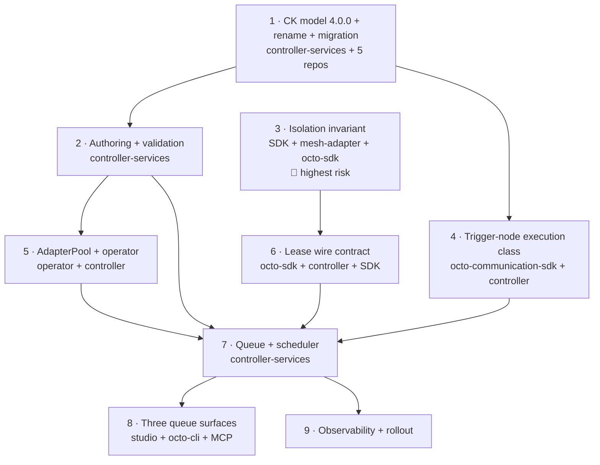

# Shared Adapter Leasing — Implementation Plan

**Epic:** AB#4914 · **Work item:** AB#4924 · **Design:** [`shared-adapter-leasing.md`](shared-adapter-leasing.md)
· **Status:** plan 2.0 (2026-09-14), increment 1 implemented against the reworked design

This breaks the leasing design into increments that each ship and are each verifiable on
their own. It is deliberately written against the **real code**: every file path below was
read, every count below was measured, and the places where the concept does not survive
contact with the code are called out in §12 rather than worked around silently.

Repositories involved, all on `test/0.2-dev`:

| Repo | Role |
|---|---|
| `octo-communication-controller-services` | CK model, lease scheduler, queue, validation, pool hub |
| `octo-sdk` | `Communication.Contracts` hub interfaces + DTOs, `Sdk.ServiceClient` SignalR client |
| `octo-communication-sdk` | adapter host: `AdapterOptions`, `AdapterExecutionService`, trigger-node descriptors |
| `octo-mesh-adapter` | the pool member process: tenant repository, identity, HTTP routes |
| `octo-communication-operator` | pool workload deployment into a platform namespace |
| `octo-frontend-refinery-studio` | queue surface #1 |
| `octo-cli` | queue surface #2 |
| `octo-mcp-service` | queue surface #3 |
| `octo-ai-services`, `octo-adapter-loxone` | forced along by the major bump (§3) |
| `octo-construction-kit-engine` + `-mongodb` | the `RenameAssociationRole` migration transform the role rename needs (§3.10) — **must ship first** |
| `octo-construction-kit`, `meshmakers-app`, `demo-energy-iq` | seed/runtime data carrying the renamed `roleId` (§3.9) |

### What changed between plan 1.0 and 2.0

Plan 1.0 was written while §8 of the concept still had eleven open questions. All of them are
now decided, and four decisions reshaped this plan rather than merely filling a blank:

| Decision | Effect here |
|---|---|
| Q16 + Q18 — rename `Pool` → `DeploymentSite`, shipping **with** leasing | Increment 1 becomes **4.0.0 with a migration**, not the additive 3.36.0 that was built. §3 is new and is the largest single piece of work in the plan. |
| §4a — adapter pools are first-class | New increment 5. Supersedes Q2 and, with it, the old "increment 6 is blocked" note. |
| Q1 — platform namespace, lender as owner reference | Unblocks the operator work and sets its scope: the one-workload-per-tenant-namespace assumption has to break. |
| Q3 + Q17 — two execution classes, declared by the trigger node | New increment 4, in `octo-communication-sdk`, on the critical path of the scheduler. |
| Q5, Q6, Q4 | Fold into increments 1, 6 and 7 as decided; no longer gates. |

Plan 1.0's increment 3 (the isolation invariant) is unchanged and is reproduced here as
increment 3 with its analysis intact — the concept now depends on it explicitly.

---

## 1. Increment overview



Increment 3 has **no dependency on 1, 2, 4 or 5** and should be started in parallel and
early: it is a behaviour-preserving refactor of the adapter fleet, it is the one that can
cause a cross-tenant data incident, and everything else waits on it before it can be enabled.

| # | Ships what | Independently testable? | Observable effect when shipped alone |
|---|---|---|---|
| 1 | CK engine transform, then CK model 4.0.0, `Pool` → `DeploymentSite` + `Manages` → `Hosts`, one migration | yes (CK compile + full suites + a migration run on a copy) | the estate takes one migration; no behaviour changes |
| 2 | `Leased` and `AdapterPool` authorable and validated | yes (unit) | a misconfigured `Leased` adapter is refused at deploy with a named reason |
| 3 | process retains nothing tenant-scoped between executions | partly — see §5.5: the 2-tenant integration form needs a lease | none — single-tenant behaviour identical |
| 4 | trigger nodes declare an execution class, resolved on save | yes (unit) | `ExecutionClass` visible on every pipeline; nothing reads it yet |
| 5 | pool workloads deploy into a platform namespace | yes (kind e2e) | a pool runs N members that no tenant can reach yet |
| 6 | management connection + `Lease`/`Release` verbs | yes (hub tests + a manual lease) | a pool member can be leased by hand |
| 7 | queue, round-robin, priority, TTL, `Queued` executions | yes (unit + integration) | leasing actually executes work |
| 8 | queue visible and cancellable in all three surfaces | yes (vitest + CLI + MCP tests) | the queue is operable |
| 9 | metrics, alerts, per-tenant enablement | yes | rollout becomes operable |

---

## 2. Increment 1 — CK model 4.0.0 ✅ implemented

**Repo:** `octo-communication-controller-services` ·
**Version:** `System.Communication` 3.35.0 → **4.0.0** (major, with a migration script)

3.36.0 as built by plan 1.0 is **withdrawn**. Its contents were correct; only its version
label was, and the rename plus its migration now ship in the same bump (concept §8, Q18) so
the estate takes one migration instead of two. See §3.6 for why the withdrawn 3.36.0 still
needs a defensive migration entry of its own.

### 2.1 The rename

| File | Change |
|---|---|
| `types/pool.yaml` → `types/deploymentSite.yaml` | `typeId: Pool` → `DeploymentSite` (git mv, so history follows) |
| `types/deployableWorkload.yaml` | `Manages` association `targetCkTypeId` → `${this}/DeploymentSite` |
| `associations/manages.yaml` | **unchanged role id** — annotated, see below |
| `migrations/3.35.0-to-4.0.0.yaml` *(new)* | `ChangeCkType Pool → DeploymentSite`, `NoEntitiesOfType` post-validation at `severity: Error` |
| `migrations/migration-meta.yaml` | `ckModelId` 3.1.1 → 4.0.0; two entry points (§3.6) |

**The association role is renamed too: `Manages` / `ManagedBy` → `Hosts` / `HostedBy`**
(D1, decided 2026-09-14 — it moves with this bump, because deferring it guarantees the second
major migration Q18 set out to avoid).

`associations/manages.yaml` → `associations/hosts.yaml`; `types/deployableWorkload.yaml`
binds `${this}/Hosts`.

**Why `Hosts` / `HostedBy`.** A deployment location does not *manage* anything — the
Communication Operator does — so the old name described the relationship backwards, which is
the same defect as calling the type `Pool`. `Deploys` / `DeployedTo` was rejected for the same
reason on the site side: the site does not deploy either, it is deployed *to*. Hosting is the
relationship that persists once the deployment is over, which is exactly what this edge
records, and `DeploymentSite.Hosts → N workloads` / `Adapter.HostedBy → ZeroOrOne
DeploymentSite` both read correctly. It also keeps the model's dominant convention — active
verb inbound, passive inverse outbound (`Executes`/`ExecutedBy`, `MapsTo`/`MappedAsTarget`,
`SendsDataTo`/`ReceivesDataFrom`) — and stays a minimal cognitive delta from the old pair, so
review diffs remain legible.

🔴 **The rename moves three independent identifiers, with disjoint blast radii.** This is
the thing to understand before reading the numbers in §3.9:

| YAML field | What it generates | Blast radius |
|---|---|---|
| `id: Manages` | the persisted `roleId` in seed/runtime data **and** the generated C# constant `SystemCommunicationCkIds.RtCkManagesRoleId` → `RtCkHostsRoleId` | seed data + C# + **stored data** |
| `inboundName` | GraphQL field `manages`, union type `…_ManagesUnion*` | frontend only |
| `outboundName` | GraphQL field `managedBy`, union type `…_ManagedByUnion*` | frontend only |

Renaming *only* `inboundName`/`outboundName` would have bought most of the readability for a
third of the cost and **no migration at all** — the persisted `associationRoleId` derives from
`id`, not from the display names. That option was considered and rejected: it leaves seed data
saying `roleId: …/Manages` while the navigation says `hosts`, i.e. a hidden alias between the
data and the API, which is a worse comprehension trap than the one being fixed.

### 2.2 The additive elements

| Element | File | Meaning |
|---|---|---|
| `LifecycleMode` `3 Leased` | `enums/lifecycleMode.yaml` | the **borrower's** mode and only ever that. `2 Auto` stays reserved (AB#4984). |
| `PipelineExecutionStatus` `5 Queued` | `enums/pipelineExecutionStatus.yaml` | appended, never inserted — the keys are persisted on every entity. |
| `AdapterSharingMode` (`NotShared` / `Descendants` / `DescendantsAndSiblings`) | `enums/adapterSharingMode.yaml` | on `AdapterPool.SharingMode`. Q10 kept `DescendantsAndSiblings` a distinct mode. |
| `PoolScaleUpPolicy` (`QueueDepthOrWaitSeconds` / `QueueDepth` / `QueueWaitSeconds`) | `enums/poolScaleUpPolicy.yaml` *(new)* | Q14. Queue-driven, never CPU-driven. |
| `PipelineExecutionClass` (`Interactive` / `Batch`) | `enums/pipelineExecutionClass.yaml` *(new)* | Q3 + Q17. Keys ordered so ascending key order == scheduling order. |
| `AdapterPool` type | `types/adapterPool.yaml` *(new)* | §4a. Derives from `DeployableWorkload`; `MinReplicas` / `MaxReplicas` / per-member sizing / scale-up policy / lending scope. |
| `PoolServiceAccount` role | `associations/poolServiceAccount.yaml` *(new)* | the pool's **management** identity. A dedicated role, not a second origin on `PipelineServiceAccount` — see §2.4. |
| `Adapter.LentFromTenantId` + `LentFromPoolRtId` | `attributes/adapterLeasing.yaml`, `types/adapter.yaml` | borrower half. `LentFromAdapterRtId` from 3.36.0 was **renamed** to `LentFromPoolRtId`: it names the pool, not a member. |
| `PipelineExecution.QueuedAt` / `LeaseGrantedAt` / `LeaseReleasedAt` / `LeaseWaitMs` | `attributes/attributes.yaml`, `types/pipelineExecution.yaml` | Q5. Four timestamps, see §2.3. |
| `PipelineExecution.LeasedFromTenantId` / `LeasedFromPoolRtId` / `LeasedOnMemberId` | `attributes/adapterLeasing.yaml` | which pool and which member served it. Values, not an association — see §12.1. |
| `Pipeline.ExecutionClass` | `types/pipeline.yaml` | computed on save, persisted, `isRuntimeState: true`, default `Batch`. |
| `PipelineExecution` index on `QueuedAt` | `types/pipelineExecution.yaml` | the queue read is `(status = Queued) ordered by QueuedAt`; it cannot ride the `StartedAt` index because a queued execution has no `StartedAt`. |

**`StartedAt` relaxed to optional** (Q5), with `LeaseGrantedAt` and `LeaseReleasedAt` added
beside it. The alternatives were both worse: stamping `StartedAt` at enqueue makes it lie for
the whole queue wait and gets the entry reaped, because it is the **age key** of both the
AB#4280 stuck reaper and the AB#4280 orphan resolver; a separate queue entity contradicts
§5's "one execution is one entity". Relaxation is only a *minor* change on its own — it is
riding in 4.0.0 because the rename is what forces the major.

### 2.3 Why four timestamps and not two

`LeaseGrantedAt`..`LeaseReleasedAt` and `StartedAt`..`CompletedAt` are deliberately different
spans. The difference between them is exactly the per-lease warm-up — token, tenant
repository, pipeline definitions — that the pool exists to amortise. Concept §4's central
claim ("irrelevant at ~16 executions/h, prohibitive at energyiq's 4089/h") rests on that
overhead, and keeping both pairs is what makes the claim measurable instead of asserted.

`LeaseReleasedAt` is also a **billing input**, not only a diagnostic: §4b prices a borrower's
consumption as the sum of its lease spans times the pool's per-member sizing. It therefore
has to be stamped on the TTL-expiry and crash paths too, where `CompletedAt` never arrives.

### 2.4 Two modelling decisions worth defending

**The pool's service account is a dedicated role.** Adding `AdapterPool` as a second origin
type on the existing `PipelineServiceAccount` role changes the inverse union view on
`ServiceAccountConfiguration`, and the CK engine then drops `SystemConfigurationInterface`
from the generated GraphQL schema for **every** `Configuration` subtype. That failure is
already documented twice in this model (on the `HelmRepository` link and on
`PipelineServiceAccount` itself); a third instance was not worth the saved file.

**The lending scope moved from `Adapter` to `AdapterPool`.** 3.36.0 put `SharingMode`,
`LendingAllowedTenantIds` and `LendingMaxConcurrentLeasesPerTenant` on `Adapter`. Lending is a
property of the thing that owns processes, and after §4a that is the pool. On `Adapter` two
adapters in one tenant could declare different lending scopes over what is really one set of
processes.

### 2.5 Verification performed

All builds run `-c DebugL -p:BaseOutputPath=<temp>/`, and — per §3.7 — **after
`git clean -xfd` on the model's `bin` and `obj`**, so no stale `ck-system.communication-3.yaml`
could mask the rename. That matters: the same commands on an *incremental* tree reported 0
errors while `RtPool` still resolved.

- CK model, clean: **0 warnings, 0 errors**; the compiled artifact carries `AdapterPool`, `DeploymentSite`, the `Hosts` role and `modelId: System.Communication-4.0.0`.
- `Octo.CommunicationController.sln` (all projects incl. both test projects), clean: **0 warnings, 0 errors**.
- `CommunicationControllerService.Tests`: **917 / 917 passed**, 0 skipped.
- The AB#5187 ownership lint passes (it is a build warning source, and the build is warning-free).
- CK engine, the three changed projects built individually: **0 warnings, 0 errors**.

🔴 **One caveat, stated rather than smoothed over.** The model build above was run with the
`RenameAssociationRole` step temporarily removed, because the CK compiler validates migration
YAML against the schema in the *installed* engine package and that package predates the new
transform (§3.10). So what is proven is: the role rename itself — model, seed data, C# and all
917 tests — is clean, and the **only** thing blocking the full script is the engine release that
has to precede it anyway. The step is present in the committed script.

Two things remain unverifiable locally and must not be reported as done:

- `ckc ValidateVersion` against a real catalog, and an actual migration run against a tenant database (§13, wave 2).
- The `octo-construction-kit-engine-mongodb` override. It fails locally with `CS0115` purely because the restored `Meshmakers.Octo.Runtime.Engine` 999.0.0 package is the stale shared one — the restored assembly provably does not contain the new method, while the freshly packed one does. The base and override signatures are textually identical and `TenantRepository` derives directly from `RuntimeRepositoryBase`. Verifying it end-to-end requires republishing the three engine packages into the shared DebugL feed at `/Users/gerald/RiderProjects/meshmakers/main/nuget`, which would change what the `main` checkout builds against — deliberately not done.

Not yet verified, and it cannot be verified locally: `ckc ValidateVersion` against a real
catalog, and an actual migration run. Both are §3.7.

---

## 3. Increment 1, part two — the bump cascade 🔴

This is the part nobody should be surprised by, so it is measured rather than estimated.
Measurement date 2026-09-14, over the whole `~/RiderProjects/meshmakers/dev` checkout.

### 3.1 Correcting the numbers in the concept — and the scope they apply to

Three different counts of "how many pins are there" are in circulation, and they disagree
because they cover **different scopes**. Stating the scope is the whole point:

| Count | Scope | Status |
|---|---|---|
| 84 files / 82 blueprints (concept §2a) | `dev` checkout, counting *mentions* of `System.Communication` | ❌ wrong — mentions, not pins (85 files mention it, 51 under `Blueprints/`, but most are `ckTypeId:` type references) |
| **65 files / 46 source blueprints** (this plan, §3.2–3.3) | the **`dev` checkout only**, counting real version pins | ✅ what a PR on `test/0.2-dev` actually has to change |
| **203 blocking pins + 7 open-ended** | the **whole estate**, all checkouts | ✅ what the migration ultimately has to reach |

The gap between 65 and 203 is not a contradiction — it is everything outside this checkout:
the `main` checkout's copy of the same repos, repos not cloned into `dev` (`getting-started`
is one; it is absent here, which is why this plan's open-ended list has 5 entries and the
estate-wide one has 7), and the published catalog.

🔴 **The published catalog is immutable history and must not be edited.** The ~70 pins under
`meshmakers.github.io` (and the 10 local mirrors in `dev/.octo/local-catalog/ck-models/v2/s/System.Communication/3/`)
are *published versions*. They must keep saying `Pool` and `Manages` forever — that is what
makes an already-installed tenant reproducible. Only a new version carries the new names.
Anyone "fixing" the cascade by grepping and replacing across the estate will hit these; they
are the one bucket where a hit is correct as it stands.

With that scope fixed, the concept's figures for the `dev` checkout:

| What | Concept says | Actual | Note |
|---|---|---|---|
| Files carrying a `System.Communication` version **pin** | 84 | **65** (61 source + 4 generated) | |
| …of which blueprint files | 82 | **46 source** (10 `blueprint.yaml` + 36 seed-data) | 50 counting the 4 `.octo` artifacts |
| Dependent CK models with their own pin | 2 | **2** ✅ | `System.Ai-3.7.0`, `Loxone-4.3.1` |
| Loxone pinned exactly `[3.31,3.32)` | yes | **yes** ✅ | |

Where 84/82 came from: **85 source YAML files mention the string `System.Communication` at
all**, and 51 of those live under a `Blueprints/` directory. But most of those mentions are
`ckTypeId: System.Communication/Pipeline`-style *type references*, not version pins. Counting
mentions instead of pins overstates the blocking set by 30 %.

### 3.2 The pins, by range

| Range | Source files | Behaviour at 4.0.0 |
|---|---|---|
| `[3.0,4.0)` | 39 | 🔴 blocks |
| `[3.22.0,4.0)` | 14 | 🔴 blocks |
| `[3.18,4.0)` | 1 | 🔴 blocks |
| `[3.31,3.32)` | 1 | 🔴 blocks (Loxone — see §3.4) |
| `[1.0,2.0)` | 1 | already dead (`samples/Blueprints/HelloCommunication`) |
| `[3.6,)` / `[3.12,)` / `[3.13,)` | 5 | ⚠️ open-ended — **silently absorb 4.0.0** |
| **Total** | **61** | 56 block, 5 absorb silently |

The open-ended ranges are the more dangerous half. They will not fail; they will resolve to
4.0.0 and then import runtime data referencing a type called `Pool` and a role called `Manages`
that no longer exist. All five in this checkout are in `demo-energy-iq/data/` — which, note,
**is on branch `main`, not `test/0.2-dev`**, so it is outside the branch this work is being done
on and will not be seen by anyone reviewing the feature branch. Estate-wide there are **7**; the
two not visible here include `getting-started/scripts/simulation-adapter.yaml`, in a repo that
is not cloned into this checkout at all. That is precisely why they are dangerous: they are not
where anyone is looking.

(Three further open-ended ranges in `octo-adapter-loxone` — `DEVELOPMENT.md:357`,
`docs/concepts/ck-model.md:5`, `readme.md:141` — are **documentation prose quoting old ranges**,
not live pins. They go stale rather than break.)

### 3.3 By category, with owners

| # | Category | Source files | What has to happen |
|---|---|---|---|
| A | `blueprint.yaml` → `ckModelDependencies` | 10 | raise to `[4.0,5.0)` **and** bump the `blueprintId` |
| B | blueprint seed-data → runtime-model `dependencies` | 36 | raise to `[4.0,5.0)`; rewrite any `ckTypeId: …/Pool` |
| C | `ckModel.yaml` → `dependencies` | 2 | see §3.4 |
| D | standalone runtime-data YAML applied via octo-cli, **not** packaged | 12 | raise the range; these are easy to miss because no CI touches them |
| E | C# comment carrying a range | 1 | cosmetic (`DefaultConfigurationCreatorService.cs:84`) |

Category A, by repo: `octo-communication-controller-services` 3 (2 service-managed + 1 dead
sample), `octo-construction-kit` 4 (`Samples.Photovoltaics`, `Samples.PipelineBasics`,
`Samples.Simulator.Energy`, `Samples.Simulator.EnergyCommunity`), `octo-office-integration` 1
(`Office.ExcelImport`), `meshmakers-app` 2 (`MeshmakersAccounting`, `…​.Tesla`).

Category B is dominated by `meshmakers-app`: 28 files under `MeshmakersAccounting-1.0.0/seed-data/`
plus 2 under `…​.Tesla-1.0.0/`, then `octo-construction-kit` 5 and `octo-office-integration` 1.

🔴 **Plan 1.0 said "no blueprint bump — the floors are satisfiability floors only". That was
true for a minor bump and is flatly wrong for a major one.** `[3.22.0,4.0)` does not merely
go stale against 4.0.0, it **excludes** it: the blueprint becomes unsatisfiable and fails to
install. Both service-managed blueprints have accordingly been raised to `[4.0,5.0)` and
bumped `1.5.0` → `2.0.0` in this increment, and their seed data now creates a `DeploymentSite`.

### 3.4 The two dependent CK models

| Model | Path | Declares | Required action |
|---|---|---|---|
| `System.Ai-3.7.0` | `octo-ai-services/src/SystemAiCkModel/ConstructionKit/ckModel.yaml` | `System.Communication-[3.0,4.0)` | 🔴 **major bump to 4.0.0**, republished in the same train |
| `Loxone-4.3.1` | `octo-adapter-loxone/src/AdapterEdgeLoxone.CkModel/ConstructionKit/ckModel.yaml` | `System.Communication-[3.31,3.32)` | 🔴 **major bump to 5.0.0**, range widened to `[4.0,5.0)` |

**Both are major bumps, not minor ones.** `ck-semver-rules.md` classifies "dependency
switched to a new **major** version" as Major — so the cascade does not stop at
System.Communication, it propagates as a wave of majors. Plan 1.0 said `System.Ai` needed "a
minor bump"; that is wrong.

The consequences chain one level further: `System.Ai` going to 4.0.0 breaks
`octo-ai-services/src/SystemAiCkModel/Blueprints/System.Ai.Default/blueprint.yaml`, which
pins `System.Ai-[3.1.2,4.0)` — it too must be raised and bumped. Its
`Blueprints/System.Ai.Default/seed-data/entities.yaml` carries the dependency pin as well.
There is also a NuGet-level coupling that fails in the same breath:
`SystemAiCkModel.csproj:22` references `Meshmakers.Octo.ConstructionKit.Models.System.Communication`.

**Loxone is the frozen-pin trap and it must move with the bump, not after it.** The pin was
narrowed to exactly `[3.31,3.32)` by `499e55d "AB#5196 Fix: Pin Loxone-4.3.1 to
System.Communication 3.31.0 for prod-1"`, reverting an earlier widening. It resolves to
3.31.0 today and is therefore *unaffected* by a 3.x bump — which is precisely what makes it
dangerous here. `CkModelId` is name + version and `CkModelMigrationService` refuses to
migrate across model names, so **one tenant holds exactly one version of `System.Communication`**.
A prod-1 tenant running Loxone therefore cannot take 4.0.0 at all while the pin stands: the
install compares versions exactly and finds 3.31.0 against 4.0.0. That is the same failure as
AB#4696 / AB#4999 / AB#5196, for the third and fourth time.

Loxone's only structural coupling is one line —
`ConstructionKit/attributes/control.yaml`, `valueCkRecordId: ${System.Communication}/DataPoint`
— and `DataPoint` is **not** renamed. So the widening is safe in content; it is the version
arithmetic, not the model content, that blocks. `octo-adapter-loxone` contains no blueprints
at all, so there is no blueprint half to chase.

⚠️ Verify the "one version per model name per tenant" conclusion on a test tenant before the
train. It is read off `CkModelId` and `CkModelMigrationService.MigrateAsync`, not off a test.

### 3.5 The C# cascade — it is the namespace, not the type name

The interesting discovery of this increment. Renaming `Pool` breaks **26** C# files across
three repos (19 controller, 4 operator, 3 `octo-sdk`). Bumping the **major** breaks **123**,
because the source generator versions the generated namespace by major:

```
Meshmakers.Octo.ConstructionKit.Models.System.Communication.Generated.System.Communication.v3
                                                                                          ^^ → v4
```

| Surface | Files | Repos |
|---|---|---|
| `using …Generated.System.Communication.v3` | **123** | 122 controller-services, 1 `octo-ai-services` |
| `RtPool` → `RtDeploymentSite` | 26 | 19 controller-services, 4 operator, 3 `octo-sdk` |
| `SystemCommunicationCkIds.RtCkPoolTypeId` → `…RtCkDeploymentSiteTypeId` | 11 call sites | controller-services |
| `AddCkModelSystemCommunicationV3()` → `…V4()` | 3 | controller-services (`Program.cs` + 2 test fixtures) |
| `AddBlueprintSystemCommunication{Release,MainLatest}V1()` → `…V2()` | 1 | `Program.cs` — the blueprint DI extension is named by the blueprint's **major**, so the `1.5.0 → 2.0.0` bump renames it |
| `CommunicationCkTypeIds.Pool = "System.Communication/Pool"` | 1 | `octo-sdk` — a **string constant**, so it compiles fine and is simply wrong at runtime |

All of the above except the `octo-sdk` and operator halves has been applied in this pass and
the repo builds and tests green. The `octo-sdk` / operator halves are left for their own
increments because they need NuGet propagation and each repo's `CLAUDE.md` read first.

🔴 **`CommunicationCkTypeIds.Pool` is the one that will not announce itself.** Everything else
is a compile error; this is a `const string` whose *value* is stale. Grep for it explicitly.

**The nullable-`StartedAt` ripple is smaller than plan 1.0 claimed.** Plan 1.0 said "~16
sites"; the compiler says **11 errors in 5 files**, because most of the 16 reads are already
null-tolerant. The five, each fixed as a deliberate semantic decision rather than a cast:

| File | Decision |
|---|---|
| `Models/PipelineExecutionDto.cs` | property becomes `DateTime?` — the DTO must be able to say "not started" |
| `Services/PipelineStatisticsFolder.cs` | a `Queued` execution is **skipped**, not folded — otherwise it lands in a default-timestamp bucket and inflates that hour |
| `Repository/CommunicationRepository.cs` (stuck-execution failer) | no start time ⇒ `DurationMs = 0`, never a duration measured from a substituted timestamp |
| `TenantApi/v1/Controllers/PipelineDebugController.cs` (×2) | fall back to `QueuedAt` — the moment the entry became visible is what the history should order by |
| `tests/…/StatisticsTests.cs` | `Nullable.Compare` — ordering unchanged, just spelled explicitly |

### 3.6 🔴 The withdrawn 3.36.0 leaves a hole in the migration chain

`CkModelMigrationService.FindBridgedMigrationPathAsync` collects candidate entry points as
"every `fromVersion` **greater than** the installed version" and bridges the start gap with a
no-op. So a tenant on any 3.x below 3.35.0 bridges straight to the `3.35.0 → 4.0.0` entry and
runs the rename — good, and it is also why that entry hangs off 3.35.0 rather than extending
the 3.1.1 chain, which would drag every modern tenant back through four obsolete DataFlow
scripts.

But a tenant that installed the withdrawn **3.36.0** sits *above* every `fromVersion` in the
chain. For it the bridging finds no candidate at all, falls through to the final "post-chain
schema-only bridge", and **upgrades the schema while silently skipping the rename**. The
tenant is then left holding `Pool` entities of a type the model no longer defines, with no
error anywhere.

3.36.0 is on no cluster, but it **is** in `dev/.octo/local-catalog/ck-models/v2/s/System.Communication/3/`,
so any local dev tenant can be at it. `migration-meta.yaml` therefore carries a second entry
`3.36.0 → 4.0.0` pointing at the same (idempotent) script. It is documented in the file as
deletable once no environment can be at 3.36.0.

This is the same shape as the frozen-pin trap: a version that resolves correctly right up to
the moment it does not, and reports nothing when it does not.

### 3.7 🔴 A stale build artifact makes the rename look free

Found the hard way. The CK output directory holds **one compiled model file per major**:

```
bin/DebugL/net10.0/octo-ck-libraries/SystemCommunicationCkModel/out/
    ck-system.communication-3.yaml     ← left over from the 3.36.0 build
    ck-system.communication-4.yaml     ← the new one
```

The source generator emits `Rt*` classes for **every** file it finds there. With both present
it emits `RtPool` *and* `RtDeploymentSite`, the whole repo compiles clean, all 917 tests pass
— and `RtPool` now refers to a type that the installed model does not define. The failure
surfaces on a tenant at runtime instead of at build time.

Deleting `bin/DebugL` and `obj/DebugL` and rebuilding turned "0 errors" into **506 errors**,
which is the honest number.

**Consequences for the plan:** the CI step that publishes this model must build from a clean
output directory, and the increment-1 PR must be validated after `git clean -xfd` on the model
project, not incrementally. Nobody should trust a green local build of a major CK bump.

### 3.9 The role rename — measured blast radius

Measured 2026-09-14 across the whole checkout, the same way §3.1 was.

**20 source files, 38 occurrences.** Smaller than feared, and concentrated in three places:

| Repo | Category | Files | Occurrences |
|---|---|---|---|
| `octo-communication-controller-services` | CK model (`associations/hosts.yaml` + `types/deployableWorkload.yaml`) | 2 | 4 |
| `octo-communication-controller-services` | blueprint seed-data `roleId:` | 2 | 2 |
| `octo-communication-controller-services` | C# — **`CommunicationRepository.cs` only** | 1 | 4 |
| `octo-construction-kit` | blueprint seed-data (`Samples.Photovoltaics/seed-data/adapters/modbus-edge.yaml`) | 1 | 1 |
| `meshmakers-app` | blueprint seed-data (`MeshmakersAccounting-1.0.0/seed-data/configurations/adapter-and-app.yaml`) | 1 | 2 |
| `demo-energy-iq` | runtime-data YAML, octo-cli applied (`data/_general/rt-adapters-loxone.yaml`) | 1 | 1 |
| `octo-frontend-refinery-studio` | hand-written `.graphql` queries | 5 | 6 |
| `octo-frontend-refinery-studio` | hand-written TS components | 6 | 17 |
| `octo-frontend-refinery-studio` | TS spec | 1 | 1 |
| **Total source** | | **20** | **38** |

Plus **59 generated / published artifacts that must NOT be hand-edited** — 10 published CK
catalog JSONs, 1 published blueprint seed copy, 11 frontend codegen outputs across 5 repos, 6
generated CK doc pages, 30 Docusaurus build outputs, 1 ng-packagr cache.

Four results are worth stating explicitly because they contradict what the earlier plan
assumed:

- **The operator does not read this association at all.** It receives workloads *pushed* over `/operatorHub`; the controller resolves the edge server-side in `CommunicationRepository.GetWorkloadsForPoolAsync` and fans the results out. Its only `Manages` mentions are documentation prose. Plan 1.0 listed "the operator's association reads" as a reason not to rename — that reason does not exist.
- **`octo-cli` and the MCP server are zero.** Both handle associations generically, with the role id as a runtime parameter. Their exposure is in the *data* they apply, which is the `demo-energy-iq` row above.
- **C# is one file.** `SystemCommunicationCkIds` is source-generated, so the rename produces exactly 4 compile errors, all in `CommunicationRepository.cs` (lines 43, 72, 232, 1180). ~35 other files match `Manages` in doc-comment prose ("Manages the …") and must be left alone.
- **C# tests are zero.** No test references the role id; `RtEntityCreator` never wires the edge.

`meshmakers-app`, `octo-frontend-libraries` and `octo-office-integration` have **no hand-written
consumers** — their hits are 100 % codegen. Only the Studio actually queries the association.

⚠️ Two pre-existing defects surface on the exact lines this rename touches. All four Studio
`managedBy(…)` queries still filter `ckTypeIds: ["System.Communication/Pool"]`, and the
`octo-office-integration` / `octo-documentation` schema dumps are from an older model
generation entirely (they still contain `SystemCommunicationEdgeAdapter`). Both are stale
*before* this change and are not fixed by it.

### 3.10 ✅ The role rename needed a CK engine change that did not exist — added

**This is the finding that should have changed the D1 decision, and it was not knowable from
the design.** The transform has since been implemented and committed (`octo-construction-kit-engine`
`232220a`, `-mongodb` `cb37496`); it is **not released yet**, which is what the sequencing note at
the end of this section is about.

Renaming an association role is not migratable with the engine as it stands. The seven
transform types (`ChangeCkType`, `SetValue`, `RenameAttribute`, `CopyAttribute`,
`DeleteAttribute`, `MapValue`, `WrapScalarInRecord` — `ck-migration.schema.json`) all operate on
entities and their attributes. **None of them touches an association role id**, and
`RtAssociation.AssociationRoleId` is persisted on **every stored edge**.

Without a migration the rename orphans every deployment-site↔workload edge in every tenant —
and does so *silently*: the model no longer defines the role the data refers to, the navigation
returns nothing, and nothing raises an error anywhere. Every adapter in the estate would simply
stop resolving its deployment site.

What *is* already handled, verified in the code rather than assumed: `ChangeCkType` rewrites the
stored `originCkTypeId` / `targetCkTypeId` on edges via
`TenantRepository.UpdateAssociationCkTypeIdsForMigrationAsync`, so the **type** half of this
migration was already complete. There is no equivalent for the role id.

**A new transform was therefore added to the CK engine** — `RenameAssociationRole`, mirroring the
existing ckTypeId rewrite:

| Repo | File | Change |
|---|---|---|
| `octo-construction-kit-engine` | `ConstructionKit.Contracts/Serialization/Schema/ck-migration.schema.json` | enum value + `sourceAssociationRoleId` / `targetAssociationRoleId` |
| `octo-construction-kit-engine` | `…/DataTransferObjects/CkMigrationMetaDto.cs` | enum value + two DTO properties |
| `octo-construction-kit-engine` | `Runtime.Contracts/Repositories/IRuntimeRepository.cs` | `UpdateAssociationRoleIdsForMigrationAsync` |
| `octo-construction-kit-engine` | `Runtime.Engine/Repositories/RuntimeRepositoryBase.cs` | virtual `NotSupportedException` default |
| `octo-construction-kit-engine` | `Runtime.Engine/CkModelMigrations/CkModelMigrationService.cs` | dispatch + `ExecuteRenameAssociationRoleAsync` |
| `octo-construction-kit-engine` | `docs/ck-model-migrations.md` | the new transform documented |
| `octo-construction-kit-engine-mongodb` | `…/MongoDb/TenantRepository.cs` | the `UpdateMany` override |

Design notes that matter: the step takes **no `target`** (it rewrites the association
collection, not entities of one CK type), it runs **outside the step transaction** — the same
treatment the association half of `ChangeCkType` already gets, because wrapping a rewrite of
90K+ association documents in a transaction risks MongoDB's oplog entry size limit — and it is
**idempotent**, matching only rows that still carry the old role id.

Associations live in exactly **one** dedicated collection; the `_associations` / `$associations`
names in the query pipelines are `$lookup` aliases, not a second copy. A single `UpdateMany` is
therefore a complete rewrite, with no embedded duplicate to keep in sync. Verified before
writing the helper.

🔴 **Sequencing consequence for the plan.** Increment 1 now spans an extra repo and an extra
train, in a hard order:

```
octo-construction-kit-engine (+ -mongodb)  →  core-libs train  →  System.Communication 4.0.0
```

The CK compiler validates migration YAML against the schema embedded in the **installed**
`Meshmakers.Octo.ConstructionKit.Contracts` package. Until the engine change is published, the
model does not compile at all — the exact error is
`Schema validation failed at '/steps/1/transform/type' … Value: "RenameAssociationRole"`.
This is an ordering fact, not a defect, but it means the engine change cannot ride along in the
same PR as the model.

**If that prerequisite is unwelcome**, the fallback is the `inboundName`/`outboundName`-only
rename described in §2.1: it needs no engine change, no migration and no seed-data edit,
because nothing persisted derives from the display names. It buys the GraphQL and navigation
readability and leaves `roleId: …/Manages` in the data as a hidden alias.

### 3.8 Not in scope, and deliberately so

- **The `CommunicationPool` CRD is not renamed.** Its Kind is a hardcoded string literal in `V1CommunicationPoolEntity.cs` and its schema ships from `octo-helm-core/src/octo-mesh-crds`; the link to the CK entity is by **RtId**, not by name. Renaming it would require recreating every CR plus RBAC and webhook config, for no functional gain. Same for the Helm value names `operator.autoManagePools` / `poolNamespace` / `defaultPoolName`, which are a breaking chart change for every installation.
- **`rtWellKnownName: CommunicationPool` on the seeded entity stays.** It is identity, not display text: the service-managed blueprint re-applies against it, and renaming it would create a *second* deployment site on every provisioned tenant and orphan the adapters attached to the first.
- **Documentation follows separately.** 66 genuine markdown files in `octo-documentation` (45 EN + 28 DE, ~15 of them generated from the CK model or CLI metadata), including the doc folder `docs/technologyGuide/communication/pools/` whose URL would need a redirect.
- **The public REST route `{tenantId}/v1/pool`** comes from `[controller]` on `PoolController`. If the C# class is ever renamed, pin `[Route("pool")]` explicitly or accept a breaking API change. The same applies to the `octo-cli` commands `GetPools` / `DeployPool` / `UndeployPool` and the MCP tools `get_pools` / `undeploy_pool`, all user-facing.
- **The GraphQL type renames itself.** `SystemCommunicationPool` is derived from the CkTypeId, so publishing 4.0.0 breaks ~66 frontend files across `octo-frontend-refinery-studio` (59), `octo-frontend-libraries` (5) and `meshmakers-app` (2) **without anyone editing the frontend**. Codegen must be re-run in the same train. This is the largest downstream surface in the whole rename and it is invisible from this repo.

---

## 4. Increment 2 — authoring and validation (no runtime yet) ✅ implemented

**Repo:** `octo-communication-controller-services`. Ships alone: `Leased` and `AdapterPool`
become *configurable and validated* states whose deploy is refused with an explicit "leasing
runtime not available" reason, so nothing can be half-enabled by accident.

### 4.1 Lending scope resolver

New `Services/TenantLendingScopeResolver.cs` + `ITenantLendingScopeResolver`, singleton.

```csharp
Task<bool> MayLendAsync(string lenderTenantId, string borrowerTenantId, RtAdapterPool pool);
Task<IReadOnlyCollection<string>> ResolveLendableTenantsAsync(string lenderTenantId, RtAdapterPool pool);
```

🔴 **It does not call `GET {tenantId}/v1/tenants/descendants`.** See §12.3 — the controller
has no `Sdk.ServiceClient` reference and a background scheduler has no caller token to
forward. It re-implements the same breadth-first walk in process over `ISystemContext` /
`ITenantContext.GetDirectChildTenantsAsync(session)` + `TryGetChildTenantContextAsync`,
copying the AB#5151 rules **verbatim**: a `visited` set seeded with the root (cycle guard),
and a child whose context cannot be resolved is listed but its subtree is not walked.
Reference implementation to mirror: `octo-asset-repo-services/src/AssetRepositoryServices/
TenantApi/v1/Controllers/TenantsController.cs`, `GetDescendants()`.

Sibling mode resolves the lender tenant's parent first, then that parent's direct children
minus the lender. Direction is fixed by the tree; `LendingAllowedTenantIds` intersects the
result and can never widen it.

Cache the resolved set behind a short TTL (the `ILifecycleConfigurationService` 30 s pattern);
the walk touches every descendant's admin session and must not run per work item.

Tests (`Services/TenantLendingScopeResolverTests`): parent→child, parent→grandchild,
sibling→sibling only in `DescendantsAndSiblings`, child→parent refused, `NotShared` refuses
everything, allow-list intersects and never widens, registry cycle terminates, unresolvable
child listed but not walked, TTL cache invalidation.

### 4.2 Deploy validation

`Services/PoolService.cs` → `EnsureWorkloadIsHelmDeployableAsync`, next to the AB#4984
`LifecycleMode` block at line ~535:

- `LifecycleMode == Leased` on a non-`RtAdapter` → reject (`WorkloadOnDemandNotSupportedForType` sibling).
- `LifecycleMode == Leased` and `!OnDemandCapable` → reject with the blocking reasons (concept §2).
- `LifecycleMode == Leased` with only one of `LentFromTenantId` / `LentFromPoolRtId` → reject; they are a pair.
- `LifecycleMode == Leased` whose pool does not lend to this tenant (resolver) → reject naming both tenants.
- `LifecycleMode != Leased` with `LentFrom*` set → reject (a value that does nothing is worse than an error).
- `LifecycleMode == Leased` on an `AdapterPool` → reject. A pool is not itself leased; see §12.2.
- `AdapterPool` with `MinReplicas > MaxReplicas`, or `MaxReplicas < 1` → reject.
- `AdapterPool` with `SharingMode != NotShared` and `!OnDemandCapable` → reject; a lease can only be handed to a wake-capable process.
- `LendingMaxConcurrentLeasesPerTenant <= 0` when present → reject.
- Resource strings that Kubernetes cannot parse → reject at authoring time, not at helm time.

New `PoolServiceException` factory methods, following the existing naming.

`Services/AdapterService.cs` → the reverse direction, next to the AB#4984 pipeline gate in
`DeployPipelineAsync` / `DeployDataFlowAsync`: deploying a **process-bound** trigger to a
`Leased` adapter is refused, exactly as it is for `OnDemand`
(`Services/OnDemandCapabilityService` already classifies this; reuse it, do not duplicate
the trigger list).

Until increment 7 lands, `DeployWorkloadAsync` on a `Leased` adapter or an `AdapterPool`
additionally refuses with "the leasing runtime is not available in this release" — explicit
beats a workload that deploys and then never executes.

### 4.3 Read surface

- `TenantApi/v1/Controllers/AdapterPoolController.cs` — CRUD over `AdapterPool`, mirroring `PoolController`'s shape.
- `AdapterController`: `GET {tenantId}/v1/adapter/{adapterRtId}/lending` → the resolved lendable tenant list + effective mode + cap, `TenantCommunicationApiReadOnlyPolicy`. Mirrors the `serviceAccount/health` shape (AB#5112) so the surfaces have one pattern.
- CLAUDE.md section.

**Tests:** `Services/PoolServiceTests/DeployWorkloadLeasingValidationTests`,
`Services/AdapterServiceTests/DeployPipelineLeasedGateTests`,
`Controllers/AdapterControllerLendingTests`, `Controllers/AdapterPoolControllerTests`.

### 4.4 What was built, and the one thing copying `GetDescendants` verbatim gets wrong

| Piece | Where |
|---|---|
| `ITenantLendingScopeResolver` + `LendingScope` | `Services/ITenantLendingScopeResolver.cs` |
| `TenantLendingScopeResolver` (in-process BFS, 30 s cache) | `Services/TenantLendingScopeResolver.cs` |
| 10 deploy guards + 9 exception factories | `Services/PoolService.cs`, `Services/PoolServiceException.cs` |
| Cross-tenant pool read | `CommunicationRepository.TryGetAdapterPoolLendingScopeAsync` |
| `GET {tenantId}/v1/adapter/lending` + `AdapterLendingScopeDto` | `TenantApi/v1/Controllers/AdapterController.cs`, `Models/` |

🔴 **`GetDescendants`'s cycle guard is not sufficient for an authorization decision.** The walk
is copied verbatim, as planned — but its `visited` set only stops the walk from *looping*. It does
**not** stop an ancestor from appearing in the result: in a registry where parent `P` lists child
`C` and a corrupted record also lists `P` as a child of `C`, the walk starting at `C` adds `P`,
because `P` was never visited. `GetDescendants` can tolerate that — it produces a listing. Here the
same set decides whether one tenant may execute work **inside** another, so a registry cycle would
become a privilege escalation upwards.

The resolver therefore subtracts the lender's own ancestor chain, computed by walking
`ParentTenantId` upwards — a path independent of the child records a cycle corrupts. That is what
turns "lending never flows upwards" from documentation into an enforced invariant, and
`ARegistryCycleCannotMakeAnAncestorBorrowable` is the test that holds it: deleting the subtraction
fails that test **and no other**.

Two smaller decisions worth recording: an unresolvable lender resolves to *nobody* rather than to a
wider scope (concept §6, "parent tenant deleted while lending"), and a tenant with no parent has **no
siblings** — treating "every other root" as a sibling set would make every unparented tenant lend to
every other one, erasing the boundary the tenant tree exists to draw.

---

---

## 5. Increment 3 — the isolation invariant 🔴 ✅ implemented

**Repos:** `octo-communication-sdk`, `octo-mesh-adapter`. **Not** `octo-sdk` — see §5.6.

> **This is the highest-risk increment in the whole feature. A defect here is not a bug, it
> is a cross-tenant data incident.** It is listed third but should be *started first*, and it
> must ship and bake as a behaviour-preserving refactor **before** any lease is ever granted.

Unchanged from plan 1.0. The concept now depends on it explicitly (§4, "The isolation
invariant"), and §4's three bullet points are answered here — one of them by correcting it.

### 5.1 What actually has to change

The concept is right that "the node layer is already prepared" — `MeshContextCreatorService`
resolves its repository from `pipelineRegistration.TenantId`, `PipelineRegistryService` is
already keyed by `(tenantId, rtEntityId)`, and every `CallerBinding` lookup takes a `tenantId`
parameter. The binding sits above them, and this is the **complete** inventory of
process-global tenant reads found in the dev checkout:

| # | File | Line | What it binds |
|---|---|---|---|
| 1 | `octo-communication-sdk/src/Sdk.Adapters/AdapterOptions.cs` | 15, 44 | the property itself, defaulted to `"meshTest"` |
| 2 | `octo-communication-sdk/src/Sdk.Adapters/AdapterBuilder.cs` | 158 | `AdapterHubClientOptions.TenantId` |
| 3 | `octo-communication-sdk/src/Sdk.Common.Web/Sockets/WebAdapterBuilder.cs` | 112 | same, web host |
| 4 | `octo-communication-sdk/src/Sdk.Adapters/ConfigureAdapterAuthenticatorOptions.cs` | 48 | `acr_values=tenant:{TenantId}` on the adapter's own token (AB#5072) |
| 5 | `octo-communication-sdk/src/Sdk.Adapters/AdapterExecutionService.cs` | 124, 343, 503, 598, 643 | foreign-tenant callback filter, register/unregister, shutdown |
| 6 | `octo-sdk/src/Sdk.ServiceClient/SignalRClient.cs` | 477–482 | **the hub URI itself**: `{endpoint}/{TenantId}/adapterHub`, and it throws when the tenant is blank |
| 7 | `octo-mesh-adapter/src/MeshAdapter.Sdk/Configuration/DependencyInjection/ServiceCollectionExtensions.cs` | 160 | `CommunicationServiceClientOptions.TenantId` (the `DeployPipeline@1` node's client) |
| 8 | `octo-mesh-adapter/src/MeshAdapter.Sdk/Services/HttpRequests/HttpRequestService.cs` | 321, 455 | route tenant check and the `/{tenant}` route prefix |
| 9 | `octo-mesh-adapter/src/MeshAdapter.Sdk/Services/ServiceAccountTokenService.cs` | 713 | own-tenant fallback; its token cache at line 151 is already keyed `(TenantId, ClientId)` |

Plus two singletons that hold tenant-derived *values* rather than the tenant id:

- `IServiceClientAccessToken` (registered in `AdapterBuilder`, written by `AdapterAccessTokenService`) — one token, one tenant, read by the SignalR client on **every reconnect**.
- `ICkCacheService` — the CK model cache; keyed by tenant, so it is isolation-safe, but it is loaded per tenant and grows with every leased tenant (see §12.4).

### 5.2 Shape of the change

1. **Delete `AdapterOptions.TenantId`.** Not deprecate, not ignore — delete, so every one of
   the nine sites above becomes a compile error and is dealt with deliberately. This is the
   concept's own requirement and it is the only mechanism that actually works: as long as the
   property exists, a future node can read it and get a plausible wrong answer.
2. Introduce **`IAdapterTenantScope`** in `Sdk.Adapters`: the tenant of the *current* lease,
   plus `IsPoolMember`. For a dedicated adapter it is set once at startup from a new
   `AdapterOptions.DedicatedTenantId` (name it differently on purpose — a property called
   `TenantId` invites the old assumption back); for a pool member it is set by the lease and
   cleared by the release.
3. `SignalRClient.GetHubUri()` grows a tenant-free variant for the management connection
   (increment 6). The dedicated path keeps today's URI.
4. **Per-lease scope**: a lease opens a DI scope; everything tenant-derived resolves from it.
   The token holder, the `HttpRequestService` route prefix and the communication service
   client all move from singleton to scoped.
5. On release: dispose the scope, clear the token holder, and unload the tenant's CK cache
   entry (`ICkCacheService.Unload(tenantId)` — `MeshAdapterService` already does exactly this
   on `CkModelChanged`, so the mechanism exists).

### 5.3 How it is verified — concretely

A defect here is silent by nature, so verification cannot rest on review.

1. **Compiler.** The property is gone. `grep -rn "AdapterOptions"` across all adapter repos
   must show no `TenantId` read. A source-level guard test pins this the way
   `OperatorHubAuthorizationWiringTests` pins the `Program.cs` filter registration: read the
   `AdapterOptions.cs` source at test time and assert no member named `TenantId`.
2. **DI sweep test.** Enumerate the built `IServiceCollection` of the mesh adapter host and
   assert that no `ServiceLifetime.Singleton` registration's implementation type appears on
   a maintained **allow-list** of types cleared as tenant-free. A new singleton therefore
   fails the build until somebody has looked at it. This is the test that catches the
   regression *nobody is thinking about* six months from now.
3. **Two-tenant interleave (the core test).** Integration test, real MongoDB via
   Testcontainers, two tenants A and B whose databases contain the *same* CK type with
   *different* marker values. Lease A → run a pipeline that reads the marker → release →
   lease B → run the same pipeline → assert B's marker, and then the reverse order. Repeat
   with A and B swapped and with A leased twice in a row. Assert on the **pipeline output**,
   not on internal state — a cache that leaks shows up exactly here.
4. **Poison canary.** One tenant's database holds an entity whose value must never appear in
   another tenant's execution output. Every interleave assertion also asserts the canary is
   absent. Cheap, and it fails loudly on a leak nobody predicted.
5. **Randomised interleavings.** N ≥ 200 random `(tenant, pipeline)` sequences over M ≥ 3
   tenants, each execution asserting it saw only its own tenant's data. Run repeatedly in CI;
   a race that shows up once in fifty leases is exactly the failure mode of a shared process.
6. **Post-release state assertion.** After `Release`: `ICkCacheService.IsTenantLoaded(prev)`
   is false, the `IServiceClientAccessToken` holder is empty, the per-lease DI scope is
   disposed, and `PipelineRegistryService` holds no registration for the released tenant.
7. **Log-target assertion**, using the existing pattern from
   `DeployWorkloadAsync_NeverWritesTheClientSecretToAnyLogTarget`: reconfigure NLog to a
   `MemoryTarget`, run an interleave, assert the **rendered** output of tenant B's execution
   contains no occurrence of tenant A's id.
8. **Identity assertion.** Assert the token presented during B's lease carries
   `tenant_id=B` — not merely that a token exists. The AB#5077 failure mode (a token without
   `acr_values` silently issued for the system tenant) is a 403 if you are lucky and a
   cross-tenant read if you are not.
9. **Staged rollout.** Ship this increment with `IsPoolMember` always false, i.e. the entire
   estate keeps running one tenant per process through the new abstraction. Bake one release.
   The refactor is then proven by the fleet before a single lease is granted.

### 5.4 What was actually built

| Change | Where |
|---|---|
| **`AdapterOptions.TenantId` deleted** | `octo-communication-sdk/src/Sdk.Adapters/AdapterOptions.cs` |
| `AdapterOptions.DedicatedTenantId` added in its place | same file |
| `IAdapterTenantScope` + `AdapterTenantScope` | `octo-communication-sdk/src/Sdk.Pipeline/Services/` |
| The tenant entered per execution | `EtlDataOrchestrator.ExecutePipelineAsync` |
| `ConfigureLegacyAdapterTenantId` (one-release deprecation of `OCTO_ADAPTER__TENANTID`) | `octo-communication-sdk/src/Sdk.Adapters/` |
| 6 call sites moved to `DedicatedTenantId` | `AdapterBuilder`, `WebAdapterBuilder`, `ConfigureAdapterAuthenticatorOptions`, `AdapterAccessTokenService`, `AdapterExecutionService` (×5 reads) |
| 4 call sites moved to `DedicatedTenantId` | `octo-mesh-adapter`: `ServiceAccountTokenService`, `HttpRequestService` (×2), `ServiceCollectionExtensions` |
| 17 test sites updated by the compiler | 9 in `octo-communication-sdk`, 8 in `octo-mesh-adapter` |

**The scope is entered at one chokepoint, not at every call site.** `EtlDataOrchestrator` already
created a DI scope per execution and already had `etlContext.TenantId` in hand; that is where the
tenant is entered and it is the only place. Every pipeline execution in the estate passes through
it, so the mechanism is **live from day one** rather than dormant until leasing arrives — which is
the entire point of baking increment 3 for a release. When leasing lands, only the *value* differs
between consecutive executions; this site does not change.

Two design decisions worth defending:

- **`AsyncLocal` on a singleton, not a scoped DI service.** Executions run concurrently in one
  process and a DI scope does not flow across an async call chain — the tenant of an execution must.
  An `AsyncLocal` flows into every continuation of the execution that set it and into nothing else,
  which is exactly the required shape. It is an **instance** field, not static: a static one would
  couple two adapter hosts sharing a process and would couple otherwise independent tests.
- **`IsPoolMember` is hard-coded `false` and is not bindable.** A flag that could flip it by
  environment variable would defeat the point of shipping a refactor for the fleet to bake.

⚠️ The orchestrator resolves the scope with `GetService`, not `GetRequiredService`, so adapter repos
that do not register it (the samples, and any adapter host not built on `AdapterBuilder`) keep
working unchanged. **That tolerance must be removed before the first lease**: on a pool member a
missing scope means every execution falls back to no tenant at all, and the failure would be a
confusing null rather than a loud one.

### 5.5 🔴 Which verification mechanisms exist — and which cannot exist yet

**§5.3's list is internally inconsistent, and that only became visible while building it.** Item 9
requires shipping with `IsPoolMember` always false so the fleet bakes the refactor before any lease
exists. Items 3–8 all require **one process to serve two tenants** — which is precisely what a lease
is. Both cannot be true in the same increment.

The resolution: increment 3's exit criterion is the fleet baking a behaviour-preserving refactor;
the full interleave suite is the exit criterion for **enabling leasing in increment 6**, and it is
listed there, not here. What was built now is everything that can be built now.

| # | Mechanism | Status |
|---|---|---|
| 1 | Compiler / source guard | ✅ `AdapterOptionsTenantIdRemovalTests` — reflection over all members incl. non-public, static and inherited, so a re-added `TenantId` fails by any route |
| 2 | DI sweep over singletons against a cleared allow-list | ✅ `SingletonTenantFreedomSweepTests` — **SDK singletons only**, see the caveat below |
| 3 | Two-tenant interleave asserting on **pipeline output**, real MongoDB | ⚠️ **scope-level only.** `ConcurrentExecutionsEachSeeOnlyTheirOwnTenant`: 12 tenants × 25 interleaved awaits. The pipeline-output form needs a lease → increment 6 |
| 4 | Poison canary | ⚠️ **scope-level only.** `ThePoisonCanaryNeverCrosses` — a value no other execution may observe |
| 5 | Randomised interleavings | ✅ at scope level. `RandomisedInterleavingsHoldOverManyRuns` — 200 executions over 4 tenants |
| 6 | Post-release state assertion (CK cache unloaded, token holder empty, scope disposed) | ❌ there is no release without a lease → increment 6 |
| 7 | Log-target assertion (tenant B's rendered log contains no tenant A id) | ❌ needs two tenants in one process → increment 6 |
| 8 | Identity assertion (`tenant_id=B` on B's token) | ❌ needs the lease credential → increment 6 |
| 9 | Staged rollout with `IsPoolMember` false | ✅ that is what this increment ships; see §13 |

**What the scope-level tests are and are not.** They are not a proxy for the real thing and must not
be read as one. What they *do* cover is the mechanism this refactor introduces and the one place it
can fail on its own: whether the per-execution tenant follows an async call chain correctly under
concurrency. `AsyncLocal` flows into continuations but is copy-on-write across them, and getting
that wrong produces exactly the failure the increment exists to prevent — an execution observing
another tenant's value — while a single-tenant suite stays green.

**They were checked against a mutation, not just run.** Changing `Restore.Dispose` to clear the
tenant instead of restoring it makes
`ASubPipelineRestoresTheOuterTenantRatherThanClearingIt` fail. A test that cannot fail proves
nothing, and on this increment that distinction is the difference between verification and comfort.

⚠️ **The DI sweep sees only what the SDK registers.** Domain singletons registered by an adapter
repository are invisible from `octo-communication-sdk`, so the same sweep has to exist on the
`octo-mesh-adapter` side over its own registration extension **before** leasing is enabled. That is
an increment-6 entry criterion, not an optional follow-up: the mesh adapter is where the caches are.

### 5.6 `octo-sdk` is not touched by this increment

Plan 1.0 listed `SignalRClient.GetHubUri()` (site 6 of §5.1) among the nine. It belongs to
**increment 6**: the tenant-free hub URI exists for the *management* connection, which is the lease
protocol's, and the dedicated path keeps today's URI unchanged. Increment 3 therefore spans two
repos, not three, and `octo-sdk` needs no release for it.

Sites 1–5 and 7–9 are all resolved; site 6 is deferred with the increment that needs it.

### 5.4 Fleet compatibility

`AdapterOptions` is shared by every SDK-based adapter (Loxone, Modbus, Zenon, EDA, finAPI,
WeClapp, the simulation plug) and its env key `OCTO_ADAPTER__TENANTID` is set by eight Helm
charts. Renaming the property without renaming the key would be invisible; renaming the key
takes the fleet down on upgrade. Bind **both** keys for one release with the old one
logging a deprecation warning, then drop it. That deprecation window is part of this
increment, not a follow-up.

---

## 6. Increment 4 — trigger-node execution class ✅ implemented

**Repos:** `octo-communication-sdk` (descriptor contract first), then
`octo-communication-controller-services`.

Concept §5, Q17. Two classes, `Interactive` before `Batch`, **within a tenant's turn only**.

- **The descriptor contract gains a second capability.** `RequiresRunningProcess` (AB#4914 §5)
  is the precedent and the pattern: a property on the trigger-node descriptor, set by the SDK
  trigger-node implementations and picked up automatically by the reflection-based descriptor
  scan. No controller-side list of node names — future and third-party nodes self-describe.
- Initial classification, to be confirmed against the node inventory:
  `FromHttpRequest@*`, `FromExecutePipelineCommand` and manual/Studio execution →
  `Interactive`; `FromCron`/scheduled, `FromPipelineDataEvent`, `FromPipelineTriggerEvent`
  and every event-driven source → `Batch`. A node that declares nothing is `Batch`.
- **Resolved on save, persisted on the pipeline.** `Pipeline.ExecutionClass` is written where
  `OnDemandCapable` is computed today, on the same code path, so the two cannot drift.
  Deriving it at dequeue time would mean parsing the YAML per work item and would leave the
  class invisible until something ran.
- Same caveat as `OnDemandCapable`: a pipeline edited to a different trigger changes class on
  save, so §8's surfaces must show the current value rather than cache it.

Shipping alone this increment has no behavioural effect — nothing reads the class until
increment 7 — but it makes the classification of the whole estate visible and reviewable
*before* it starts ordering a queue, which is the point.

### 6.1 What was built

| Piece | Where |
|---|---|
| `PipelineExecutionClass` enum + `[NodeExecutionClass]` attribute | `octo-communication-sdk/src/Sdk.Pipeline/EtlDataPipeline/Configuration/` |
| `NodeDescriptor.ExecutionClass`, picked up by the reflection scan, `x-executionClass` schema extension | `NodeDescriptor.cs`, `NodeSchemaRegistry.cs` |
| `NodeDescriptorDto.ExecutionClass` (appended, defaulted — the wire-compat trick) | `octo-sdk/src/Communication.Contracts/` |
| `FromHttpRequest@1`, `@2`, `FromExecutePipelineCommand@1` → `Interactive` | SDK + `octo-mesh-adapter/src/MeshNodes.Sdk/Trigger/` |
| `IPipelineDefinitionService.TryGetTriggerNodes` (**new** — trigger-only) | controller |
| `IPipelineExecutionClassService` + implementation | controller |
| Persisted in the same update as the definition | `CommunicationRepository.SetPipelineDefinitionAsync` |
| Single-field writer for the redeploy path | `CommunicationRepository.SetPipelineExecutionClassAsync` |

### 6.2 🔴 Three corrections to what this plan assumed

**1. "Write `ExecutionClass` where `OnDemandCapable` is computed today, on the same code path"
cannot be taken literally.** `OnDemandCapable` is written **per workload, after deploy,
best-effort**, from a full re-scan of every pipeline — it is never written inside a pipeline-save
transaction. `ExecutionClass` belongs on the **pipeline**, so the precedent gives the *shape* (a
capability declared by the node, a descriptor scan, a fallback list) but not the *hook*. The actual
choke point is `SetPipelineDefinitionAsync`, the one repository method that writes
`RtPipeline.PipelineDefinition`, and the class is written in that same update so the two can never
disagree.

**2. `IPipelineDefinitionService` had no trigger-only API.** `GetAllNodes` / `TryGetAllNodes` flatten
`triggers:` and `transformations:` into one list — which is right for on-demand capability (a
process-bound node anywhere is disqualifying) and wrong here (the class describes how work
*arrived*). `TryGetTriggerNodes` was added. `AnInteractiveNodeInTheTransformationsSectionIsIgnored`
pins it: switching the service back to `TryGetAllNodes` fails that test and no other.

**3. The redeploy path needed its own writer, and a pre-existing test caught it.** The first cut
re-resolved on redeploy by calling `SetPipelineDefinitionAsync` with the *existing* definition.
`DeployPipelineAsync_NewPipelineWithoutCustomDefinition_AddsToConfiguration` asserts
"deploy must not persist a definition when none was provided" — a real invariant, and the
re-resolution broke it. `SetPipelineExecutionClassAsync` writes the single field instead.

### 6.3 The fallback list — a known wart, adopted deliberately

Node descriptors are **never persisted**: `Adapter.NodeDescriptors` is in-memory only and is null
whenever the adapter has not registered during this controller process's lifetime — offline,
hibernated, or simply after a controller restart. Without a fallback the class would depend on
whether the adapter happened to be connected when somebody saved, which is not an answer the queue
surfaces can explain.

So `PipelineExecutionClassService` carries `KnownInteractiveTriggerNames`, knowingly the same wart as
`KnownProcessBoundTriggerNames`. It is bounded: the list has two entries, a self-describing
descriptor always wins over it, and drift degrades to "classified Batch" — never to a wrong
`Interactive`.

⚠️ **The AB#4984 list it mirrors has a live gap.** `octo-adapter-loxone`'s `LoxonePollTrigger@1` is
process-bound, carries no `[NodeRequiresRunningProcess]` attribute, and is **absent from
`KnownProcessBoundTriggerNames`** — so a workload whose only trigger is that node is currently
classified on-demand capable and would be hibernated. `FromLoxoneStateChange` is in the list;
`LoxonePollTrigger` was missed. That is an existing AB#4984 defect, not one this increment
introduces, and it deserves its own work item.

### 6.4 Where the class is *not* resolved

Deliberately named rather than left silent: `RtPipeline` is a plain CK entity, so GraphQL writes and
blueprint seed data can set `PipelineDefinition` without going through `AdapterService` at all. Those
pipelines keep the CK default (`Batch`) until the next deploy. The CK default is the safety net and
the deploy is the enforcement point — exactly the arrangement `PoolService` already documents for
`LifecycleMode`.

**Tests:** `Services/PipelineExecutionClassServiceTests` (12) — descriptor self-description, the
fallback, trigger-only extraction, the `IsTrigger` filter, malformed YAML, multi-trigger precedence,
version-stripped matching, and both cache-hit and cache-miss paths of `ResolveForAdapter`.

---

## 7. Increment 5 — `AdapterPool` deployment and the platform namespace 🔴

**Repos:** `octo-communication-operator`, `octo-communication-controller-services`.

Plan 1.0 listed this as **blocked**. Q1 and Q2 unblocked it and, at the same time, set its
scope precisely.

### 7.1 What Q1 decided, and what it costs

Pool members run in a **platform namespace with the lending tenant as owner reference**, not
in the lender's tenant namespace. The deciding argument is attribution: consumption is billed
to the tenant whose work executed, and a member sitting in the lender's namespace would charge
every borrower's load to the lender.

The cost is in the operator, and it is real:

- `WorkloadReconciler` and `WorkloadHostnameIndex` assume **one workload per tenant namespace**. That assumption has to break for the platform namespace specifically, without weakening it for tenant namespaces.
- New RBAC for the platform namespace itself, plus owner-reference handling so a deleted lending tenant garbage-collects its pool.
- The secret-injection tier changes: a member in a platform namespace cannot pick up tenant-namespace secrets.

### 7.2 What the model makes easier than the concept suggests

Because an `AdapterPool` is **one workload with a replica range** (§12.2), the operator's
1:1 workload ↔ helm release ↔ `RtDeployableWorkload` model is *preserved*. `MinReplicas` /
`MaxReplicas` map to a replica count on one release, and the AB#4917 `ScaleWorkloadDto` verb
that already exists is the scaling mechanism — no new deployment concept, and KEDA stays
rejected for the same reasons as on the on-demand path (per-pipeline queue names churn, edge
clusters would need KEDA installs).

The per-member sizing (`PoolMemberCpuRequest` etc.) becomes chart values applied identically
to every replica, which is exactly Q15's "one sizing per pool".

### 7.3 Work

- Operator: platform-namespace reconciliation path, owner references, RBAC, `WorkloadHostnameIndex` scoping.
- Controller: `AdapterPool` → deploy/undeploy/scale, honouring `MinReplicas` as a floor the idle path must not cross.
- 🔴 **The AB#4918 idle watchdog must not see pool members.** It drains a workload from *its own* pipelines' `LastExecutionAt`, and a pool has no pipelines of its own — every pipeline it runs belongs to a borrower in a different tenant database. Left alone it would drain a healthy pool to zero. Exclude `AdapterPool` from the watchdog explicitly and let `MinReplicas` + `IdleTimeoutMinutes` + queue pressure own the lifecycle instead (concept §4a). This also closes plan 1.0's Q7.

**Tests:** operator TUnit coverage for the platform-namespace path and owner-reference
garbage collection; a kind e2e that scales a pool 1 → 3 → 1; a watchdog test asserting an
`AdapterPool` is never drained below `MinReplicas`.

---

## 8. Increment 6 — lease wire contract

**Repos:** `octo-sdk` (contracts first — publish before consumers), then
`octo-communication-controller-services` and `octo-communication-sdk`.

- `octo-sdk/src/Communication.Contracts/Hubs/` — new `IAdapterPoolHub` (adapter → controller:
  `RegisterPoolMemberAsync`, `ReleaseLeaseAsync(result)`, heartbeat) and
  `IAdapterPoolHubCallbacks` (controller → adapter: `LeaseAsync(LeaseDto)`, `DrainAsync`).
  New DTOs under `DataTransferObjects/`.
- 🔴 **A new hub, not `AdapterHub`.** `/{tenantId:tenantId}/adapterHub` (`Program.cs:371`) is
  tenant-addressed, and `AdapterHubAuthorizationFilter` (AB#5063) exists precisely to bind a
  connection to its route tenant. A tenant-free adapter connection cannot use that route and
  must not weaken that filter. Mount `/adapterPoolHub` next to `/operatorHub`
  (`Program.cs:372`) with its own `AdapterPoolHubAuthorizationFilter`, staged
  `LogOnly` | `Enforce` exactly like the other two.
- **Hub authorization — Q4 decided (a):** the **lending tenant's** read-write policy plus a
  filter binding the connection to that tenant. Authorization for a *borrower* comes from the
  lease, never from the connection. `SystemCommunicationApiPolicy` was rejected as too much
  authority for the job.
- **Borrower identity — Q6 decided (b):** the lease carries the **borrower's own
  `PipelineServiceAccount` credential** (AB#5027), scoped to the lease TTL and never persisted
  by the member. The member logs in and acts exactly as the borrower's own adapter would.
  RFC 8693 token exchange does **not** cover this case — see §12.5, which is unchanged and is
  what drove the decision.

  Concretely this means: the controller already holds these secrets (it provisions the account
  in `DeployWorkloadAsync`), so no new secret store is needed; the `LeaseDto` carries
  `clientId` + `clientSecret`; and the AB#5027
  `DeployWorkloadAsync_NeverWritesTheClientSecretToAnyLogTarget` pattern must be extended to
  the lease path, because a secret now travels over the hub as well as over the deploy path.
- Controller: `Hubs/AdapterPoolHub.cs`, `Services/LeaseService` with a manual
  `POST {tenantId}/v1/adapterPool/{id}/lease` for testing. No scheduler yet.
- SDK: `AdapterPoolClient` driving `IAdapterTenantScope` from increment 3.

🔴 **Entry criteria, inherited from increment 3 (§5.5).** Leasing must not be enabled until all
of these exist, because each of them can only be written once a lease can be granted:

- the two-tenant interleave asserting on **pipeline output** over real MongoDB, plus the poison canary in that form;
- the post-release state assertion (CK cache unloaded for the released tenant, token holder empty, scope disposed, no registration left behind);
- the log-target assertion that tenant B's **rendered** execution log contains no occurrence of tenant A's id;
- the identity assertion that the token presented during B's lease carries `tenant_id=B`;
- a DI sweep on the **`octo-mesh-adapter`** side — the SDK-side sweep cannot see the adapter repo's own singletons, and that is where the caches are;
- `EtlDataOrchestrator`'s `GetService` tolerance for a missing `IAdapterTenantScope` replaced by `GetRequiredService`.

Skew rule, as for AB#4917: controller + `octo-sdk` + adapter SDK ship together, and both
directions use the once-only `HubException` degrade pattern.

**Tests:** `Hubs/AdapterPoolHubTests` (register, lease routed to the right connection, release,
disconnect mid-lease, `IShutdownState` guard), `Hubs/AdapterPoolHubAuthorizationFilterTests`
(the AB#5063 matrix), SDK-side lease/release scope tests, and a log-target test that the
borrower credential never reaches a log.

---

## 9. Increment 7 — queue and scheduler

**Repo:** `octo-communication-controller-services`.

### 9.1 The queue belongs to the pool

- `Services/LeaseSchedulerService` — **one queue per pool**, round-robin across borrowing
  tenants, honouring `LendingMaxConcurrentLeasesPerTenant`. The per-adapter view is a
  projection of the pool queue (`LeasedOnMemberId` carries the member), never a collection of
  its own: pool membership is elastic and a queue held by a member would strand its work the
  moment that member is drained.
- **Manual adapters have no queue.** They execute immediately, as today. `Queued` is a
  pool-only state, and the asymmetry in the surfaces is intended.
- `Services/TriggerManagementService.StartExecutePipelineAsync` — for a `Leased` adapter the
  execution entity is created **`Queued`** with `QueuedAt` instead of being sent to the
  execute queue. This is where the `Queued` status is written.
- On lease grant: `Queued → Running`, `LeaseGrantedAt` stamped, `LeaseWaitMs = LeaseGrantedAt - QueuedAt`,
  `LeasedFromTenantId` / `LeasedFromPoolRtId` / `LeasedOnMemberId` recorded.
- On release: `LeaseReleasedAt` stamped — **including** on the TTL-expiry and crash paths,
  because it is a billing input (§2.3).

### 9.2 Fairness and priority

Round-robin per tenant, never global FIFO: global FIFO would let one tenant with 200 queued
jobs starve every other, which is the displacement problem this design exists to remove.

**Within one tenant's turn**, order by `Pipeline.ExecutionClass` (increment 4): `Interactive`
before `Batch`. It never reorders tenants against each other, so it cannot reintroduce the
starvation round-robin exists to prevent.

The cost of round-robin is intuitiveness, so §10's surfaces must show **position within the
tenant plus the number of tenants ahead in the rotation**, never a single global rank. The
second number is the scheduler's rotation cursor and exists only server-side — see §10.

### 9.3 Reliability

- Lease TTL + re-queue; on TTL expiry the previous attempt becomes `Interrupted` (existing status) and the member is **drained and restarted, not re-used**, because its post-lease cleanliness is unproven (concept §6).
- `Repository/CommunicationRepository.cs` — `EnqueueExecutionAsync`, queue reads by `(tenant, status = Queued)` ordered by `QueuedAt` (the new index), and a per-tenant position query.
- `BackgroundServices/` — a lease reaper on the `ExecutionCleanupBackgroundService` cadence.
- 🔴 A `Queued` execution must be invisible to the AB#4280 stuck reaper (which fails stale non-`Online` work) and must not fold into `RtPipelineStatistics` before it runs. Both filters are `ExecutionStatus`-based and both need `Queued` named **explicitly**. The statistics half is already done (§3.5); the reaper half is this increment's.

### 9.4 Scale-up

`PoolScaleUpPolicy` + `ScaleUpQueueDepthThreshold` + `ScaleUpQueueWaitSeconds` drive
`ScaleWorkloadDto` against the pool, bounded by `MaxReplicas`. Q14 deliberately leaves the
**averaging window** to be measured here rather than guessed — instrument it (increment 9)
before fixing a default, and keep it configurable.

### 9.5 Cancellation

A `Queued` entry can be cancelled from any of the three surfaces; it becomes `Cancelled` (key
4, which already exists) and is never leased. Cancelling an execution that already **holds** a
lease is a different operation — it has to interrupt a running pipeline — and follows the
existing cancellation path, not the queue path. Both must be reachable from all three
surfaces, and the surfaces must make the difference visible.

**Tests:** round-robin fairness with one tenant holding 200 items, `Interactive` ahead of
`Batch` within a turn and *not* across turns, per-tenant cap, TTL re-queue, crash mid-lease,
pool exhaustion grows the queue rather than dropping work, `LeaseWaitMs` arithmetic,
`LeaseReleasedAt` stamped on the TTL path, integration coverage in
`FailStuckAndOrphanedExecutionsTests` that a `Queued` execution is never reaped.

---

## 10. Increment 8 — the queue in all three surfaces

Concept §5 is explicit that the queue is operable from **Refinery Studio, `octo-cli` and the
MCP server** — "the same surface in all three, not a Studio-only view". Plan 1.0 had only the
Studio; this is a three-repo increment.

**Shared server contract, built once in increment 7:**
`GET {tenantId}/v1/adapterPool/{id}/queue` returning, per entry: execution id, pipeline,
borrowing tenant, `ExecutionClass`, `QueuedAt`, position within the tenant, tenants ahead in
the rotation, and the assigned member when leased. Plus
`DELETE …/queue/{executionId}` for cancellation. All three surfaces consume this one endpoint
— a GraphQL query cannot serve it, because the rotation cursor is scheduler state, not entity
state.

| Surface | Repo | Work |
|---|---|---|
| Refinery Studio | `octo-frontend-refinery-studio` | Queue panel on the pool view. Extend `pipeline-execution-history-dialog.component.ts`: add `QUEUED` to the `status` filter items (~line 420) and to the status-badge colour switch (~line 527); surface `QueuedAt`, `LeaseWaitMs`, `ExecutionClass`. Cancel action. `ng lint` + `npm test` after every change. |
| `octo-cli` | `octo-cli` | `GetAdapterPoolQueue` / `CancelQueuedExecution` in the `CommunicationServices` group, alongside the existing `GetPools` family. |
| MCP | `octo-mcp-service` | `get_adapter_pool_queue` / `cancel_queued_execution` tools with the right `McpRisk` classification (the cancel is destructive). |

⚠️ The rename in increment 1 also forces a **separate, unavoidable** frontend pass: the
GraphQL type `SystemCommunicationPool` renames itself when 4.0.0 publishes (§3.8). Sequence
the codegen re-run with the model train, not with this increment, or the Studio will be broken
in between.

---

## 11. Open decisions

Concept §8 closes with "None" — every design question is decided. These are the three that
implementation raised, and they are engineering decisions rather than design ones:

**D1 — Does the association role get renamed too? ✅ Decided 2026-09-14: yes.**
`Manages` / `ManagedBy` → `Hosts` / `HostedBy`, folded into the same migration script, the same
entry point and the same version (§2.1, §3.9). The measured blast radius came in at 20 source
files / 38 occurrences — smaller than the plan 1.0 estimate, and two of the three reasons that
estimate gave for deferring (the operator's association reads, octo-cli/MCP coupling) turned out
not to exist at all.

🔴 **One prerequisite was not knowable when the decision was made:** the CK engine has no
transform for renaming an association role, and the role id is persisted on every edge. One had
to be added (§3.10), which puts an engine release ahead of the model in the train order. If that
is unacceptable, §2.1's `inboundName`/`outboundName`-only variant achieves most of the
readability with no engine change and no migration.

**D2 — Is the `3.36.0 → 4.0.0` migration entry kept or is 3.36.0 purged?** The entry is in
(§3.6). The alternative is to delete `ck-system.communication-3.36.0.json` from every local
catalog and accept that a dev tenant already at 3.36.0 is unrecoverable without manual
intervention. Keeping the entry is cheaper and is what is implemented; the decision is when to
remove it.

**D3 — What scale-up averaging window?** Q14 explicitly defers this to measurement. It must
not be frozen into a constant before increment 9 has produced a week of queue-depth data.

---

## 12. Where the concept meets the code

Things that turned out to be inaccurate, impossible or contradictory once the real
implementation was read. Listed plainly, because working around them silently is how they get
rediscovered in an incident. §12.1 and §12.2 are new in plan 2.0; §12.3–§12.6 carry over and
are still true.

### 12.1 🔴 §5's "association from the execution to the assigned member" cannot exist

Concept §5 says: *"The per-adapter view … is a projection of the pool queue. An association
from the execution to the assigned member carries it."*

A CK association resolves inside **one tenant database**. The `PipelineExecution` belongs to
the **borrowing** tenant — it is the borrower's pipeline that ran — and the pool and its
members belong to the **lending** tenant. There is no database in which that edge could be
stored. This is the same constraint that already forced the borrower half
(`LentFromTenantId` / `LentFromPoolRtId`) to be attributes rather than an association, and the
concept states that constraint correctly in one place while contradicting it in another.

Implemented instead: `LeasedFromTenantId` + `LeasedFromPoolRtId` + `LeasedOnMemberId` as plain
values. `LeasedOnMemberId` is also **not an RtId** — members are replicas of one pool workload,
not separate entities (§12.2) — so it carries the member's pool-hub registration identity.

Consequence to plan around: nothing enforces referential integrity on these. A member id in a
history row may name a process that no longer exists, and the surfaces must render that
gracefully rather than failing to resolve it.

### 12.2 🔴 §2 and §4a contradict each other about what `Leased` means

- §2: `Leased` is a `LifecycleMode` on an adapter meaning *"periodic work, shared process"* — the workload has **no process of its own**.
- §4a: *"Members are ordinary adapter workloads with `LifecycleMode = Leased`."*

These are opposite things. The borrower has no process; the member **is** the process. Both
cannot carry the same mode, and validation would have to accept a value that means two
incompatible things depending on which entity it is read from — which is exactly the sort of
ambiguity that gets resolved wrongly at 3 a.m.

Resolved in the model by making `AdapterPool` a `DeployableWorkload` in its own right whose
members are **replicas of it**, not separate `Adapter` entities:

- `Leased` stays unambiguously the **borrower's** mode, set on `Adapter`, exactly as §2 defines it.
- `MinReplicas` / `MaxReplicas` are a replica range of one Helm release, which the operator already supports (§7.2) — so the concept's claim that the operator's model must break is only *half* true: the 1:1 workload↔release assumption survives, and only the one-workload-per-tenant-namespace assumption from §4b actually has to break.
- Members need no author configuration, no entity and no lifecycle of their own, which is what §4a wanted in the first place ("the pool owns its members' lifecycle, not the AB#4918 idle watchdog").

§4a's sentence should be corrected in the concept rather than reinterpreted by each reader.

### 12.3 "resolved through the existing `GET /tenants/descendants`" (§3) — the controller cannot call it

`CommunicationControllerServices.csproj` has no `Meshmakers.Octo.Sdk.ServiceClient` reference
(deliberately — see the AB#5027 phase-2 rationale in CLAUDE.md), and the endpoint is
`Authorize`d with the asset repository's tenant read-only policy, so a call needs a bearer
token. The AB#5112 precedent (`IIdentityClientReader`) forwards the *caller's* token — a
lease scheduler has no caller.

It does not need the HTTP call. `GetDescendants()` is a pure `ITenantContext` walk over
`GetDirectChildTenantsAsync` + `TryGetChildTenantContextAsync`, and the controller already
holds `ISystemContext`. Re-implement the walk in process (§4.1) and copy the cycle guard and
the "list but do not walk an unresolvable child" rule verbatim. The endpoint stays the
contract for *external* callers; it is not the mechanism here.

### 12.4 "`FindTenantRepositoryAsync` caches per process today" (§4) — it does not

`SystemContext.FindTenantRepositoryAsync` → `FindTenantContextAsync` →
`TryGetChildTenantContextAsync` constructs a **new** `TenantContext` on every call
(`octo-construction-kit-engine-mongodb/src/Runtime.Engine.MongoDb/TenantContext.cs:1436`),
and `GetTenantRepository()` constructs a **new** `TenantRepository` on every call (same file,
line 2554). There is no repository cache to make lease-scoped.

What *is* process-wide:

- **`ICkCacheService`** — the CK model cache, keyed by tenant, shared across the process. It is **isolation-safe by construction** (a lookup is by tenant id), so the risk is memory, not leakage: a pool member that leases 30 tenants holds 30 tenant models. The AB#4920 eager warm-up is per tenant and cannot stay warm across leases. `ICkCacheService.Unload(tenantId)` on release is the lever, and `MeshAdapterService` already calls it on `CkModelChanged`, so the mechanism exists.
- Three `static ConcurrentDictionary` guards in `TenantContext` (`_serviceManagedCkModelsAttempted`, `_ownershipStampAttempted`, `_streamDataAutoImportAttempted`) — all keyed by tenant, so again safe but unbounded.

So the concept's conclusion ("that cache must become lease-scoped or be dropped on release")
is right for the **CK model cache** and wrong about *which* cache. The correction matters,
because someone hunting for a repository cache will not find one and may conclude the
invariant is already satisfied.

### 12.5 The token exchange originally named in §7 does not cover a service identity

The concept has since been corrected in §4 and Q6, but §7's bullet list still says
"AB#4338 RFC 8693 token exchange — the mechanism for acquiring the target-tenant token", which
is now stale and contradicts §4 two pages earlier.

The finding stands: RFC 8693 exchange **is** live in identity
(`TokenEndpointController.HandleTokenExchangeAsync` → `TenantExchangeProcessor`), but it is
**user-only**. It rejects a `subject_token` without `sub` and `tenant_id`, and a
client-credentials token deliberately carries no `sub` (`OctoAccessTokenShapeHandler` strips
it). It also mints an `xt_{A}_{user}` **shadow user**, which is not what a service identity
wants. Q6's decision (the lease carries the borrower's own `PipelineServiceAccount`
credential) is the right resolution; §7's bullet should be updated to match.

### 12.6 The management connection cannot reuse `AdapterHub`

`app.MapHub<AdapterHub>("/{tenantId:tenantId}/adapterHub")` and
`SignalRClient.GetHubUri()` (`octo-sdk/src/Sdk.ServiceClient/SignalRClient.cs:477`), which
*throws* `ServiceConfigurationMissingException` when `Options.TenantId` is blank, both make a
tenant-free adapter connection impossible on the existing route — and
`AdapterHubAuthorizationFilter` (AB#5063) exists to enforce exactly that binding. §4's "one
management connection per adapter process, not bound to a tenant" therefore means a **new
hub**, which is more work than the sentence suggests. Q4 has since decided its policy; the
structural point is unchanged.

### 12.7 What the concept got right and is worth keeping

- "The node layer is already prepared" — confirmed. `MeshContextCreatorService` resolves per registration, `PipelineRegistryService` is keyed `(tenantId, …)`, `ServiceAccountTokenService`'s token cache is keyed `(TenantId, ClientId)`, and every `CallerBinding` lookup takes a tenant parameter.
- "`AdapterOptions.TenantId` must be **removed**, not ignored" — confirmed as the only workable approach; the nine sites in §5.1 are exactly what the compiler will surface.
- The warm-up-cost argument for keeping both modes — confirmed by the AB#4920 measurement already in the on-demand concept (adapter boot 13 s → 4.2 s, warm-up ~1.5 s): per-lease that is real, at 4089 executions/h it is prohibitive.
- Q5's reasoning about `StartedAt` — confirmed against the code. It really is the age key of both AB#4280 reapers, and stamping it at enqueue really would get a long-waiting queue entry reaped.
- Q16's judgement that two things called "Pool" is a hazard — confirmed the moment `AdapterPool` was added next to `Pool` in the same model.

---

## 13. Rollout

Leasing must be gated the same way scale-to-zero is (AB#4916): the per-tenant
`communicationLifecycle` configuration record read through `ILifecycleConfigurationService`,
extended with `LeasingEnabled` (default **false**), so an emergency stop stays an octo-cli
one-liner per tenant and no release is needed to turn it off. Both the lender and the
borrower tenant must have it on.

**Wave order:**

1. **The CK engine change first** (§3.10), through the core-libs train. Nothing else in increment 1 compiles until it is published.
2. **Increment 1 as its own train.** The major bump moves 8 repos and every blueprint in the estate; it must not be entangled with feature work. Validate after `git clean -xfd` (§3.7), and dry-run the migration against a **copy** of a prod-1 tenant database before the train, asserting that entity counts survive, that no `Pool` entity remains, and — the one nothing validates automatically — that the number of `Hosts` edges after equals the number of `Manages` edges before.
3. **Increment 3 alone for one release across the whole fleet** — single-tenant, proves the refactor.
4. Increments 2, 4, 5, 6 in dependency order.
5. A `meshdev` two-tenant lease on test-2.
6. One low-traffic prod-1 tenant pair.

`energyiq` never participates: 4089 executions/h is exactly the load the dedicated mode exists
for.
