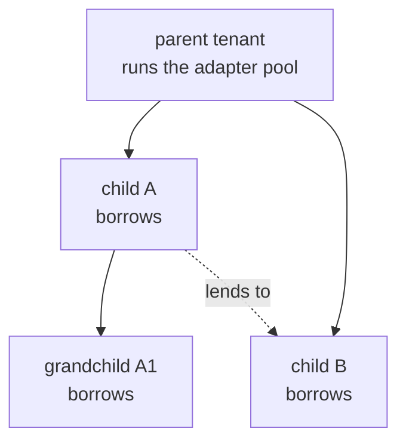
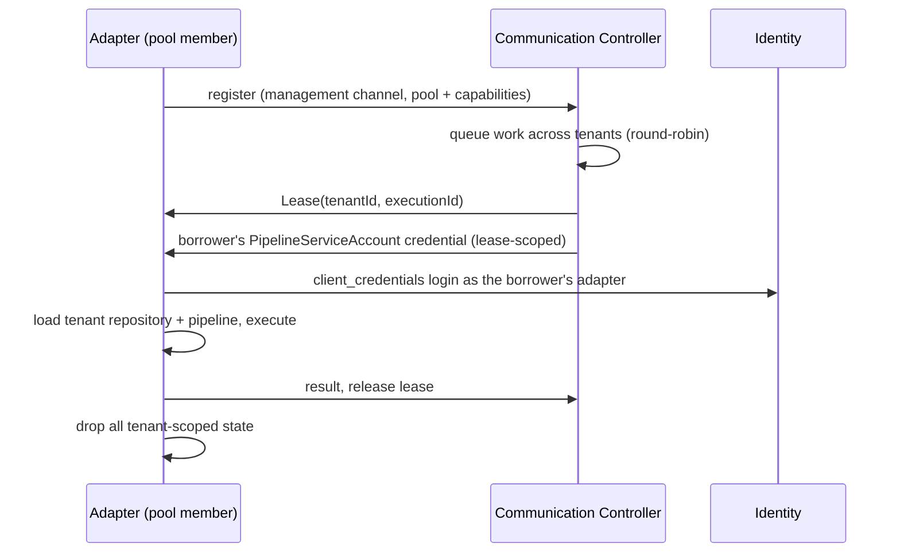

# Shared Adapter Leasing (Parent-Tenant Adapter Pool)

**Epic:** AB#4914 (On-Demand Adapter Lifecycle) · **Supersedes the approach sketched in** AB#4924 · **Status:** Design draft 1.0 (2026-09-13)

A parent tenant runs adapters that its descendants borrow. Instead of one adapter
process per tenant, a pool of processes is **leased** to a tenant for the duration
of one work item, then released. Adapters that serve continuous data keep a
dedicated process.

This refines AB#4924, which assumed multiplexing (N hub registrations in one
process, per-tenant caches side by side). Leasing was chosen instead because it
keeps tenant isolation a property of *time* rather than of code: the process
serves exactly one tenant at any instant.

## 1. Motivation (measured, prod-1, 2026-09-13)

Ten mesh adapters, 3.70 GiB actually used against 6.5 GiB reserved:

| Tenant | Memory | Pipeline executions / h |
|---|---|---|
| meshmakers | 848 Mi | 17 |
| gastroacker | 580 Mi | 16 |
| tecob | 408 Mi | 16 |
| **energyiq** | 407 Mi | **4089** |
| salzburgdev | 360 Mi | 17 |
| bierok | 322 Mi | 16 |
| pureescape | 304 Mi | 16 |
| landing | 200 Mi | **0** |
| wwc26 | 185 Mi | **0** |
| familyos | 171 Mi | **0** |

Two facts drive the design. Three tenants execute **nothing** and still hold
170–200 Mi each — pure .NET runtime baseline, the cost of a process existing. And
one tenant produces 99 % of the load. Across staging-1, prod-1 and prod-2 there
are 30 adapter pods; roughly 5 GiB is baseline that exists only because the
processes are separate.

## 2. Two modes, explicit on the adapter

`LifecycleMode` gains a third author-set value. The mode is **set on the adapter**,
not derived — `OnDemandCapable` (§5 of the on-demand concept) remains the
*validation*, not the decision.

| Mode | For | Trigger profile |
|---|---|---|
| `AlwaysOn` | continuous data | process-bound triggers: `FromPolling`, `FromWatchRtEntity`, MQTT/EDA/Loxone consumers |
| `OnDemand` | rare work, own process | wake-capable triggers, existing behaviour (AB#4914) |
| `Leased` *(new)* | periodic work, shared process | wake-capable triggers **and** no tenant-pinned runtime state |

Two kinds of adapter therefore coexist, and the distinction is worth naming because it
shapes everything below:

- **Manual adapters** — what exists today. One adapter entity, one workload, one tenant.
  `AlwaysOn` or `OnDemand`. Unchanged by this design.
- **Pool adapters** — members of an `AdapterPool` (§4a). Elastic in number, leased per work
  item, never pinned to a tenant.

`Leased` requires `OnDemandCapable == true`; setting it on a non-capable adapter is
rejected with the blocking reasons, exactly like `OnDemand` today. The reverse
direction — deploying a process-bound pipeline to a `Leased` adapter — is rejected
too. Explicit beats silent, same rule as AB#4914.

Deriving the mode automatically was considered and rejected: a mode that flips
itself when someone deploys a pipeline is the kind of silent automation that is
hard to reason about during an incident.

## 2a. Model version — this is a major bump

Renaming `Pool` to `DeploymentSite` (§8, Q16) makes this a **major** `System.Communication`
change: **3.35.0 → 4.0.0**, with a CK migration script. Everything else in this design is
additive and would have been a minor bump on its own; the rename is what forces the major.

That was accepted deliberately (Q18) rather than deferred, so the estate takes one migration
instead of two. The cascade it triggers, measured 2026-09-14:

| What | Count | Note |
|---|---|---|
| Files carrying a `System.Communication-[3.x,4.0)` pin | 84 | 82 of them blueprint files |
| Dependent CK models with their own pin | 2 | `SystemAiCkModel`, `AdapterEdgeLoxone.CkModel` |

`AdapterEdgeLoxone.CkModel` is pinned **exactly** `[3.31,3.32)` — the frozen-pin trap that has
already cost three incidents (AB#4696, AB#4999, AB#5196 on prod-1). It resolves to 3.31.0 today
and is therefore unaffected by 3.36.0, but a rename it never adopts leaves it permanently behind
a type that no longer exists. It has to move with the bump, not after it.

**Consequence for increment 1**, which was implemented as 3.36.0 before this decision: the
version has to become 4.0.0 and the rename plus its migration script belong in the same
increment. The additive parts already built (`Leased`, `Queued`, the leasing attributes) are
unaffected in content — only their version label and the migration change.

## 3. Lending scope

Lending follows the tenant tree, resolved through the existing
`GET /tenants/descendants` (AB#5151) — a BFS walk that already handles indirect
children and guards against registry cycles.



- A parent lends to **any** descendant, direct or indirect.
- **Siblings may lend to each other** when they share a parent.
- A descendant never lends **upwards**. The trust direction matches the
  parent-tenant boundary (AB#5060) and the `xt_` shadow-user chain.

## 4. Lease protocol

One **management connection** per adapter process, not bound to a tenant. The
controller hands the process a tenant for one work item.



### Borrower identity — the lease carries the credential

The concept's first draft said "token exchange to the target tenant (AB#4338, RFC 8693)".
**That mechanism does not cover this case.** RFC 8693 exchange is live, but
`TenantExchangeProcessor` rejects a `subject_token` without `sub` and `tenant_id` — and a
client-credentials token deliberately carries none (`OctoAccessTokenShapeHandler` strips it).
It also mints an `xt_{A}_{user}` shadow user, which is not what a service identity wants.

Instead the controller sends the **borrower's own `PipelineServiceAccount` credential**
(AB#5027) with the lease. The pool member then logs in and acts exactly as the borrower's own
adapter would — no new standing grants anywhere, and the whole AB#5027 identity chain is reused
unchanged.

Two properties make this acceptable rather than a new exposure class: the controller already
holds these secrets (it provisions the account in `DeployWorkloadAsync`), and the pool member
already manages one of its own. The credential is **scoped to the lease TTL and never
persisted** by the member.

The alternative — mirroring the pool's account into every borrower — was rejected: it gives
the pool a standing credential in every borrower tenant even when no lease is active, which is
the opposite of what leasing is for.

### Hub authorization

The management connection terminates on a new `/adapterPoolHub`, not on
`/{tenantId}/adapterHub` — that route binds the connection to a tenant by construction
(`SignalRClient.BuildServiceUri()` throws on a blank tenant, and `AdapterHubAuthorizationFilter`
from AB#5063 enforces it — 🔴 the method is called `BuildServiceUri`, not `GetHubUri`; corrected
2026-09-14 during increment 6).

The pool hub evaluates the **lending tenant's** read-write policy plus a filter binding the
connection to that tenant. Authorization for a borrower comes from the lease, not from the
connection. Promoting pool members to a system-level caller was considered and rejected as too
much authority for the job.

### The isolation invariant

**Between two leases the process must retain nothing tenant-scoped.** This is the
one place where a defect is not a bug but a cross-tenant data incident.

Concretely:

- `FindTenantRepositoryAsync` caches per process today. That cache must become
  lease-scoped or be dropped on release.
- The CK-model cache warmed eagerly at startup (AB#4920) is per tenant — it
  cannot simply be kept warm across leases.
- `AdapterOptions.TenantId` must be **removed**, not merely ignored. As long as a
  process-wide tenant value exists, some node can read it instead of
  `etlContext.TenantId`, and the wrong answer looks plausible. The compiler should
  make the mistake impossible.

The node layer is already prepared: nodes read `etlContext.TenantId` /
`context.TenantId`, and `systemContext.FindTenantRepositoryAsync(tenantId)` is a
multi-tenant API. The binding sits above them — in the service-client options and
the hub registration.

### Warm-up cost is why both modes exist

Every lease switch costs a token exchange, a tenant repository and the pipeline
definitions. At ~16 executions/h that is irrelevant. At energyiq's 4089/h it would
be pure overhead — which is exactly why continuous-data adapters stay dedicated.

## 4a. Adapter pools

A pool is a first-class entity owned by the lending tenant. It replaces "how many adapter
processes exist" as a human decision with a declared range and a scaling policy.

```
AdapterPool
  MinReplicas            at least one member stays hot — no cold start for the first work item
  MaxReplicas            hard ceiling, e.g. 3
  CpuRequest / CpuLimit        resource demand of EACH member — one sizing per pool,
  MemoryRequest / MemoryLimit  applied identically to every member it starts
  ScaleUpPolicy          what queue pressure starts another member
  IdleTimeoutMinutes     when a member above MinReplicas is drained again
```

🔴 **Corrected 2026-09-14, during increment 6.** This paragraph used to open "members are ordinary adapter
workloads with `LifecycleMode = Leased`", which contradicts §2: `Leased` means *"has no process of its own"*,
and a member **is** the process. Both cannot carry the same mode. Members are **replicas of the pool workload
itself**, which is a `DeployableWorkload` in its own right; they need no entity, no author configuration and no
lifecycle of their own. `Leased` stays unambiguously the **borrower's** mode, set on `Adapter`. See the
implementation plan §12.2. The pool — not the
AB#4918 idle watchdog — owns their lifecycle: the watchdog drains a workload from *its own*
pipelines' `LastExecutionAt`, and a pool member has no pipelines of its own. This resolves the
contradiction the on-demand concept would otherwise run into.

Blueprints can seed a pool: a parent tenant's blueprint declares the pool and its range, a
child tenant's blueprint declares that it borrows. Both halves are author configuration.

**Scaling is driven by the queue, not by CPU.** A pool member is I/O-bound while waiting for a
lease, so CPU utilisation says nothing about whether work is piling up. The signal is queue
depth and queue wait time (§5).

## 4b. Where pool members run, and who pays for them

This section used to run two independent questions together. They are separated here.

### Who pays

Q1: consumption is billed to the tenant **whose work executed**, not to the tenant that owns the
adapter. That is an accounting rule inside OctoMesh, and the lease timestamps make it exact without
new machinery: `LeaseGrantedAt` to `LeaseReleasedAt` is the span a member was held for one borrower,
and the pool declares what each member costs (§4a). Consumption per borrower is the sum of its lease
spans times the member sizing — derived from data the model already carries, not from a separate
metering pipeline.

🔴 **Nothing computes or exposes this yet.** Increment 1 put the spans on the model; turning them
into per-tenant consumption is deferred OctoMesh work and is not part of increments 5–9 as planned.
Stated here so the attribution is not mistaken for delivered.

### Where the members run

🔴 **Corrected 2026-09-14.** The first draft derived the placement from the billing rule: pool
members had to sit in a platform namespace because "a member sitting in the lender's namespace would
charge every borrower's load to the lender". **That inference was wrong, and it was never what Q1
decided.** Billing is computed in OctoMesh from lease spans; the account follows the lease, not the
pod. Where a member runs has no bearing on who is charged for it.

With the billing argument withdrawn, placement is an operational question alone — and the
operational grounds point at leaving things where they already are:

- Everything the operator deploys already lands in one namespace (`OperatorOptions.PoolNamespace`,
  default `octo`), separated by release name. A pool is not special enough to need its own.
- It is the only namespace that contains an object representing a tenant — its `CommunicationPool`
  CR — which is what makes the owner reference and its garbage collection possible at all.

A distinct platform namespace remains supported for whoever wants that topology, at the cost of the
owner reference (see below). It is no longer something the design asks for.

🔴 **Corrected 2026-09-14, during increment 5.** The first draft of this paragraph said
`WorkloadReconciler` and `WorkloadHostnameIndex` assume *one workload per tenant namespace*. There
are no tenant namespaces: the operator deploys every workload of every tenant into one namespace
(`OperatorOptions.PoolNamespace`, default `octo`), separated by release name, and
`WorkloadHostnameIndex` is a controller type, not an operator one. The assumption that actually has
to break is "one namespace for everything the operator deploys". And the RBAC lives in the
`octo-mesh-communication-operator` Helm chart in `octo-helm-core`, where the default cluster-scoped
binding already covers any namespace.

Independent of all of the above: **Kubernetes forbids cross-namespace owner references** — a dependent whose owner lives elsewhere is treated as having no owner and is deleted.
Since the object that represents a tenant is its `CommunicationPool` CR in the operator's own
namespace, "platform namespace" and "owned by the lending tenant" are only simultaneously satisfiable
while the platform namespace *is* that namespace. That is what the implementation defaults to; a
distinct platform namespace is supported and forfeits the owner reference, with a warning.
See the implementation plan §7.1a.

## 5. Queue


Queued work is a first-class, operable thing: visible and actionable in **Refinery Studio,
`octo-cli` and the MCP server** — the same surface in all three, not a Studio-only view.

### Model

`PipelineExecutionStatus` gains `Queued` (key 5) rather than a separate queue entity, so one
execution stays one entity from enqueue to completion and the three surfaces show a continuous
history instead of joining two sources. `Cancelled` (key 4) already exists and is what a
cancelled queue entry becomes.

Three timestamps make the lease lifecycle readable end to end:

| Attribute | Set when | Answers |
|---|---|---|
| `QueuedAt` | the work is enqueued | how long has this been waiting |
| `LeaseGrantedAt` | a pool member is assigned this tenant | when did it actually start |
| `LeaseReleasedAt` | the member is handed back | how long did it hold the process |

`StartedAt` is relaxed from mandatory to optional in the same CK bump: a queued execution has
no start time, and stamping it at enqueue is not an option because the AB#4280 reaper and the
orphan resolver both key off it — a long queue wait would be reaped as a stuck execution.

`LeaseGrantedAt` and `LeaseReleasedAt` are deliberately separate from `StartedAt`/`FinishedAt`:
lease-held time and pipeline-run time are not the same span, and the difference between them is
exactly the overhead the pool exists to amortise. Keeping both makes that measurable.

### One queue per pool

**The queue belongs to the pool, not to the member.** Pool membership is elastic; a queue held
by a member would strand its work the moment that member is drained. The per-adapter view —
"what is this member holding, what waits behind it" — is a projection of the pool queue, not a
collection of its own. An association from the execution to the assigned member carries it.

**Manual adapters have no queue.** They execute immediately and are exclusive to their tenant,
exactly as today. `Queued` is a pool-only state. The surfaces therefore show a queue for pool
adapters and none for manual ones — that asymmetry is intended and reflects a real difference,
not an inconsistency to paper over.

### Fairness

Round-robin per tenant, not global FIFO. Global FIFO would let one tenant with 200 queued jobs
starve every other — the displacement problem this design exists to remove. The cost is
intuitiveness, so the surfaces must show **position within the tenant** plus the number of
tenants ahead in the rotation, never a single global rank.

### Priority — interactive ahead of batch

Round-robin decides **between** tenants. Within a tenant's turn, work is ordered by class:
**interactive before batch**. The scenario it solves: a tenant's nightly batch has 40 entries
queued when someone clicks "generate billing" at 09:15; without classes that click waits behind
all 40.

Two classes only, not a numeric priority. A number needs someone to assign it, and it makes
"why is mine not running" unanswerable in the queue view. Two classes stay explainable: *your
interactive job runs before your batch jobs, and tenants take turns.*

**Where the class comes from.** The trigger node declares it, exactly as it already declares
`RequiresRunningProcess` for on-demand capability (AB#4914 §5). The descriptor contract gains a
second capability — the execution class the trigger implies — set by the SDK trigger-node
implementations and picked up automatically by the reflection-based descriptor scan, so future
and third-party nodes self-describe without a controller-side list.

**On save it becomes a property of the pipeline.** Deriving it at schedule time would mean
parsing the YAML on every dequeue and would leave the class invisible until something ran. Instead
the classification is resolved when the pipeline is saved and persisted on the pipeline entity.
Three things follow: the scheduler reads a field instead of parsing, Studio / `octo-cli` / MCP can
show *why* a job is where it is, and a pipeline whose class changed is visible as a change rather
than as behaviour that quietly shifted.

This mirrors `OnDemandCapable`, which is likewise computed and persisted for display. The same
caveat applies: a pipeline edited to a different trigger changes class on save, so the surfaces
must show the current value rather than caching it.

Crucially, priority applies **only inside a tenant's turn**. It never reorders tenants against
each other, so it cannot reintroduce the starvation that round-robin exists to prevent.

### Cancellation

A `Queued` entry can be cancelled from any of the three surfaces; it becomes `Cancelled` and is
never leased. Cancelling an execution that already holds a lease is a different operation —
it has to interrupt a running pipeline — and follows the existing cancellation path rather than
the queue path.

## 6. Failure modes

| Failure | Handling |
|---|---|
| Lease holder crashes mid-execution | Lease has a TTL; controller re-queues the execution and marks the previous attempt `Interrupted` (existing status). At-least-once, so pipelines must stay idempotent — same contract as today. 🔴 **Clarified during increment 7:** the re-queue is a **new** `PipelineExecution`, not the old one moved back to `Queued`. One entity cannot be `Interrupted` and `Queued` at once, and reusing it would erase both the interrupted record this row asks for and the lease span that prices it (§4b). Each *attempt* is one entity; the history reads attempt 1 `Interrupted`, attempt 2 `Queued → Running`. |
| Release never arrives | TTL expiry releases the lease server-side; the process is drained and restarted rather than re-used, because its post-lease cleanliness is unproven. |
| A borrowed tenant floods the queue | Round-robin bounds its share; a per-tenant concurrency cap bounds it further. |
| Pool exhausted | Queue grows, visible in Studio. Scale the pool, or move the tenant to a dedicated adapter. |
| Parent tenant deleted while lending | Borrowers fall back to `Deployed=false` and surface a blocking reason. Never silently stop executing. |

## 7. Relationship to existing work

- **AB#4914 / on-demand-adapter-lifecycle.md** — leasing sits beside `OnDemand`, not instead of it. A pool member may itself be `OnDemand`.
- **AB#4924** — this supersedes its multiplexing assumption; the cost/latency comparison it asks for stays valid as input.
- **AB#5027 `PipelineServiceAccount`** — the execution identity is already decoupled from the tenant; leasing needs the token exchange on top.
- **AB#4338 RFC 8693 token exchange** — 🔴 **corrected 2026-09-14, during increment 6.** This bullet used
  to call the exchange "the mechanism for acquiring the target-tenant token", which contradicted §4 and Q6
  two pages earlier. It is **not** the mechanism and cannot be: the exchange is user-only — it rejects a
  `subject_token` without `sub`/`tenant_id`, which is exactly the shape of a client-credentials token, and it
  mints an `xt_` shadow user, which is not what a service identity wants. The lease carries the borrower's own
  `PipelineServiceAccount` credential instead (Q6). See the implementation plan §12.5.
- **AB#5151 `GET /tenants/descendants`** — the lending scope resolver.

## 8. Decisions and open questions

### Decided (2026-09-14)

| # | Question | Decision |
|---|---|---|
| Q4 | Pool hub auth policy | Lending tenant's read-write policy + connection filter; borrower authority comes from the lease |
| Q5 | `StartedAt` on a queued execution | Relax to optional in the same CK bump; add `LeaseGrantedAt` / `LeaseReleasedAt`; queue operable from Studio, `octo-cli` and MCP |
| Q6 | Borrower-tenant token | Lease carries the borrower's `PipelineServiceAccount` credential, scoped to the lease TTL |
| Q9 | Borrower half config or runtime state | Author configuration — blueprints seed both pool and borrowing |
| Q10 | `DescendantsAndSiblings` | Stays a distinct mode, set per adapter |
| Q2 | Pool sizing | Superseded by §4a: declared `MinReplicas`/`MaxReplicas` with queue-driven scaling |
| Q11 | Per-tenant lease cap default | Left unset; round-robin and pool size are the real bounds |
| Q12 | Queue scope | One queue per pool; the per-adapter view is a projection |
| Q13 | Queue for manual adapters | No — they execute immediately, `Queued` is a pool-only state |
| Q15 | Resource sizing | One sizing per pool, applied identically to every member |
| Q1 | Pool member namespace | Platform namespace, lender as owner reference — consumption is billed to the tenant whose work ran |
| Q3 | Lease priorities | Two classes, interactive before batch, **within a tenant's turn only** |
| Q16 | Naming | Rename the existing `Pool` to `DeploymentSite` — it is a location, and things should be called what they are |
| Q17 | Execution class | Declared by the trigger node (like `RequiresRunningProcess`), resolved on save and persisted on the pipeline |
| Q18 | Rename sequencing | Ships **together** with leasing — one major bump, one migration |
| Q14 | Scale-up trigger | Queue depth **or** wait time crossing a threshold; averaging window measured during implementation and kept configurable — ✅ implemented as a controller option whose default *derives* the window from the pool's own `ScaleUpQueueWaitSeconds` rather than inventing a constant; see the implementation plan, D3 |

### Still open

None **of the design questions**. Every question raised during design has been decided; the
remaining unknowns are implementation measurements (the scale-up averaging window, the wake budget
for a cold pool member) that are deliberately left to be observed rather than guessed.

🔴 **One question implementation raised and design does not answer**, found in increment 7: the
lease carries an execution id and nothing else about the work — no pipeline, no input — and no
member-facing way to ask. §4's sequence diagram says "load tenant repository + pipeline, execute"
without saying which pipeline, or how the member learns it. See the implementation plan §9.9 and
D4; it is a multi-repo decision, not a controller detail.

## 9. Out of scope

Arbitrary customer-owned adapters keep process isolation. Leasing applies to
adapters inside one tenant tree, where a trust relationship already exists.
