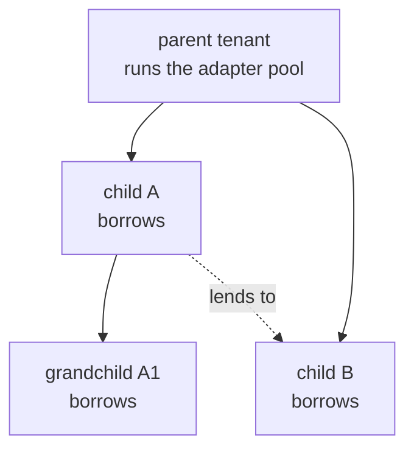
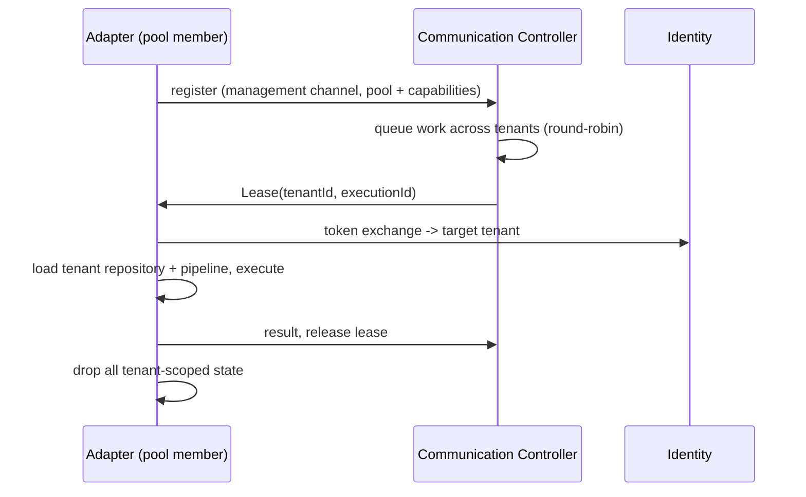

# Shared Adapter Leasing (Parent-Tenant Adapter Pool)

**Epic:** AB#4914 (On-Demand Adapter Lifecycle) · **Supersedes the approach sketched in** AB#4924 · **Status:** Design draft 1.0 (2026-09-13)

A parent tenant runs adapters that its descendants borrow. Instead of one adapter
process per tenant, a pool of processes is **leased** to a tenant for the duration
of one work item, then released. Adapters that serve continuous data keep a
dedicated process.

This refines AB#4924, which assumed multiplexing (N hub registrations in one
process, per-tenant caches side by side). Leasing was chosen instead because it
keeps tenant isolation a property of *time* rather than of code: the process
serves exactly one tenant at any instant.

## 1. Motivation (measured, prod-1, 2026-09-13)

Ten mesh adapters, 3.70 GiB actually used against 6.5 GiB reserved:

| Tenant | Memory | Pipeline executions / h |
|---|---|---|
| meshmakers | 848 Mi | 17 |
| gastroacker | 580 Mi | 16 |
| tecob | 408 Mi | 16 |
| **energyiq** | 407 Mi | **4089** |
| salzburgdev | 360 Mi | 17 |
| bierok | 322 Mi | 16 |
| pureescape | 304 Mi | 16 |
| landing | 200 Mi | **0** |
| wwc26 | 185 Mi | **0** |
| familyos | 171 Mi | **0** |

Two facts drive the design. Three tenants execute **nothing** and still hold
170–200 Mi each — pure .NET runtime baseline, the cost of a process existing. And
one tenant produces 99 % of the load. Across staging-1, prod-1 and prod-2 there
are 30 adapter pods; roughly 5 GiB is baseline that exists only because the
processes are separate.

## 2. Two modes, explicit on the adapter

`LifecycleMode` gains a third author-set value. The mode is **set on the adapter**,
not derived — `OnDemandCapable` (§5 of the on-demand concept) remains the
*validation*, not the decision.

| Mode | For | Trigger profile |
|---|---|---|
| `AlwaysOn` | continuous data | process-bound triggers: `FromPolling`, `FromWatchRtEntity`, MQTT/EDA/Loxone consumers |
| `OnDemand` | rare work, own process | wake-capable triggers, existing behaviour (AB#4914) |
| `Leased` *(new)* | periodic work, shared process | wake-capable triggers **and** no tenant-pinned runtime state |

`Leased` requires `OnDemandCapable == true`; setting it on a non-capable adapter is
rejected with the blocking reasons, exactly like `OnDemand` today. The reverse
direction — deploying a process-bound pipeline to a `Leased` adapter — is rejected
too. Explicit beats silent, same rule as AB#4914.

Deriving the mode automatically was considered and rejected: a mode that flips
itself when someone deploys a pipeline is the kind of silent automation that is
hard to reason about during an incident.

## 3. Lending scope

Lending follows the tenant tree, resolved through the existing
`GET /tenants/descendants` (AB#5151) — a BFS walk that already handles indirect
children and guards against registry cycles.

- A parent lends to **any** descendant, direct or indirect.
- **Siblings may lend to each other** when they share a parent.
- A descendant never lends **upwards**. The trust direction matches the
  parent-tenant boundary (AB#5060) and the `xt_` shadow-user chain.

## 4. Lease protocol

One **management connection** per adapter process, not bound to a tenant. The
controller hands the process a tenant for one work item.

### The isolation invariant

**Between two leases the process must retain nothing tenant-scoped.** This is the
one place where a defect is not a bug but a cross-tenant data incident.

Concretely:

- `FindTenantRepositoryAsync` caches per process today. That cache must become
  lease-scoped or be dropped on release.
- The CK-model cache warmed eagerly at startup (AB#4920) is per tenant — it
  cannot simply be kept warm across leases.
- `AdapterOptions.TenantId` must be **removed**, not merely ignored. As long as a
  process-wide tenant value exists, some node can read it instead of
  `etlContext.TenantId`, and the wrong answer looks plausible. The compiler should
  make the mistake impossible.

The node layer is already prepared: nodes read `etlContext.TenantId` /
`context.TenantId`, and `systemContext.FindTenantRepositoryAsync(tenantId)` is a
multi-tenant API. The binding sits above them — in the service-client options and
the hub registration.

### Warm-up cost is why both modes exist

Every lease switch costs a token exchange, a tenant repository and the pipeline
definitions. At ~16 executions/h that is irrelevant. At energyiq's 4089/h it would
be pure overhead — which is exactly why continuous-data adapters stay dedicated.

## 5. Queue

Work waiting for a lease is visible in Refinery Studio.

`PipelineExecutionStatus` gains `Queued` (key 5) rather than a separate queue
entity, so one execution is one entity from enqueue to completion and Studio shows
a continuous history instead of joining two sources. Accompanying attributes:
`QueuedAt`, `LeaseWaitMs`.

**Fairness is round-robin per tenant**, not global FIFO. Global FIFO would let a
tenant with 200 queued jobs block every other tenant — the starvation problem in
new clothing. Round-robin costs intuitiveness ("my job is at the front, why is it
not running?"), so Studio must show **position within the tenant** plus the number
of tenants ahead in the rotation, not a single global rank.

## 6. Failure modes

| Failure | Handling |
|---|---|
| Lease holder crashes mid-execution | Lease has a TTL; controller re-queues the execution and marks the previous attempt `Interrupted` (existing status). At-least-once, so pipelines must stay idempotent — same contract as today. |
| Release never arrives | TTL expiry releases the lease server-side; the process is drained and restarted rather than re-used, because its post-lease cleanliness is unproven. |
| A borrowed tenant floods the queue | Round-robin bounds its share; a per-tenant concurrency cap bounds it further. |
| Pool exhausted | Queue grows, visible in Studio. Scale the pool, or move the tenant to a dedicated adapter. |
| Parent tenant deleted while lending | Borrowers fall back to `Deployed=false` and surface a blocking reason. Never silently stop executing. |

## 7. Relationship to existing work

- **AB#4914 / on-demand-adapter-lifecycle.md** — leasing sits beside `OnDemand`, not instead of it. A pool member may itself be `OnDemand`.
- **AB#4924** — this supersedes its multiplexing assumption; the cost/latency comparison it asks for stays valid as input.
- **AB#5027 `PipelineServiceAccount`** — the execution identity is already decoupled from the tenant; leasing needs the token exchange on top.
- **AB#4338 RFC 8693 token exchange** — the mechanism for acquiring the target-tenant token.
- **AB#5151 `GET /tenants/descendants`** — the lending scope resolver.

## 8. Open questions

- Does the pool live in the parent tenant's namespace, or in a platform namespace with the parent as owner? Affects the operator's 1:1 workload↔adapter assumption.
- How is pool size decided — fixed, or autoscaled from queue depth?
- Do leases need priorities (interactive HTTP-triggered work ahead of nightly batches), or does round-robin plus the 202 pattern suffice?

## 9. Out of scope

Arbitrary customer-owned adapters keep process isolation. Leasing applies to
adapters inside one tenant tree, where a trust relationship already exists.
